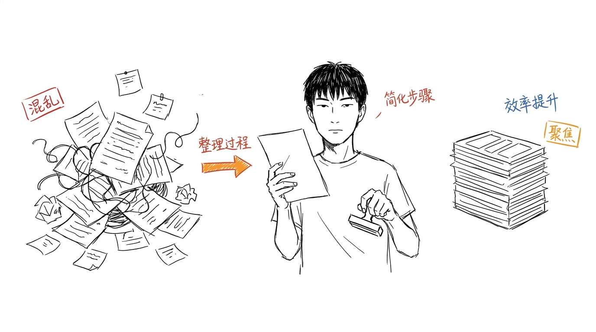
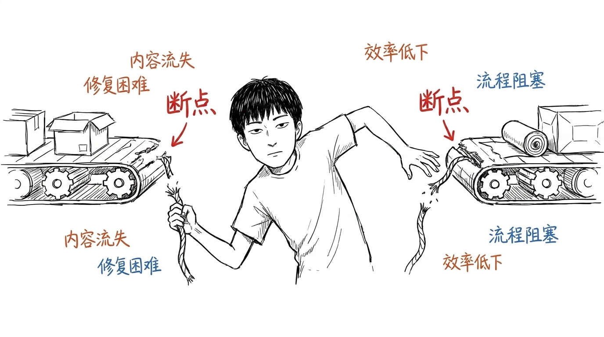
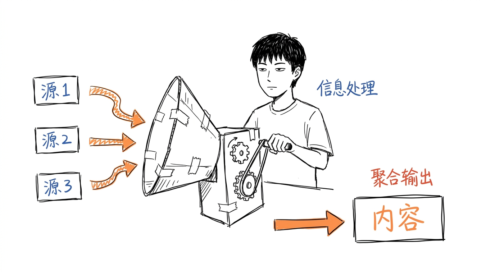
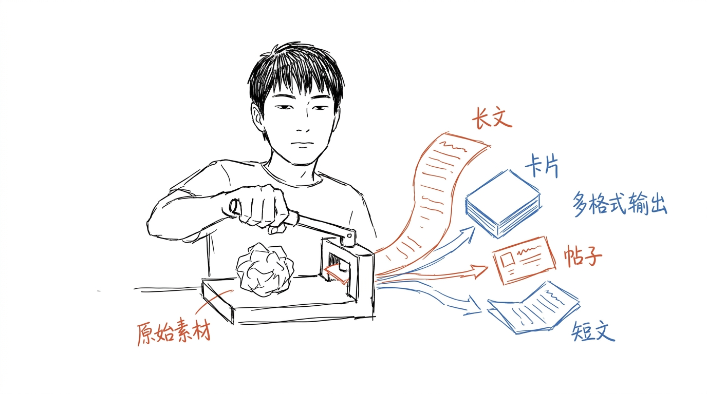
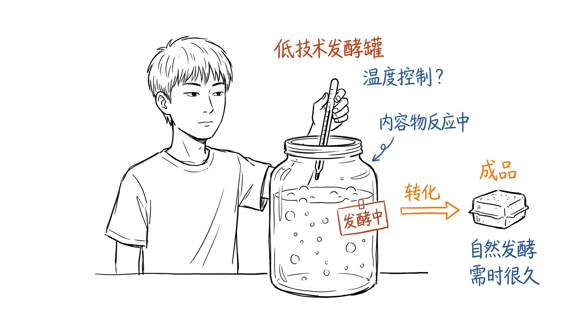
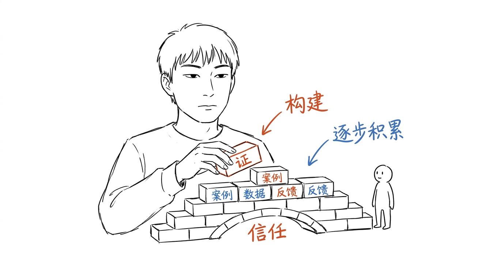

# 小凡墨水 / Xiaofan Ink

> 把中文文章里的判断、流程、状态和隐喻,变成一张张白底、手绘、怪诞但清爽的正文配图。
>
> 16:9 横版 | 小凡 IP | 纯白手绘 | 少量红橙蓝中文批注 | Codex Skill
>
> ⚠️ 本仓库 fork 自 [helloianneo/ian-xiaohei-illustrations](https://github.com/helloianneo/ian-xiaohei-illustrations),作为私有项目自用,IP 已从原作者的"小黑"替换为"小凡"(基于真人面部特征风格化转译)。原作者 Ian 的"小黑"IP 仍归原作者所有,详见 NOTICE.md。
>
> 关联公众号:**小凡的草稿本**(过程 > 结论 / 草稿 > 作品 / 死板冷静 / 想写就写,见 `brand/README.md`)

---

## 这个仓库是什么

小凡墨水 是一个 Codex Skill,用来指导 AI Agent 为中文文章、帖子、博客、Notion 文档和方法论内容生成正文配图。

它不是通用插画 prompt,也不是 PPT 信息图模板。它的核心目标是:先理解文章里的认知锚点,再把其中一个判断、流程、结构、状态或隐喻,变成一张有记忆点的 16:9 手绘解释图。

默认视觉 IP 是"小凡":一个细长单眼皮、碎短发、薄唇、**默认死板冷静**(v1.0+ 表情库可在 prompt 里切换 1-2 种微表情,如思考/疲惫/满足),基于真人手绘风格化转译,保持白板速写感的线稿气质。小凡不是吉祥物,不是贴纸,也不是站在角落里的装饰物,而是正在认真参与系统运转的荒诞工作者。

一句话:**让 AI 不只是"配一张图",而是把文章里的一个关键认知动作画出来。**

---

## 适合谁用

特别适合:

- 写中文文章,需要正文配图和文章插图的人
- 做知识型内容、方法论内容、AI 工作流内容的人
- 想把抽象判断画成具体隐喻的人
- 想要一种比 PPT 信息图更轻、更怪、更有个人识别度的配图风格的人
- 用 Codex 做内容生产,希望稳定复用一套视觉语言的人

不适合:

- 想要商业插画、品牌 KV 或精致扁平插画的人
- 想要传统 PPT 信息图、复杂架构图或流程图的人
- 想要儿童卡通、可爱 IP、表情包风格的人
- 想把大量正文、长段解释或完整课程页塞进一张图里的人
- 需要严格可编辑矢量源文件的人

---

## 它会产出什么

默认输出:

- 16:9 横版正文配图
- 一篇文章的 4-8 张 shot list
- 每张图的主题、核心意思、结构类型、小凡动作和中文标注建议
- 最终 PNG 图片,保存到 workspace 的 `assets/<article-slug>-illustrations/`

默认不输出:

- PPTX / PDF / Keynote
- SVG / HTML / Canvas 可编辑图
- 商业海报或封面 KV
- 大段文字型信息图

---

## 视觉风格

这个 skill 默认使用"小凡怪诞正文配图"风格:

- 纯白背景
- 黑色手绘线稿,细线,轻微抖动(白板速写感)
- 大量留白,主体只占画面约 40%-60%
- 少量红色、橙色、蓝色中文手写批注
- 一张图只表达一个核心动作、结构、状态或隐喻
- 小凡必须参与核心动作,不能只是装饰
- 怪诞、有创意、清爽,但不幼稚、不卖萌

具体调色板(温暖墨水感)见 `xiaofan-ink/references/style-dna.md`:黑 `#1A1A1A` / 红 `#C0392B` / 橙 `#E67E22` / 蓝 `#2C5F8D`。

---

## 示例效果

### 混乱到聚焦



### 两个断点



### 信息汇聚



### 一稿多用



### 内容发酵



### 信任桥



这些图片是风格校准样例,不是构图模板。使用时应该从当前文章重新发明隐喻,不要照抄这些样例的物件和构图。同一篇文章的多张图,要让小凡的姿态、动作、物件、视角至少有 3 个不同维度在变化,具体见 `xiaofan-ink/references/composition-patterns.md` 的"反复刻规则"段。

> 原作者 Ian 的 8 张"小黑"样例图已移至 `.ip-dev/legacy-examples/`(gitignored),仅作原版视觉风格存档,不再出现在本仓库的 skill 结构里。

---

## 目录结构

```text
.
├── README.md
├── CHANGELOG.md
├── LICENSE
├── NOTICE.md
├── brand/                          ← 【v1.4+】公众号"小凡的草稿本" brand 资源
│   ├── README.md                   ← 公众号基础信息 + 简介
│   ├── avatar.png                  ← 公众号头像
│   ├── welcome.md                  ← 关注欢迎语 + 关键词自动回复
│   ├── menu.md                     ← 公众号自定义菜单
│   └── style-guide.md              ← 视觉规范(配色/字体/排版/封面)
├── doc/
│   ├── walkthrough.md              ← 完整使用 walkthrough(v1.1 含表情库案例)
│   ├── CREATION-PLAN.md            ← 长期创作规范(v1.2+)
│   ├── SERIES-STATE.md             ← 防重复数据库 + 轮换状态(v1.2+)
│   ├── whiteboard-vs-doc.md        ← 实战第一篇(v0.4 白板比文档)
│   ├── why-i-quit-gtd.md           ← 实战第二篇(v0.6 GTD 反思)
│   ├── why-i-write-drafts.md       ← 实战第三篇(v1.1 写废稿 + 表情库首篇)
│   ├── essays/                     ← 《小凡墨水周记》正式系列(v1.2+)
│   │   ├── README.md               ← 系列说明(节奏 + 品牌定位 + 初衷)
│   │   ├── 000-grass-journal-intro.md   ← 开篇(品牌定位 + 系列预告)
│   │   ├── 001-why-i-dont-do-daily-plan.md
│   │   ├── 002-focus-boundary.md
│   │   ├── 003-llm-code-control.md   ← 工具三部曲收尾(控制权)
│   │   ├── 004-red-light-30-seconds.md   ← v2.0 生活小事角度池开篇
│   │   ├── 005-wechat-recall.md         ← v2.0 生活小事角度池第二篇
│   │   ├── 006-yawn-contagion.md         ← v2.0 生活小事角度池第三篇
│   │   └── images/
│   │       ├── 000-grass-journal-intro/   (cover + 4 张,去 IP)
│   │       ├── 001-why-i-dont-do-daily-plan/  (cover + 4 张)
│   │       ├── 002-focus-boundary/             (cover + 5 张)
│   │       ├── 003-llm-code-control/          (cover + 4 张,v1.8 IP 决策:3 IP + 2 去 IP)
│   │       ├── 004-red-light-30-seconds/       (cover + 3 张,v2.0)
│   │       ├── 005-wechat-recall/               (cover + 3 张,v2.0)
│   │       └── 006-yawn-contagion/             (cover + 3 张,v2.0)
│   └── images/                     ← 实战配图(按文章分子目录)
│       ├── whiteboard-vs-doc/      (4 张)
│       ├── why-i-quit-gtd/         (4 张)
│       └── why-i-write-drafts/     (4 张)
└── xiaofan-ink/                    ← skill 主目录
    ├── SKILL.md
    ├── agents/
    │   └── openai.yaml
    ├── assets/
    │   ├── examples/               ← 6 张样例图
    │   ├── ip-reference/           ← 3 张定稿图 + standard.png
    │   │   └── variants/           ← 11 张(6 张备选装扮 + 5 张微表情)
    │   └── prompts/                ← 实战 + 样例 prompt 库
    │       ├── _standard-ip-description.md
    │       ├── articles/           ← 实战文章 prompt(实战 1-3 + 系列 001/002 共 5 篇)
    │       └── skill-samples/      ← skill 样例图 prompt(6 张)
    └── references/
        ├── style-dna.md
        ├── xiaofan-ip.md           ← 包含备选装扮 + 表情库
        ├── composition-patterns.md
        ├── prompt-template.md      ← 包含表情选择 guidance
        └── qa-checklist.md
```

更详细的使用流程见 `doc/walkthrough.md`,实战示例默认从 `doc/whiteboard-vs-doc.md` 开始看。**正式发布内容**见 `doc/essays/`,公众号 brand 资源见 `brand/`。

---

## 注意事项

- 图片里的中文文字越短越稳定。
- 每张图只讲一个核心结构,不要把文章做成说明书。
- 小凡必须承担核心动作;如果去掉小凡画面仍然完全成立,说明小凡太装饰了。
- 示例图只用于校准线条密度、留白、颜色克制和小凡参与方式,不要复刻构图。
- AI 图像模型可能出现错字、幻觉标签、风格漂移或多余标题,生成后需要检查。
- 如果中文错字严重,优先减少标注词并重生成。

---

## License

MIT License. See [LICENSE](LICENSE).
