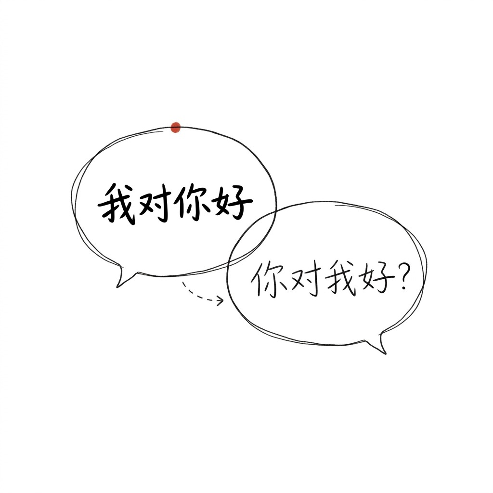
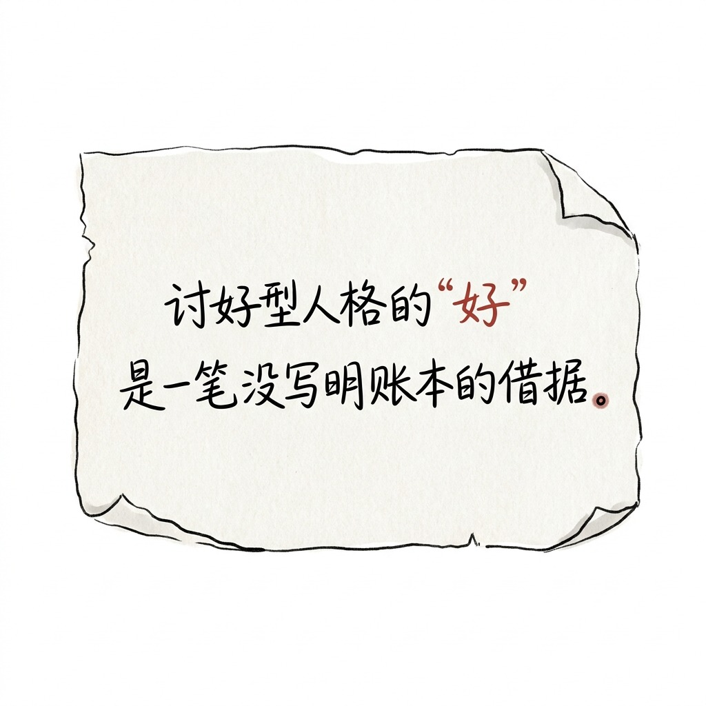

# 001 / 讨好型人格的"好" 不是善良, 是交易

你总对所有人"好"。

不是因为你善良。
是因为你期待, 他们对你"一样好"。

当他们没"对你好",
你的"好" 就变成怨气。
你开始觉得"我付出了这么多, 怎么没人看见"。

这不是善良。
这是一笔没写明账本的借据。

## 你累, 不是因为付出太多

讨好型人格的"好", 从来不是"我愿意"。

是"我付出了, 你应该回报"。
是"我不敢拒绝, 所以我用'好'换你的'好'"。

你累, 不是因为你付出太多。
是因为你从来没说过"不"。
你把"不"藏在"好"后面, 期待对方懂。

但对方不懂。
对方只看到"你愿意"。

## 1 句扎心

> 讨好型人格的"好", 是一笔没写明账本的借据。

下次想"好" 的时候, 先问自己:
这是我愿意, 还是我怕拒绝?

如果答案是"怕", 那笔账本, 从来不是对方欠你的。
是你自己欠自己的。

---

#讨好型人格 #心理学 #心理疗愈 #原生家庭 #边界感
