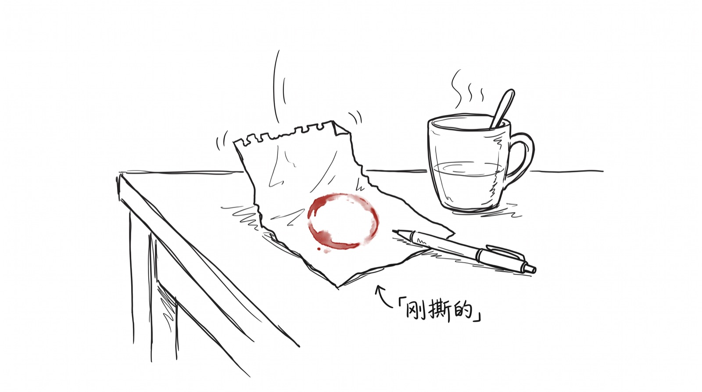
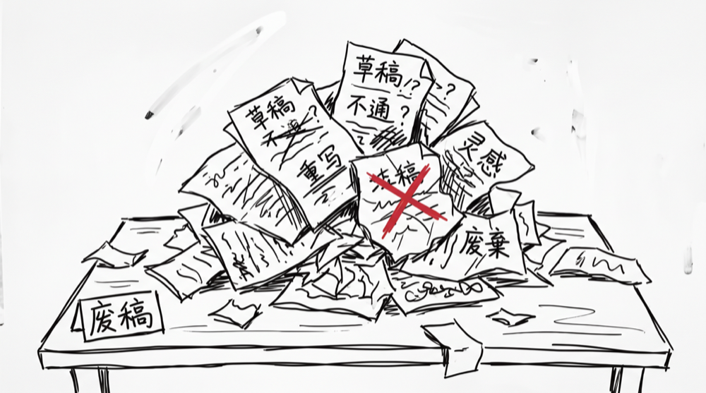
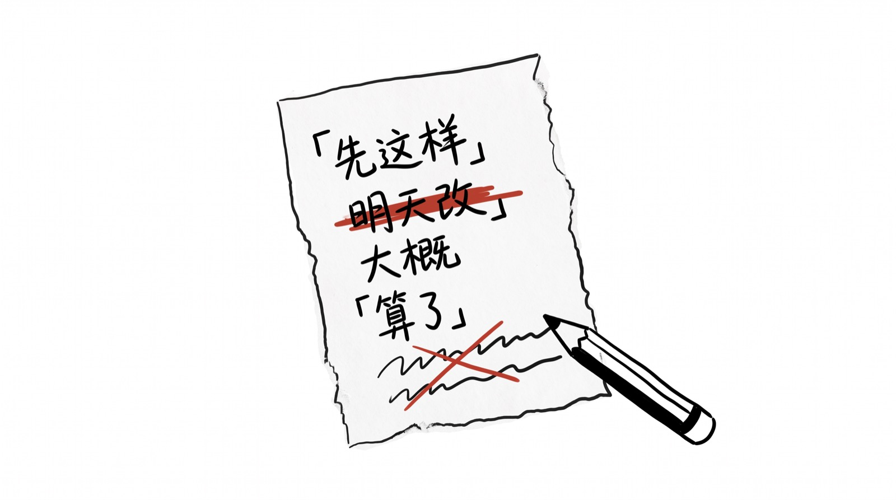
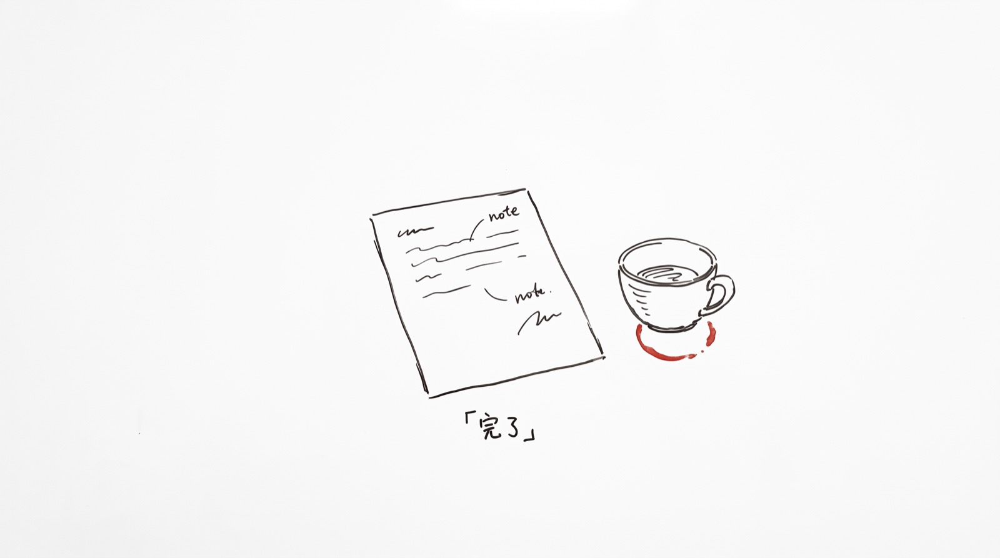

# 我开了个公众号,叫"草稿本"

我想开一个公众号,想了 3 个月。

1 个朋友说"现在谁还看公众号",我回他"那你看吗",他说"我每天都看"。开了。

---

## 为什么不叫"作品集"

大部分公众号都叫"XX 的作品"或"XX 的笔记"。

叫作品,意味着写完、改到自己满意了才发。叫笔记,意味着只发"有价值"的东西。

我不想这样。我想叫"草稿本"。

草稿是边写边改、没改完的版本。它承认"我还没想清楚",还是要先发出来。

过程比结论值钱。草稿比作品诚实。

---

## 这里会有啥

工具反思 —— 我从哪些"高效工具"里走出来了(每日计划、番茄钟,以后可能还有)。

创作过程 —— 写东西时的真实状态,不是美化版。

一些小观察 —— 路上看到的、想吐槽的。不一定成系列。

形式上:想写就写,可能有时候是废稿。配几张手绘白板风的小图,文字走克制。

不卖萌、不喊口号。发完算数。

---

## 调性一句话

> 死板冷静。不喊加油,不卖萌。

跟"成长博主" / "自律达人" 反着来。我只想说"我也做不到,然后呢"。

---

## 第一篇讲啥

第一篇是「5 年每日计划,我戒了」。

下一篇什么时候,看心情。跟 5 年每日计划一样,没计划。

---

> 发了。
>
> 什么时候见,看心情。
