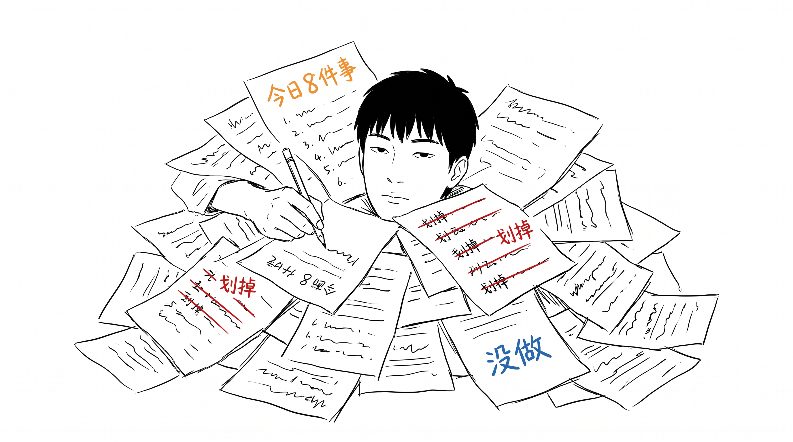
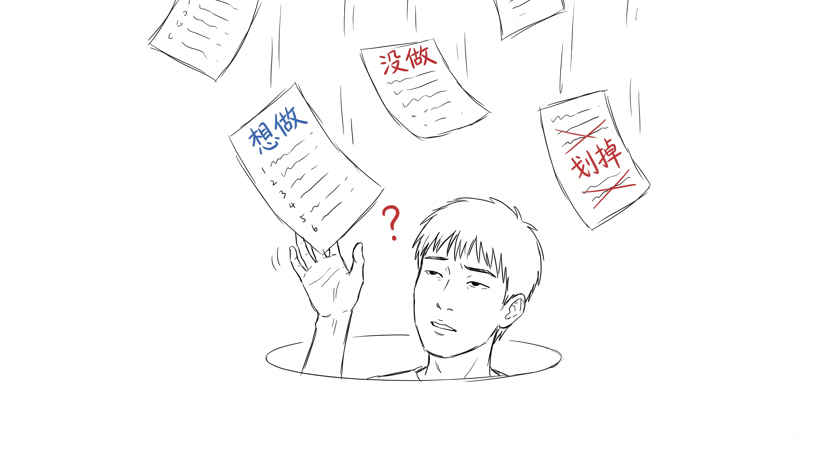
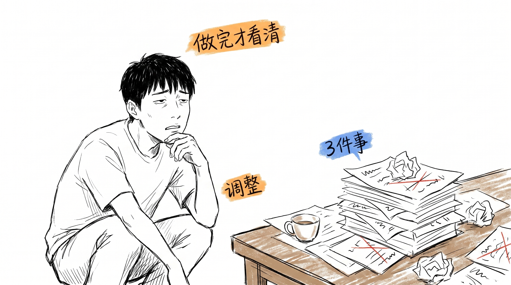
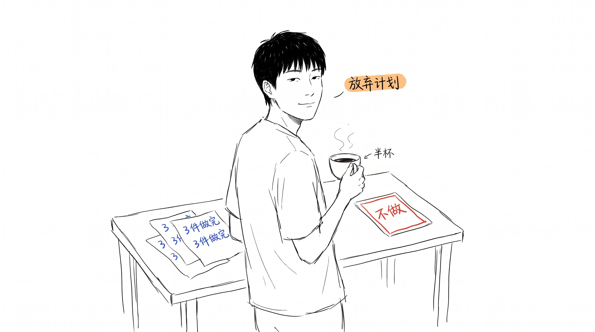

# 5 年每日计划,我戒了

我做了五年每日计划。后来不做了。

具体哪天停的,我想不起来了。可能是某个早上 8:55,坐下来,打开笔记本,写下今天要做的 8 件事 —— 然后 9 点整就开始后悔。

---

## 计划像安慰剂

早上 9 点列 8 件事,写完会舒服一点。好像今天已经被"安排"了。但"被安排"和"做了"是两回事。

第一件花 30 分钟,第二件 15 分钟,第三件写到一半"今天没心情",跳到第四件。晚上回家,纸上一半划掉了,一半没动。

划掉那一下确实爽。但 5 件事里有 3 件,写的时候就没打算真做。划掉是为了"假装做完了"。

---

## 写计划是另一个大任务

列 8 件事要算优先级、依赖关系、每件大概多久。光是这个就够花 20 分钟。然后你还有 8 件事要做。

换句话说,你一天里第一个大任务,可能就是"决定今天做什么"。

更糟的是,列完计划人会累。心理上的累。剩下的 8 小时,要用半口气去做。

---

## 3 件就够

后来我只写 3 件。

写完就停。剩的不写,也不内疚。

3 件里至少 1 件是"做完才看清"的那种,不是"想清楚才去做"。做完才知道对不对,不对再调。

还有 1 张纸写"今天不做哪些事"。明确"不做"比"要做"更难写,但写下来有奇效。

---

## 桌面现在长这样

没有"今日计划"那张纸了。

3 张写过字的草稿(今天的 3 件事做完的痕迹),1 张写"今天不做"的纸,1 杯喝了一半的冷咖啡。

少了那张纸,我反而做得多了。我也说不清为什么。

可能是因为,不用再花 20 分钟跟"今天该做什么"打架了。

---

> 写完这篇,我又想给"小凡墨水周记"列个接下来 5 篇的主题清单。
>
> 没列。
>
> 嗯。
