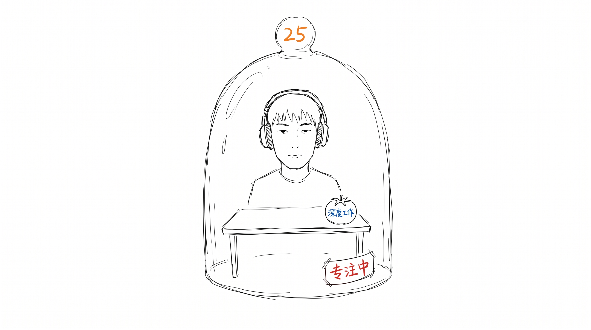
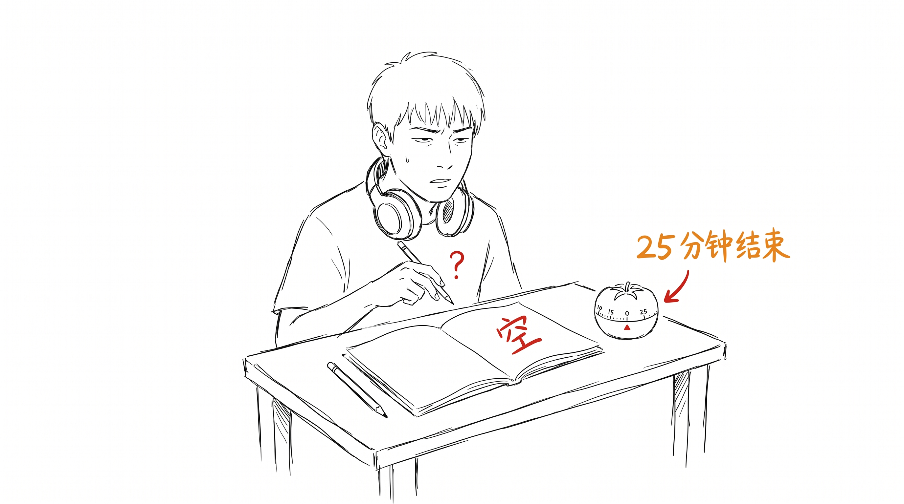
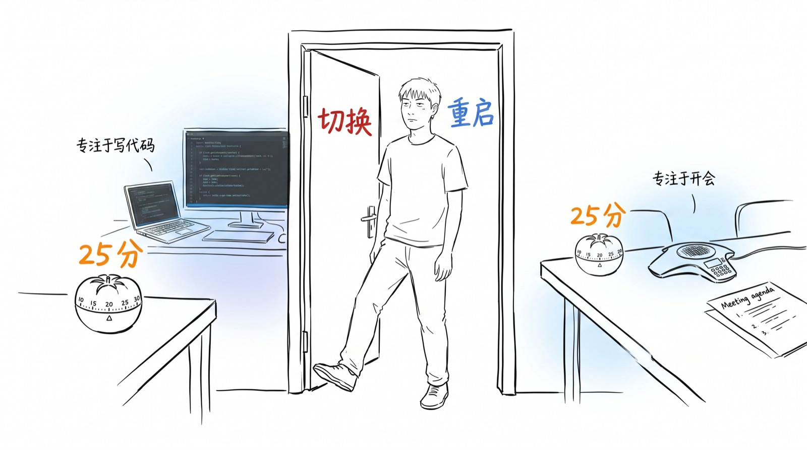
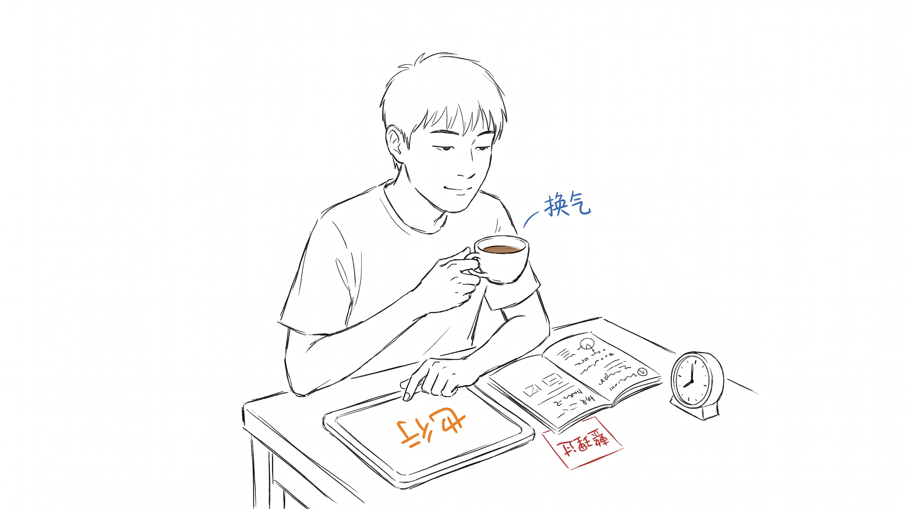
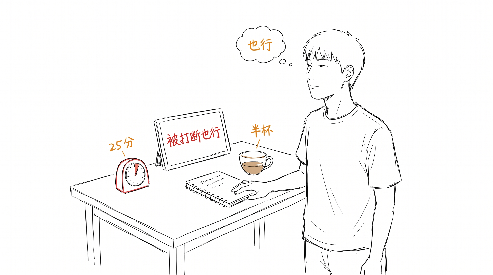

# 专注力的边界

我戴过大耳机,开过番茄钟,坚持"25 分钟深度工作"这个姿势三年。后来放弃了。

不是它没用。是"专注"被当成一种目标之后,会变成另一种干扰。

---

## 25 分钟的标准姿势

戴耳机,关掉手机,开 25 分钟倒计时。然后试着不看任何消息。

我做这个姿势很熟。熟到能一边"专注"一边在脑子里开小差 —— 盯着屏幕,其实在看自己看屏幕这件事。

有天 25 分钟结束,摘耳机,翻笔记本。空白。刚那 25 分钟什么都"没发生"。

---

## 出来以后,人是空的

更怪的还在后面。25 分钟"高度专注"听了一个播客,读了一篇文章,写了 30 行代码。然后呢?

让我现在复述刚才听到的?复述不出来。
刚才那 30 行代码解决的是什么问题?想不起来了。

那 25 分钟,我"在场"了吗?在场了。但那个"在场"没留下痕迹。

---

## 切来切去更累

而且,就算"专注 25 分钟"真有效,我也做不到每天 6-8 次。

每次专注完要切到下一件事。写代码切到开会,开会切到回邮件,回邮件切到写代码。切换那一下,大脑要从一个世界跳到另一个世界,有时候跳不过去。

我后来想,真正消耗我的可能不是 25 分钟专注本身,是"专注 + 切换 + 专注 + 切换"反复重启的那股劲。

---

## 被打断也行

但被打断跟"专注"并不是反的。

有次我写一半卡住,放下键盘去回了个消息。回来的时候,刚才卡的地方通了。

不是因为我"想通了"。是那 30 秒切换,让大脑自己整理了一遍。

所以我现在桌上有 25 分钟钟,也有一块白板写着"被打断也行"。

---

## 25 分钟钟换了个位置

现在那个 25 分钟钟,放在桌角。不是提醒我"开始专注",是提醒我"做完一件事就停"。

被打断就停,做完就停,别装作自己还在专注。停下来比假装专注要难。

专注这件事,不是越多越好,是真的算数才算。

---

> 写完这篇,同事问"在吗?"。
>
> 在。
>
> 嗯,反正"在"也不是什么必须一直保持的状态。
