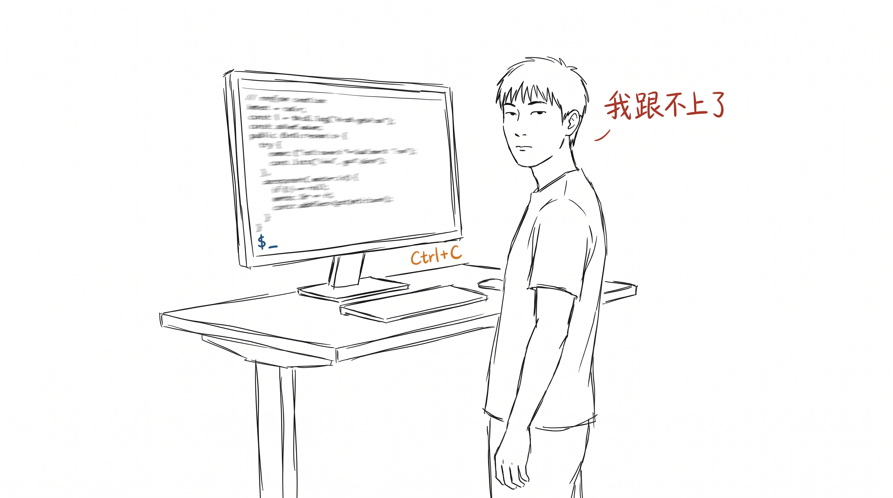
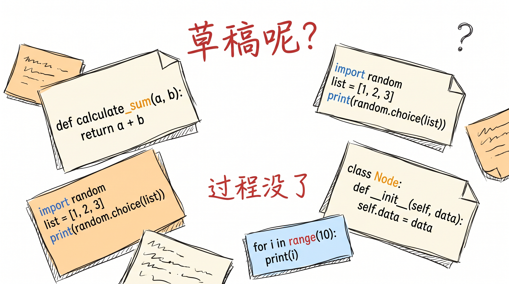
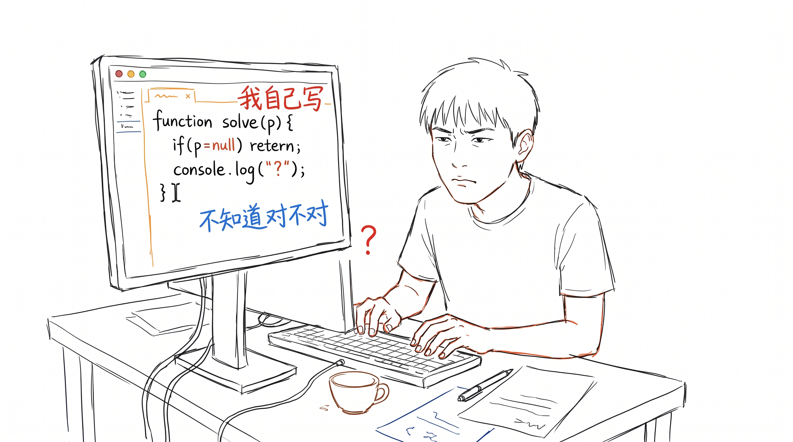
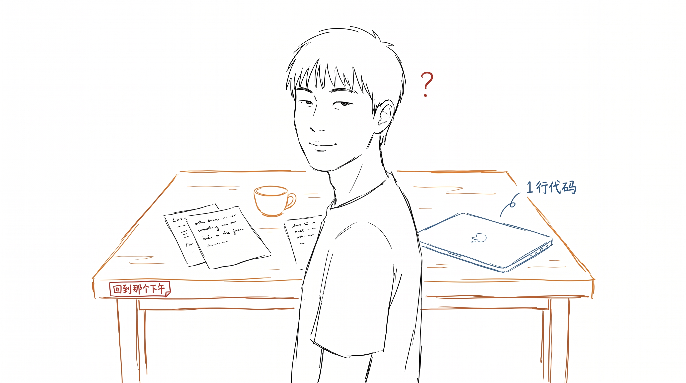

# Claude Code 用了一周, 我关掉了

一周前我开了 Claude Code Pro, 想着"反正试试, 不行就关"。

现在关了。

---

## 第三天, 我不认识自己写的代码

事情是这样的。第三天, 我打开一个自己 3 个月前写的旧项目, 准备加点小功能。

打开一看, 一个函数, 没印象。

这函数是我写的吗? 是。但名字、参数、逻辑, 我都不认得。它能跑, 测试也过。但我不认识它。

我试着读那段代码, 读到一半, 心里咯噔一下: 我跟这段代码, 没有关系了。

它没等我。我写完第一版, Claude Code 自己改了三版。最后一版干净得很, 命名规范, 边界条件都处理了。

我应该高兴才对。

---

## 不是 AI 写得不好

怪 Claude Code 没意义。它写得比 80% 的同事都干净。命名、注释、边界条件, 都比我自己写的好。

怪的是, 我应该高兴, 但我慌了。

我慌的不是"它写得不好"。是"它写完之后, 我失去了什么"。

失去的不是代码本身。代码我可以让它再写一次。

失去的是过程。写代码这件事, 我以前觉得是"为了结果"。功能跑通就完了。

但过程在。我一行一行写, 写到一半卡住, 改了 3 版, 第 3 版才跑通 —— 这一整段是"我"的。卡住的那些次、那几次想"算了, 删了重写"的瞬间, 都在。

AI 跳过这个。它直接给我第 3 版。

---

## 草稿跟作品的差别, 在这

我在开篇说过一句话: 过程比结论值钱, 草稿比作品诚实。

写完那篇我自己也没太当回事。真正理解它是这次。

草稿乱, 没改完, 但那是我"还没想清楚"的痕迹, 写下来就明白了。作品干净, 是"我想清楚了再发"的版本, 是结果, 不是过程。

AI 给我的是"跳过草稿直接交作品"。它跳过了我没想清楚的部分。

跳过的部分, 才是我需要的。

---

## 现在怎么用

Claude Code 我没删。

我只是切回了"自己写, 卡住再问"的工作流。

跟番茄钟那次一样的反推。番茄钟放在"开始专注"那个位置, 不对, 应该是"做完一件事就停"。Claude Code 放在"替你写"那个位置, 也不对, 应该是"你卡住的时候陪你卡"。

工具要是站错位, 越用越累, 不是工具变差了, 是你把它请到了不该在的位置。

一周不写代码的那种"我没在做"的感觉, 比"代码不是我写的"更让我慌。

代码我可以重写。但失去对过程的掌控, 那种空, 我不知道怎么补。

---

## 收尾

关掉 Claude Code Pro 那一秒, 有点爽。

像是回到那个下午, 自己手写一行代码, 卡了 2 小时, 第 3 版跑通。

那个下午什么都没"做出来" —— 但那才是我。

> 关掉之前, 我让 Claude Code 帮我做最后一件事: 写一段注释。
>
> 它写得很好。
>
> 嗯, 注释这种"过程" 我不需要, 工具刚刚好。
