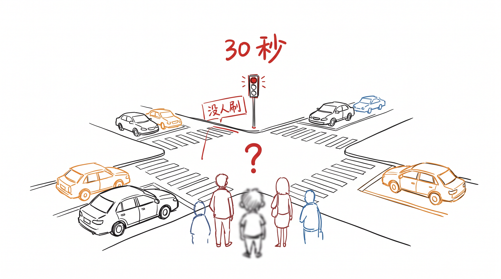
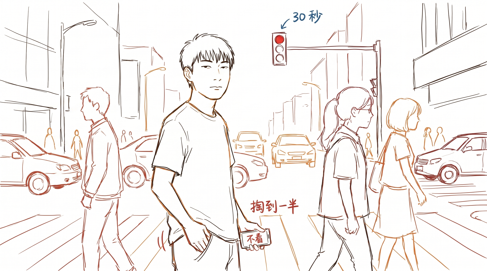
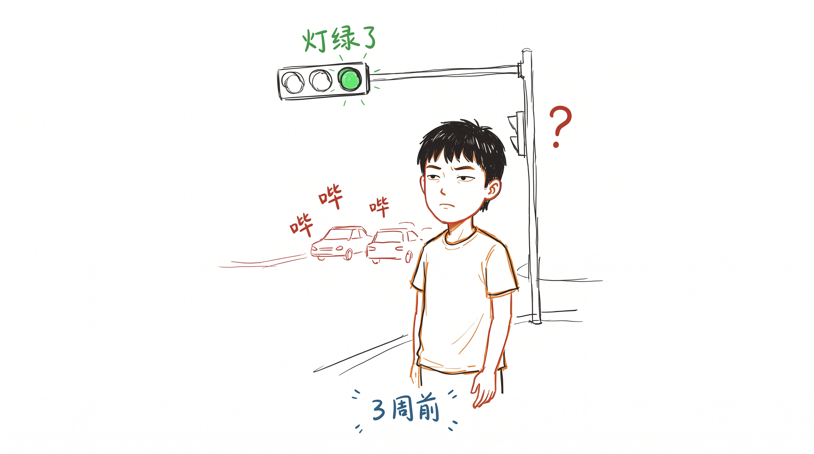
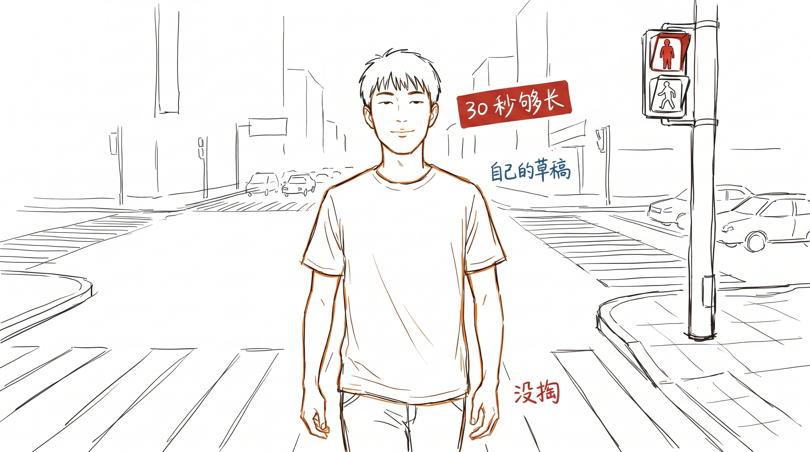

# 等红灯 30 秒, 我以为我需要信息, 其实我需要 30 秒

等红灯 30 秒, 我一直掏手机。

刷一下小红书, 30 秒过得快。微信也是, 推特也是。绿灯了, 走。

这事干了 5 年。

---

## 1 次没掏, 站在路口看 30 秒

上周一个下午, 等红灯, 掏手机掏到一半, 突然没掏。

不知道为啥, 就是不想掏。

站在路口, 看前面那辆车, 看右边的行人, 看左边的树。30 秒。绿灯了, 后面按喇叭。

我走过去的时候, 有点不爽: 我刚才那 30 秒, 到底看了什么?

---

## 30 秒里想到了一件之前没想到的小事

回去之后, 我坐在工位上回想那 30 秒, 才发现我想的不是"路口有什么"。

我想的是: 3 周前, 我给一个朋友发了一段话。他没回。

当时没在意。那段话是关于他最近的状态, 我觉得他应该会想听, 发完就过了。

30 秒里我想: 他没回, 是不是那段话真的重要? 我是不是该再问一句?

第二天我问了。他回: "你那段话, 我看了 3 遍。"

我那段话, 比那天刷到的所有信息都值钱。

但我差点永远不知道。

---

## 我以为我需要信息, 其实我需要 30 秒

回过头看, 那 30 秒里发生的事, 跟我之前 5 年掏手机的 30 秒, 完全不同。

掏手机, 我拿到的是"信息"。一条小红书, 一个邮件, 一个短视频。每一条都是别人已经想清楚的、已经写好的、已经剪好的成品。

那 30 秒发呆, 我拿到的是"过程"。3 周前发的那段话, 在脑子里重新走了一遍。

掏出手机 = 拿结论。

30 秒发呆 = 拿过程。

我以为我需要的是"信息"。其实我需要的是"30 秒"。

---

## 跟"草稿"一回事

我在开篇说过一句话: 草稿比作品诚实。

这次更明白了。

掏出手机看到的, 是别人写完的"作品"。它干净、完整、已经定稿。

30 秒发呆想到的, 是我自己"还没想清楚"的草稿。它没改完, 没整理, 很多线索没串起来。

但它是我的。

5 年掏手机, 我消费了无数别人的"作品"。上周 1 次没掏, 我才听见自己的草稿。

---

## 现在怎么等红灯

我也不打算每次都不掏。掏一下也是好的, 不掏一下也是好的。

但偶尔, 我会刻意把那只手放下来。

不掏, 不刷, 也不刻意想什么。就站 30 秒。

能想到啥, 算赚到。想不到, 就当看了 30 秒的红灯。

我以前觉得, 30 秒很短, 不刷点什么就浪费了。

现在觉得, 30 秒挺长的。够我跟自己说一句话。

---

> 上周, 那个朋友又发了一条消息。
>
> "你那段话, 我又看了一遍。"
>
> 嗯, 我那段话, 我自己都快忘了。
>
> 还好那天, 30 秒够长。
