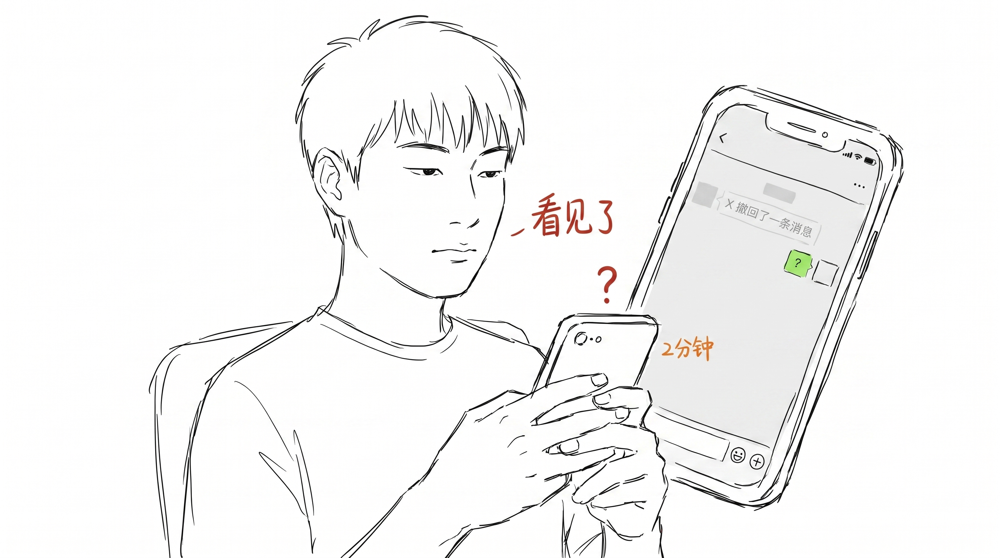
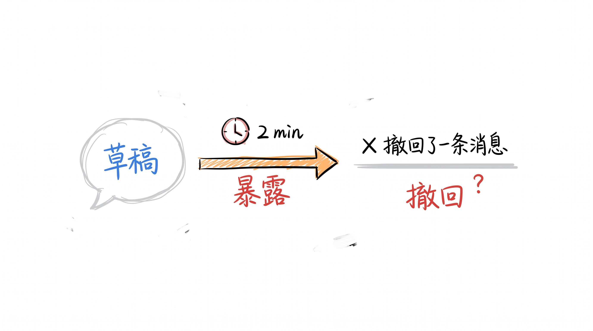
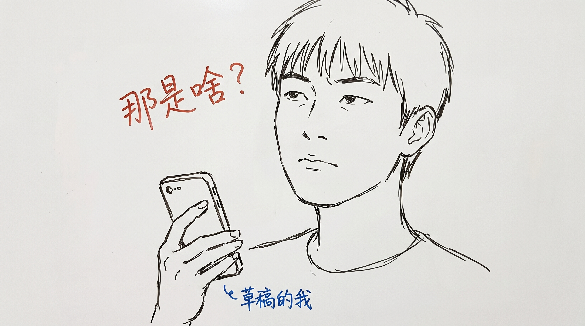

# 微信撤回消息, 撤回不是修改, 是暴露

微信撤回消息, 我做过很多次。

发了一条, 1 秒撤回, 假装没发过。

朋友看见了, 当没看见。我看见朋友看见了, 当朋友没看见。

这是我们这个时代的"社交礼仪"。

---

## 撤回的两个规则

撤回消息, 我观察了 5 年, 发现两个规则。

规则 1: 撤回只能在 2 分钟内。

规则 2: 撤回会留一条提示"X 撤回了一条消息"。

这两条加起来等于: 微信给你 2 分钟反悔, 但反悔这件事, 所有人都看见。

---

## 撤回不是修改

我以前以为撤回是"修改"。

发错了, 改一下, 重发。看起来天经地义。

后来发现不对。撤回不是修改。

修改是: 我发了草稿, 你看到了草稿, 我改成作品, 你看到了作品。这中间有一次"草稿"被看见过。

撤回是: 我发了草稿, 你没看到作品, 你只看到"我撤回了"。

你看到的不再是"我说了啥", 是"我不想让你看到我说了啥"。

撤回把"草稿"藏起来了, 但暴露了"我在意"。

---

## 把"草稿的我" 抹掉了

我在开篇写过一句话: 草稿比作品诚实。

撤回是反过来的操作: 我把"草稿"(还没想清楚)藏起来, 改"作品"(想清楚), 再发。看起来更完美。

但其实藏了"还没想清楚"的那段, 也就藏了"我那时候在想啥"。

撤回不是把草稿改成了作品, 是把"草稿"那个"我"抹掉了。

暴露的是: 我不想让你看到那个"我"。

那个"我"是发完才觉得不好意思的, 是不确定的。也是最真的。

---

## 我现在不太撤回了

我现在的撤回次数少了。

偶尔也会撤, 但 1 分钟内我先想: 我撤回, 是因为我打错字了, 还是因为那句话有点不好意思?

错字, 撤回, 改, 重发, OK。系统问题。

不好意思, 撤回, 假装没发生。这事比打错字更值得想。

"不好意思"的那句话, 往往是真话。

真话比错字值钱。

---

## 留个缝

撤回消息这个功能本身没毛病, 2 分钟内反悔是合理的。

但别忘了那条提示"X 撤回了一条消息"。

这条提示不是"暴露你说了啥", 是"暴露你撤回"。

撤回这件事, 跟草稿一样, **留个缝**比较好。

缝在哪? 在那条提示上。对方看见"你撤回了", 但不知道你撤回了啥。这就是缝。

这个缝, 让你那个"草稿的我" 还活着。

也让别人知道: 你刚才有话要说, 现在改主意了。

这两件事, 比"假装没发" 更诚实。

---

> 上周有个人跟我说"我撤回了一条消息, 但我想你看见"。
>
> 我看见了。
>
> 嗯, 这条消息, 我没撤回。
