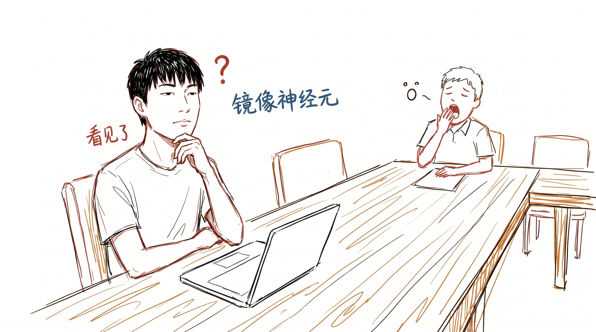
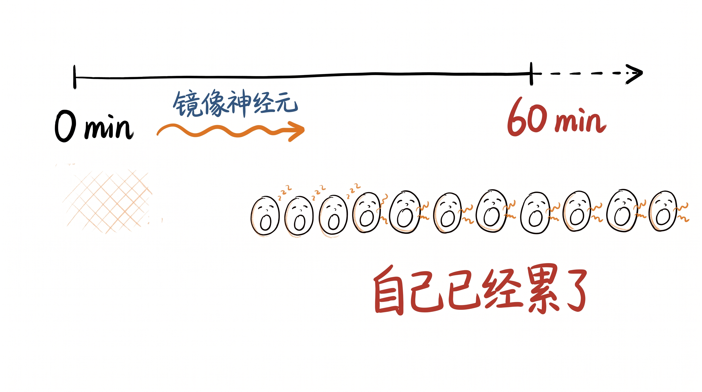
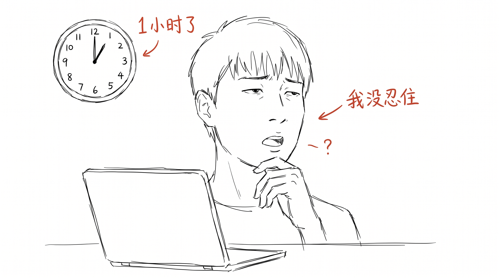

# 开会打哈欠传染, 其实是厌倦传染

开会时, 1 个人打哈欠, 5 分钟内, 整桌 11 个人都打。

哈欠传染是生理反应, 跟打喷嚏传染一样, 科学家说是因为镜像神经元。

但我发现, 在会议室里, 哈欠传染不是镜像神经元。

是厌倦传染。

---

## 哈欠传染的物理机制

哈欠传染的物理机制很早就有研究。

看到别人打哈欠, 大脑里的镜像神经元会激活, 自己也跟着打。这套机制跟笑传染、哭传染、打哈欠传染都是同一套。

物理机制上, 跟"在场的人" 没关, 跟"那个人" 有关系。看到谁, 谁传染。

---

## 但会议上的哈欠不一样

但我在会议上看哈欠传染, 发现一个现象。

大家开会开到 1 小时的时候, 有人打第一个哈欠。5 分钟内, 11 个人都打。

大家开会开到 10 分钟的时候, 没人打。1 小时后, 整桌都打。

镜像神经元不需要"等 1 小时" 才激活。它秒级就触发。

那这 1 小时里, 11 个人身体里慢慢涨起来的是啥?

不是"被传染", 是"自己已经累了", 别人打的哈欠只是把"已经累" 的盖子掀开了。

---

## 哈欠是结论, 厌倦是过程

我想, 哈欠是"结论", 厌倦是"过程"。

哈欠是"我累了" 的结论。嘴巴张开, 吸一大口气, 全身松一下。这个动作是终点, 是结论。

厌倦是"我累了" 的过程。心里一点点失去注意力, 眼神涣散, 几次看手表, 想关手机, 想说"我先去个厕所"。这个过程是过程。

哈欠传染传染的不是"哈欠", 是"厌倦"。

那个打第一个哈欠的人, 不是传染, 是提醒大家: "你已经厌倦了 50 分钟, 离结束还有 30 分钟。"

大家跟着打的哈欠, 不是镜像神经元, 是"原来你也厌倦了"。

---

## 我现在开会不再忍哈欠

我现在开会, 自己也打哈欠的时候, 不忍。

忍哈欠有个坏处: 它会让人憋气。憋气让脑子供氧不足, 让人更累。

真正的麻烦是: 忍哈欠是在告诉自己"我不累, 我可以继续"。但你已经累了。累就该承认。

哈欠是"我累了" 的诚实表达。忍着不发, 是在改结论, 不让过程出现。

跟 005 撤回消息是反的。撤回是改"草稿" 为"作品", 忍着打哈欠是改"厌倦" 为"我还行"。都没改成功, 只是把过程藏起来。

哈欠是"过程 > 结论" 在身体上的诚实表达。打出来比憋住更准。

---

## 提醒我们的不是镜像神经元

上周开会, 我打了第一个哈欠。

5 分钟内, 整桌都打。

这次我没忍住, 但我注意到了。

那个提醒大家"你也累了" 的, 不是镜像神经元, 是会议本身。会议本身让我们累, 哈欠只是把这件事摆到桌面上。

会议散场后, 大家走出会议室, 没人打哈欠。空气新鲜一点, 大家精神回来一点。

会议室里 1 小时累计的厌倦, 哈欠替我们记账。

下一次开会打到哈欠的时候, 看看表, 看看会议室温度, 看看议程清单。

也许会想: 这次, 是会议太长了, 还是我太累了?

> 上周那个哈欠之后, 我跟同事说"1 小时了, 我们已经累了吧"。
>
> 大家都愣了一下, 然后笑了。
>
> 嗯, 哈欠替我们承认了。
