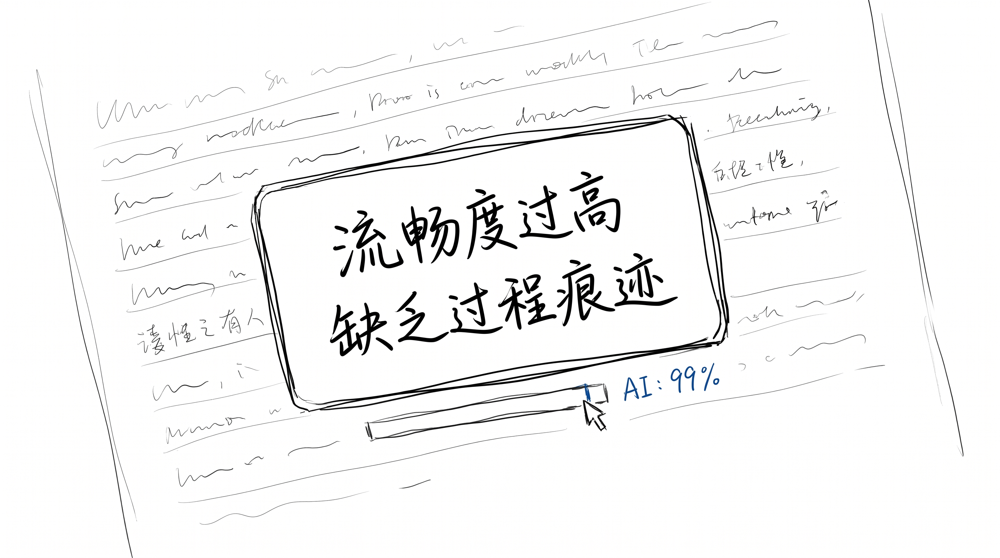

# AI 味儿被识别, 是因为跳过了草稿

7 月 15 日, 一条新规生效 — 《拟人化 AI 交互服务管理办法》。

朋友圈热闹了一周, 大部分人在讲"AI 终于要被管了"。

但没人讲清楚一件事:

**它管的不是 AI, 是过程。**

---

## 我让 AI 写了一篇

上周, 我让 AI 写一篇文章。

题目是"为什么今年暑假比去年热"。

AI 用了 12 秒, 给我 800 字, 排版工整, 引用了 3 份数据, 最后还留了一句"以上数据来源网络, 仅供参考"。

我读了一遍, 觉得挺好。

然后我把它粘到某平台, 想看看反馈。

---

## 1 秒钟判"AI 生成"

结果: 1 秒钟后, 系统弹窗:

**"本文疑似 AI 生成, 已限流。"**

我截图发给一个朋友, 他笑了 — "这都看不出来? 一眼 AI"。

但我回看那 800 字, 文字没问题, 数据也准, 排版规整。

**到底哪里像 AI?**

---

## 不是文字, 是太"顺"

我又试了 3 次, 每次让 AI 用不同口吻重写 — 一次"鲁迅风", 一次"罗翔风", 一次"小红书风"。

每次都被识别。

但系统弹出的原因不是"用词"也不是"句式"。

是 **"流畅度过高, 缺乏过程痕迹"**。

我这才反应过来:

**AI 写的东西, 太顺了。**

真人写东西, 会卡, 会绕, 会突然跑题。

**这些"卡"和"绕", 就是草稿。**

---

## 真人的草稿长这样

我翻了一下自己电脑里 3 年前的草稿。

发现一件事 — 真正被我留下没删的, 都是"不顺"的。

> 今天本来想写 X, 但写着写着, 想到 Y, 然后又绕到 Z, 最后回到 X。

> 这一段删了两次, 第二遍比第一遍差, 第三遍更差, 留第四遍。

> (这里本来想举一个例子, 但想了 20 分钟, 算了)

这些都不是"作品"。

**是过程。**

而 AI 写的东西, 没有"第四遍", 没有"想了 20 分钟算了", 没有"删了两次"。

它给你的是"已经是终稿的东西", 假装是"草稿"。

**这是"作品", 不是"草稿"。**

---

## 监管不是反 AI, 是反"跳过"

新规里有一条很关键:

> 拟人化 AI 生成的合成内容, 应当以显著方式标识, 或保留可追溯的创作过程记录。

注意, 它没说"禁止 AI"。

它说的是"**保留过程记录**"。

就像会计师事务所审计, 不是禁止用计算器, 是让你**留底稿**。

AI 写的稿子也可以用, 但你得让审稿的人看得到:

- 你改过几遍
- 哪些是你写的, 哪些是 AI 写的
- 哪些是直接抄的, 哪些是改写的

**这些"底稿", 才是 AI 味的解药。**

---

## 草稿 > 作品

我后来又用 AI 写了一遍, 但这次我让 AI 先写"草稿版", 写得不顺一点, 有几个错别字, 中间穿插"这里我先想想"。

然后我拿到这个"草稿版", 接着改, 加了我自己卡的地方、绕的地方、改了三遍还在改的地方。

最后, 检测器没报。

我读了一遍, 觉得也好。

**那篇文章, 反而是我自己写过的、最像"我"的。**

> AI 不是问题, 跳过草稿是。
>
> 检测器识别的不是"AI", 是"过程没了"。
>
> 草稿 > 作品。这句话, 不是我说的, 是我自己写出来的。
