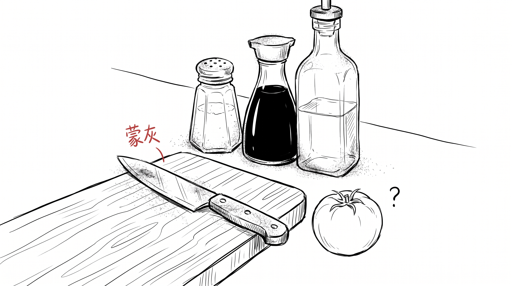
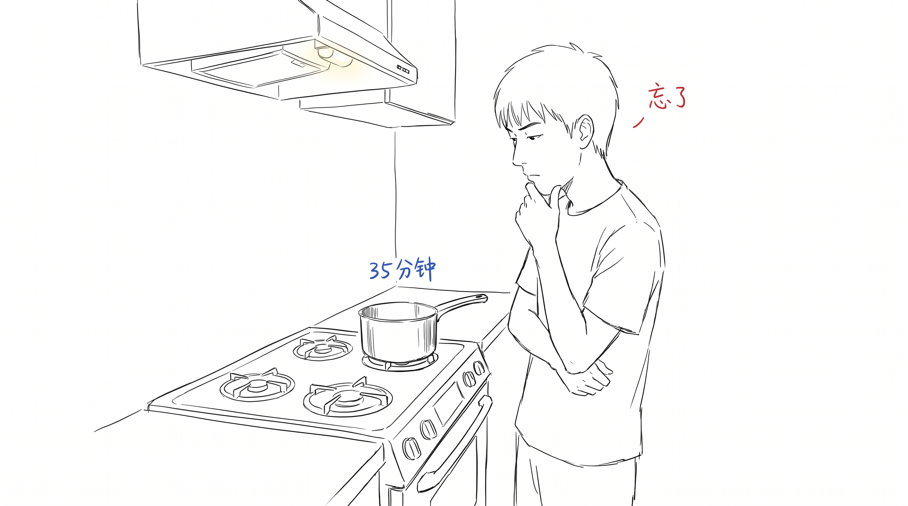

# 做饭这件事消失了

7 月底, 一条新闻 — 幽灵外卖被罚了 35.97 亿。

朋友圈都在讲"怎么识别真店假店"、"以后点外卖前要查一查"。

但没人讲另一件事:

**我已经 30 天没开过火了。**

---

## 5 分钟下单

昨晚, 我打开外卖 app, 搜"小炒肉"。

15 家店, 5 家月销过万, 1 家上了必吃榜。

我点开第一家, 选"中辣 + 米饭", 备注"少油", 5 分钟下单。

15 分钟后, 饭到了。

我跟往常一样吃, 一样扔盒子, 一样没洗碗。

---

## 30 天没开火

睡前, 我突然反应过来 —

**我 30 天没开过火了。**

不是 30 天没做饭。

是 30 天没打开过厨房的灶。

我算了一下:

- 上一次用菜刀, 是 5 月中旬, 切了半个西瓜
- 上一次开灶, 是 4 月底, 煮了一袋速冻饺子
- 上一次真正"做"一道菜, 是 3 月, 炒了一盘西红柿鸡蛋

**整整 4 个月。**

---

## 不是没时间

我不是说没时间做饭。

我这 4 个月, 周末都很空, 工作日偶尔也 7 点就下班了。

但我没做饭。

**不是因为没时间, 是因为忘了怎么做。**

不是忘了菜谱, 是忘了"做饭这件事本身"。

---

## 试一次

我上周末, 突然想做一次饭。

去超市, 买了西红柿、鸡蛋、小葱、一瓶生抽。

回家, 站在厨房。

打开冰箱, 把西红柿拿出来, 洗干净。

切。

**我不知道怎么切。**

不是不会, 是 4 个月没切, 手忘了。

切出来的形状像被砸过。

然后打蛋。3 个鸡蛋打碗里, 我不知道加不加水。我妈以前加, 我看过几次, 但**没记下来**。

开火, 倒油。

油冒烟了, 我才反应过来 — 锅还没热够。

整盘菜, 我从切到装盘用了 35 分钟, 炒出来的东西,我夹了一口, 觉得**还不如外卖**。

---

## 厨房的草稿本丢了

晚上我坐在客厅, 突然想明白一件事:

做饭这件事, 是有"草稿"的。

- 第一次切菜, 切得很慢, 还会切到手
- 第一次炒菜, 油会溅出来, 还会糊
- 第一次调味, 不知道放多少, 要反复试

**这些"翻车", 就是做饭的"草稿"。**

而我最近 4 个月, 全是外卖, 没有翻车, 也没有草稿。

**没草稿, 也就没进步。**

下次再做, 又是从零开始。

---

## 过程 > 结论

外卖不便宜, 一顿小炒肉 28 块, 自己买食材 10 块。

但外卖不是问题, 外卖是**结论**。

而做饭, 是**过程**。

我们 30 天没开火, 不是因为外卖方便, 是因为我们**丢掉了做这个"过程"的能力**。

> 饭不重要, 做饭重要。
>
> 切菜不重要, 切到手重要。
>
> 菜做得好不好不重要, 你愿不愿意试一次重要。
