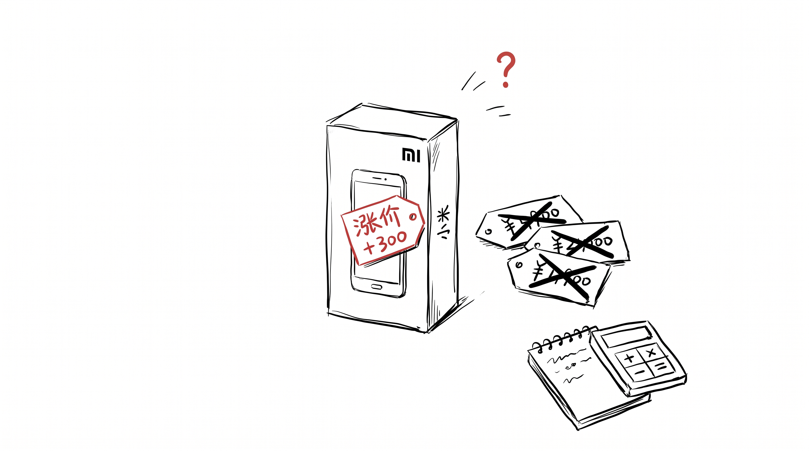

8 月 2 号那天, 我在群里看到一张图。

小米 17 Pro Max, 5999 涨到 6499。REDMI K90 Pro Max, 4199 涨到 4499。

群里 7 个人, 5 个在骂。

骂完, 安静了一会儿。

老 A 先说: "那换 K80 吧, 老款便宜。" 老 B 说: "我那手机还能再战一年。" 老 C 没说话, 发了张泡面图。

我没接话。我在想另一件事。

涨价 300 块, 群里每个人的第一反应, 都不一样。

---

老 A 砍的是"新款"。他想买的是"小米"这个牌子, 不是 K90 这一台。换个旧款, 牌子还在, 钱省了。

老 B 砍的是"现在买"。他的反应不是换便宜的, 是"那就不换了"。他不急, 换不换都行。

老 C 没砍任何东西, 发了张泡面图。我懂他意思 —— 反正手机再涨也不会涨到泡面, 吃得起饭就还好。

我呢, 我第一反应是翻了一下自己的手机壳。算一下, 这壳用了 3 年, 屏幕保护膜是 2 年前的, 充电线是朋友送的。

发现, 我好像没想砍哪一项。

---

然后我突然意识到, 我不是那种"涨价就砍"的人。

我是那种"涨价了, 才发现, 哦, 我之前也没在攒什么"的人。

不存钱, 不囤货, 不用"年度计划"。手机到了换手机, 不会提前一年攒, 也不会因为涨价 300 块改变计划。

那天看群里大家砍来砍去, 我才反应过来, 别人是有"砍"的本钱的。

得先有那个"想买", 才能砍。

我没那个"想买"。

---

老 D 晚上回来, 在群里又发了一句: "还是买吧, 毕竟 6 年没换过手机了。"

老 E 立刻反驳: "6 年不换, 涨 300 你就换?"

D 没回。

我看着这对话, 想起我前两天扔掉的那双拖鞋。

也是用了 6 年。鞋底裂了, 我才扔。

不是舍不得买新的, 是真没想到要换。

---

涨价 300 块, 砍的都是已经"想"了很久的事。

没"想"过的, 涨价了, 也还是没"想"。

至于这是"理性"还是"麻木", 我也说不清。

反正我那壳, 还能再用一年。
