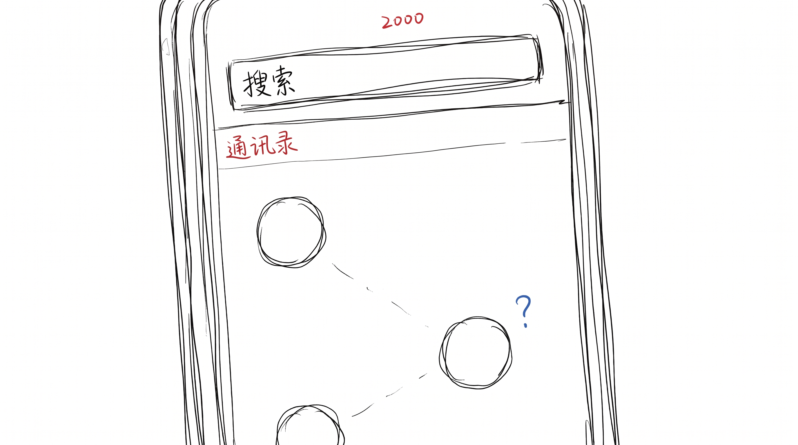
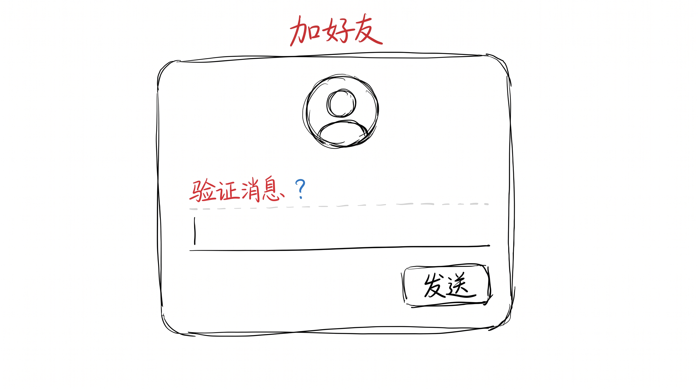
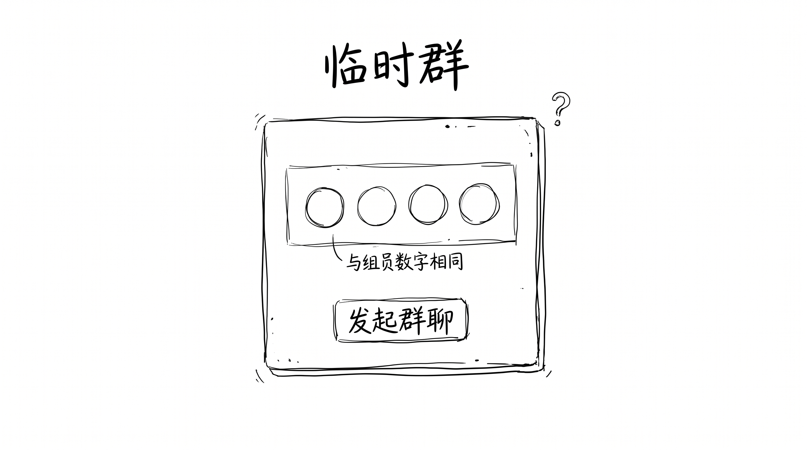
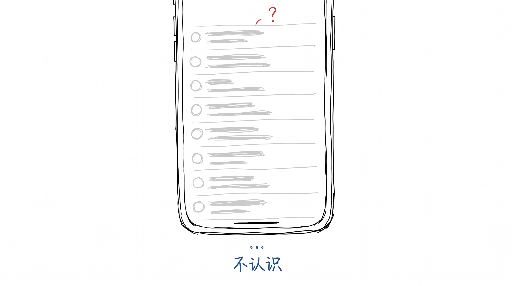

# 微信说不用加好友, 我想加的不是好友

朋友圈昨天转了微信派那篇"临时好友" 的回应。

意思就一句: 好友位很宝贵, 有些事不用加好友也能办, 传个文件, 转个账, 建个临时群, 完事。

## 早上顺手翻了下自己通讯录

我本来没当这事, 早上刷牙的时候顺手翻了下, 2000 多人。

找了一圈, 半年内聊过天的, 30 个。

30 / 2000, 1.5%。

我加了 2000 个好友, 其中 1970 个, 我都没在跟谁说话。那 1970 个是谁, 我想了下, 同学、同事、前同事、相亲没成的对象、买咖啡加的店老板、扫码送的、某次活动加的, 都凑一块了。

但 2000 这个数字, 我记得很清楚。

## 好友位在我这不是"关系", 是"数字"

加满 2000, 我就开心了, 跟实际是不是真朋友没关系。就像集邮, 集满一整本就行, 信里写了什么不重要。

那微信说"好友位宝贵", 这话对吗。

对。

但只对了一半。

好友位确实宝贵 —— 宝贵在它让我觉得"被记住"。加了好友, 哪怕不说话, 也是"我跟你有点关系" 的意思。不加好友, 我跟你就是个"陌生人", 哪怕天天见。

"加了好友" 在我这里不是结束, 是开始。

## 但问题是, 加了 5 年没说话, 算"开始"吗

我不知道。

我只知道我加的不是好友, 是"我没被扔下" 的感觉。这个感觉, 跟"加好友" 关系不大。加好友只是当时能想到的, 唯一一种"我跟 ta 还有点联系" 的证据。

现在微信教了我, 不加好友也能传文件转账建群。但"我没被扔下" 这个事, 微信没教怎么解决。

## 嗯

反正我以后, 加好友前会多想一下, 我加的到底是 ta, 还是"我怕被扔下"。
