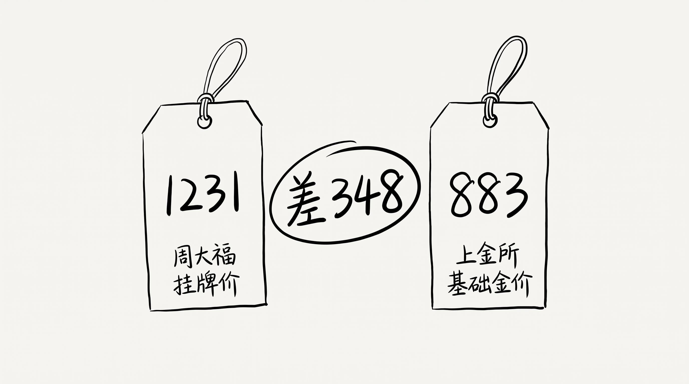
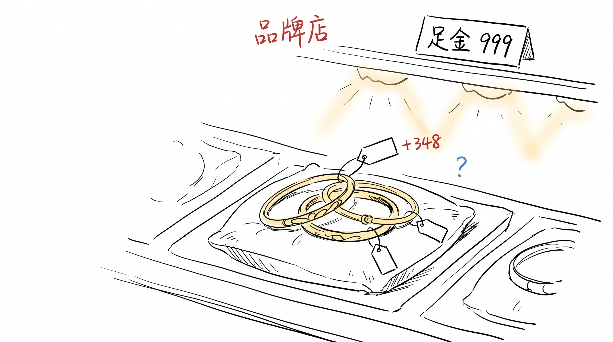

# 同一克黄金, 隔一个柜台身价差 345 块

朋友圈今天转了"黄金一夜变天"。

我看了一下。

8 月 5 日, 上海黄金交易所基础金价 883, 某品牌挂牌 1231, 另一家 1228, 第三家 1205。

银行投资金条 902, 深圳水贝批发 1055, 足金回收 868。

## 同一克, 三个价

差出来的, 不是"金", 是"加价"。

品牌店的"加价" 含工费, 银行金条也含溢价, 水贝便宜是省了"中间环节"。这些常识我都知道。

知道归知道, 看到 1231 这个数字的时候, 我还是愣了一下。

我在 1200 多买过一只镯子, 当时觉得"反正金不会跌"。

现在回头看, 我 1200 多买的"金", 实际基础金价大概 870。

差的那 300 多, 我买的不是金。

是"我以为自己在买金"。

## 我以为我买的是金

之前 009 涨价那个手机壳, 用了 3 年, 我不知道壳值多少钱, 只知道"这是我手机壳"。

金也一样。

我去金店, 看到标签 1231, 我心里"哦", 然后就买了。

我不知道 1231 是 883 + 348, 我只知道"这是金店的金"。

我付的不是金价, 是"我信这个牌子" 的钱。

## 363 块的幻觉

品牌店 1231 - 基础金价 883 = 348。

回收 868 - 基础金价 883 = -15。

一买一卖, 同一克黄金, 我"亏" 363 块。

不是金价跌了。

是我从来就没买过金。

那 363 块, 我买的是"我以为自己在买金" 的幻觉。

那个幻觉, 某品牌卖 348, 另一家卖 345, 第三家卖 322。

各家报价不一样, 跟真金没关系。

## 嗯

下次我买金, 我会多看一眼, 我买的是"金" 还是"加价"。

大概率还是分不清。
