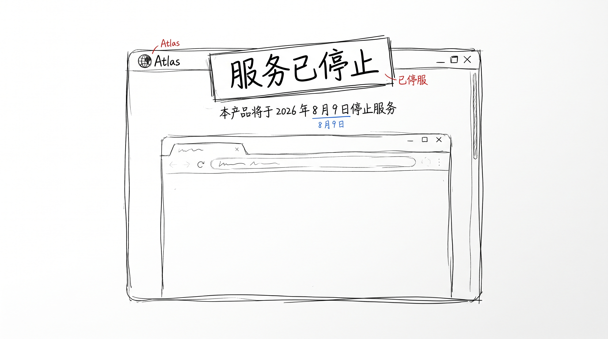
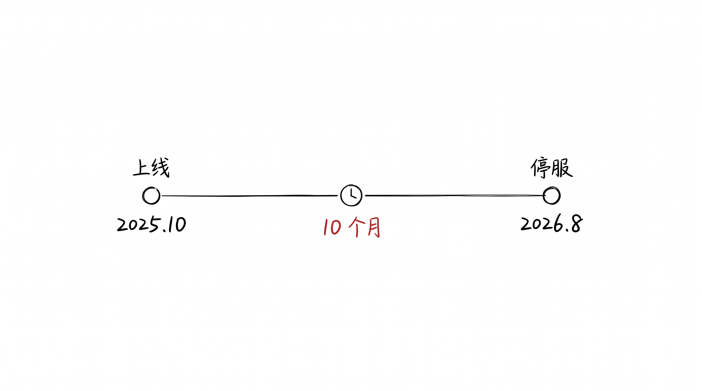

# ChatGPT Atlas 浏览器, 寿命 10 个月

昨天 OpenAI 公告, ChatGPT Atlas 浏览器 8 月 9 日停服。

去年 10 月才上, 寿命不到 10 个月。

OpenAI 第一款浏览器, 就这样没了。

## 10 个月, 没了

之前 003 我关掉了 Claude Code, 关了一周。

那次是我自己关的, 用了一周觉得没必要, 关了。

这次是 OpenAI 自己关的, 主动停服。

工具, 就这么回事。

"AI 改变了世界" 那种大词我信, "AI 工具能活下去" 那种小词我不太信。

10 个月, 一款浏览器, 没了。

之前 Atlas 上线的时候, 我下过一次。

下了打开, 用了一会, 关了。

## 工具的命, 大多这样

"上线 - 转型 - 停服", 工具的三段式。

AI 圈每天上一款, 每周死一款, 比动物世界还快。

去年那批 AI 搜索、AI 浏览器、AI 助手, 今年一查, 没几个还在。

"在用" 跟"在生" 是两回事。

技术好不好是一回事, 有人用是另一回事。

我去年也用过 Atlas, 那次打开觉得"还行", 但没什么动力换成它替代 Chrome。

没动力, 工具就死了。

## 嗯

Atlas, RIP。

下次再有新工具出来, 我会想一下"我真会用吗"。

大概率还是装一下, 用几天, 删了。
