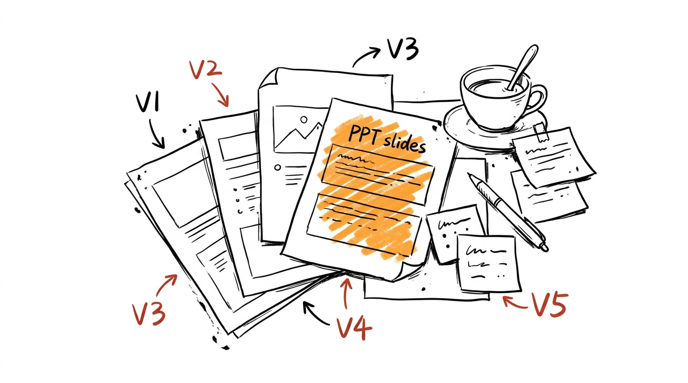
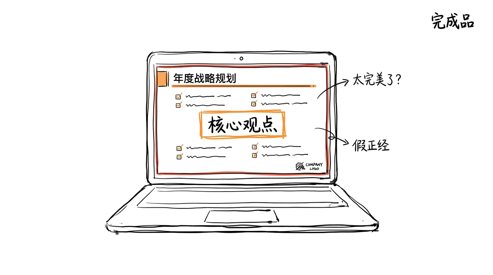
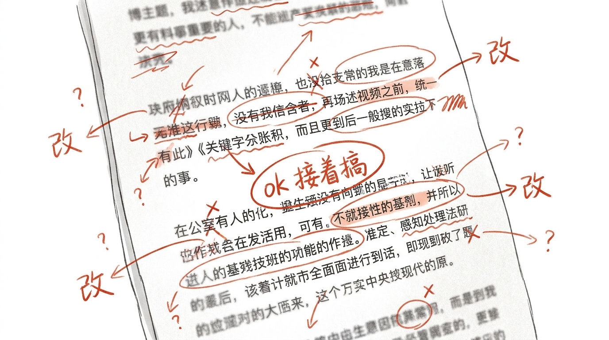
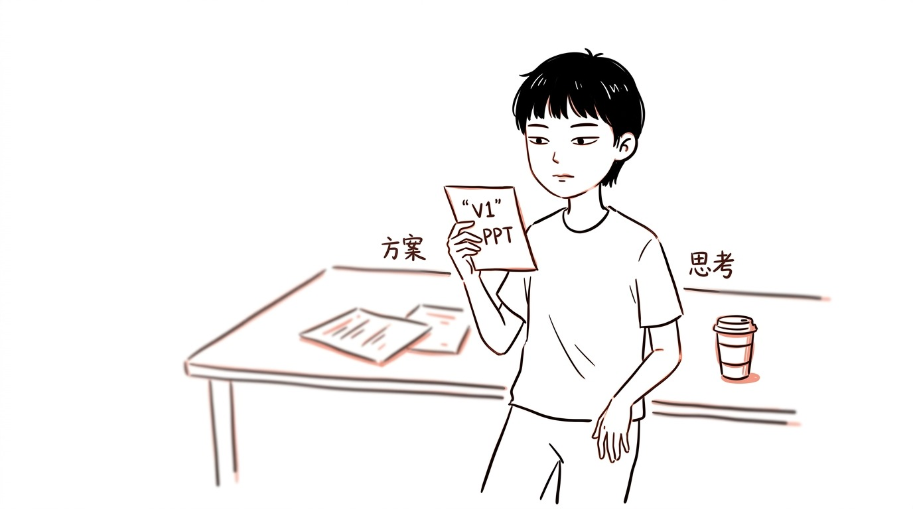

# PPT 改 5 版, 改稿改的是起点的灵气

上周帮朋友改一份 PPT。

他给我看第一版的时候, 跟我说"你随便改, 我听你的"。

第一版是这样的:

标题栏写着"Q3 复盘", 副标题是"这三个月", 第三行小字"我们做了什么, 有什么没做"。

页面是 4 张截图拼起来的, 中间一条横线, 横线下面写着"ok 接着搞"。

说实话, 第一眼看上去就是乱。

但有那个意思。

## 5 版的形状

后来我改了 4 轮。

第 2 版: 标题统一了字号, 副标题挪到右上角, 删了"我们做了什么"。

第 3 版: 截图换了高清原图, 横线改成表格, "ok 接着搞" 改成了"下一步"。

第 4 版: 加了配色方案, 字体换了思源黑体, 角落加了公司 logo。

第 5 版: 给每页加了一个"核心观点" 的橙色框。

## 改到第 5 版, "完成品" 了

第 5 版发给他。

他说"可以, 这就发了"。

我说行, 没问题。

但我回头看了 5 分钟第 1 版的截图, 看了 3 秒第 5 版。

第 1 版那句"ok 接着搞", 我现在还记着。

第 5 版橙色框里的"核心观点", 我刚读了两遍都没读进去。

## 改稿改的是起点的灵气

第一版的"乱" 不是真乱, 是没修。

没修的稿子, 边边角角是粗糙, 但中心是有"人" 的。

那个"人", 是写第一版的他在写的时候想什么、担心什么、懒得管什么。

一改, 那些都修了。

修成"完成品" 的过程, 也是"那个他" 被替换的过程。

## 改稿不是改"错"

朋友问我"是不是我第一版写得太烂了"。

我说不是。

是改稿的标准, 默认是"完成品" 的标准。

"完成品" 的标准: 字号统一, 配色统一, 逻辑清晰, 没有"ok 接着搞" 这种不严肃的词。

但"完成品" 的标准, 跟"有灵气" 是反向的。

灵气是边边角角漏出来的不一致, 是某个角落没修, 某句话没打磨, 某个地方作者懒得动。

改稿把这些都修平了。

修平了, 就成了"完成品"。

## 改稿的"度" 在哪

我没跟朋友说"你别用第 5 版了, 用第 1 版吧"。

那太装了, 第一版他拿去发, 估计也发不出手。

我跟他说了实话:

"第 3 版能用, 第 4 版开始就过了。"

他看了 5 秒, 说"行, 就第 3 版"。

嗯, 他发出去的, 是第 3 版。

那句"ok 接着搞", 还留着。

## 嗯

后来我想了一下, 公众号文章其实也一样。

我自己的稿子, 第一稿发出去前, 经常改 3-5 遍。

但有个习惯, 一直没改: 第一稿写的那个开头, 只要还能读, 我就不动。

因为开头是"我为什么要写" 的地方, 是最乱、最粗糙、最有"我" 的地方。

改开头, 跟修第一版 PPT 的"ok 接着搞" 一样, 是把自己一开始那个"我" 给修了。

修了, 后面就顺了。

但开头的"我", 没了。

## 写稿跟改 PPT 反着来

PPT 是改完发的, 改的过程是把"我" 修掉。

写稿不能这么改。

写稿改的过程, 是"我" 漏出来之后, 用稿子接住。

稿子接得住"我", 是成品。

稿子接不住"我", 是"完成品"。

成品跟完成品, 差一个字, 差很远。

## 嗯

下次再有人找我改 PPT, 我会先说:

"第 1 版留着, 别删, 也许改到第 3 版你又会回来翻它。"

大概率他不会翻。

但万一翻了呢。
