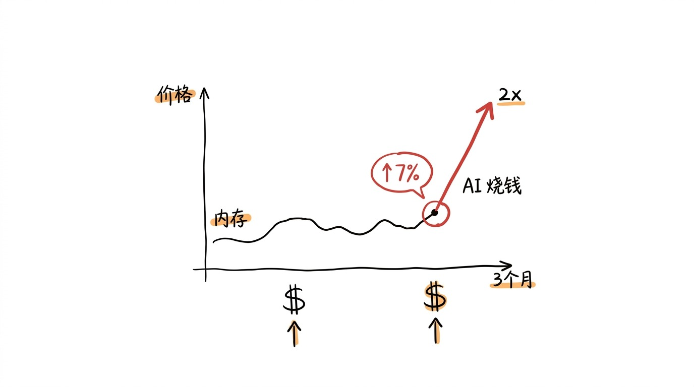
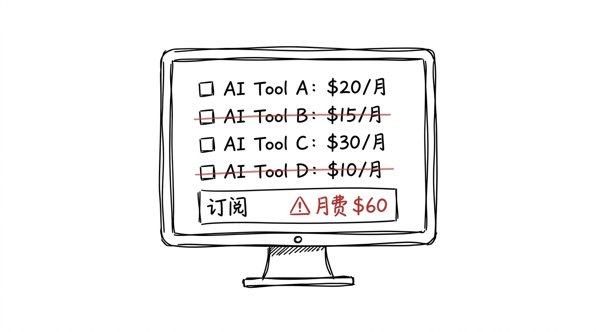

# AI 烧钱, 内存涨价, 工具越来越贵

昨天看到两条新闻, 拼在一起, 有点意思。

第一条: 内存现货价再涨 7%, 跟去年同期比, 涨了快 2 倍。

第二条: 上半年国内 AI 行业融了 935 亿, 比去年同期多了 137%。

## 这两条是同一条

内存为什么涨, 因为 AI 公司在抢。

AI 公司抢内存干什么, 因为他们要把模型跑起来, 跑起来才有用户, 有用户才能继续融钱。

融了钱继续烧, 烧了继续抢内存, 内存继续涨。

这条链, 从 2024 年开始就在转。

我是用户, 也在链上。

## 用户的账单

AI 公司烧钱, 跟我们用户有什么关系?

我自己的话, 去年 12 月开始, 订阅的 AI 工具有 4 个。

到今年 7 月, 我砍到 2 个, 一个 20 美金/月, 一个 0。

砍掉的那 2 个, 一个是因为新版涨价, 一个是因为我后来不咋用了。

留下来的那个, 我也在想: 是不是也用得太多?

用得多, 公司就继续烧, 烧完继续涨, 涨完我还是付。

或者不用, 但活儿没人接。

## 工具越来越贵, 是"变好了" 还是"卷完了"

之前 012 Atlas 停服那篇我说过, 工具命短。

但命短跟贵不贵是两回事。

命短: 工具的命。

贵不贵: 工具的命以外, 它的成本结构。

命短的工具有两种:

一种是"不值钱" 的短命, 真的没人用, 所以死了。这种便宜。

一种是"值钱" 的短命, 死之前用的人不少, 死了大家还怀念。这种也便宜, 因为它成本结构没摊到用户身上。

但还有一种, 不太短命, 但一直贵, 而且越来越贵。

这种是"卷完了" 还没卷赢的。

它要继续融, 要继续烧, 要继续涨内存价, 但用户涨不动了。

涨不动, 它可能死, 也可能"找新钱"。

## 找新钱, 是找用户

找新钱, 大头是用户。

用户怎么找, 加功能, 加订阅, 加套餐, 加"专业版"。

加到用户分不清免费版和付费版的区别。

加到用户最后用"专业版" 是因为默认跳过去的。

## 工具便宜的时候, 是它"刚生" 的时候

我现在用的那个 20 美金的, 2024 年的时候是 10 美金。

2024 年, 它刚生, 想拉用户, 所以便宜。

2025 年, 它融了 A 轮, 涨到 15 美金。

2026 年, 它融了 B 轮, 涨到 20 美金。

后面还有 C 轮, 大概率继续涨。

工具便宜, 是它"还没卷完"。

工具贵, 是它"正在卷"。

工具卷完, 大概率是死。

## 嗯

我以后用工具之前, 会多问一句:

"这工具, 是刚生的, 还在卷, 还是已经卷完了, 准备找我接盘?"

刚生的工具, 便宜, 但不知道能不能活。

正在卷的工具, 贵, 但大概率能用。

卷完的工具, 更贵, 但也快死了。

三个状态, 我都经历过。

最舒服的, 是"正在卷" 的, 大概率能用, 价格也还在我能接受。

最不舒服的, 是"卷完准备接盘" 的, 订阅弹窗每天跳。

## 嗯

工具, 跟手机一样, 是"现在还能用" 的东西。

不是"能一直用" 的东西。

能一直用的, 也就锤子螺丝刀这种。

锤子涨价, 是钢价涨了。

工具涨价, 是烧钱的人, 终于找到我了。
