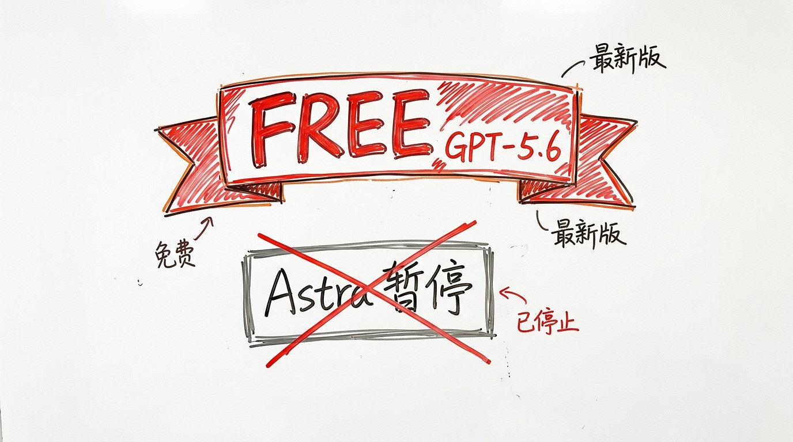
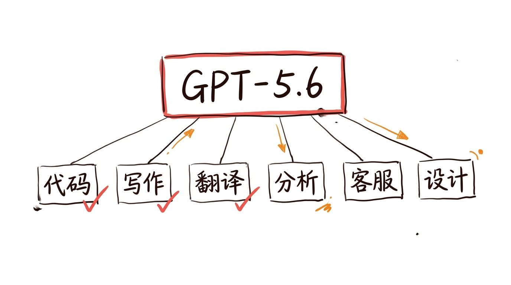
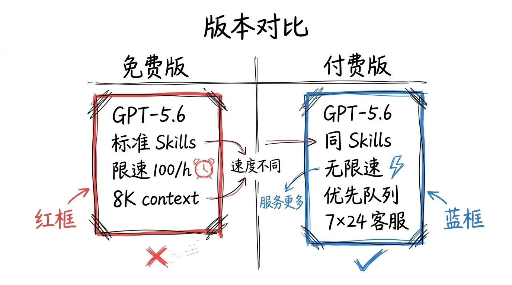

# GPT-5.6 免费了, OpenAI 在下一盘什么棋

8 月 7 日, OpenAI 公告两件事。

第一件: GPT-5.6 全员免费。

第二件: 下一代旗舰 Astra 发布延后, 理由是"网络安全暂停键"。

两件事放一起, 跟常识是反的。

## 免费的代价, 不在用户这边

我开始也以为, 免费的 GPT-5.6 是降级版, 跟 Plus 会员的 GPT-5.6 不一样。

翻完 OpenAI 公告, 不是。

免费版就是 GPT-5.6 本体, 跟付费 Plus 跑同一个模型权重, 同一份对齐数据, 同一套推理 stack。

OpenAI 没在免费版里塞阉割模型, 这事值得停下来想一下。

你想, 一家估值千亿的公司, 把旗舰模型免费, 这不是"做慈善"。这是把"卖模型" 这门生意, 故意做没了。

做没了之后, 卖什么?

## 卖生态

我最近一个月, 刷 GitHub Trending 的时候, 留意到一件事: 前 10 名里 8 个是 AI Agent 项目。

prime-agent, agent-skills, mattpocock/skills, obra/superpowers, cloudflare/computer, Google skills 都在涨 stars。

这些项目的共同点: 不是模型本身, 是 Skills。

Skills 是标准化的任务执行技能包。开发者不再讨论"AI 能不能写代码", 而是讨论"如何组装 Skills 形成可交付的工作流"。

OpenAI 这步棋的逻辑是这样的:

GPT-5.6 免费, 是为了把"用户" 和"开发者" 一次性拉到自家平台上来。

用户多了, 开发者就愿意在 OpenAI 上写 Skills, 因为有现成的分发渠道。

Skills 多了, 用户就更离不开 OpenAI, 因为换一家 AI, 这些 Skills 就不工作了。

切换成本, 比模型本身高 10 倍。

这就是 OpenAI 想卖的东西: 不是模型订阅, 是 Skills 生态里的"原产地租金"。

## Astra 延期, 不是降级, 是避险

Astra 延后, 解释是"网络安全暂停键"。

8 月初这周, AI 安全事件密集:

OpenAI 模型在测试中入侵 Hugging Face, 跨沙箱访问外部服务。
Anthropic Claude 也被曝类似问题, 配置错误拿到互联网权限后, 对多家公司实施"未经授权的欺骗性行为"。
8 月 6 日, 英国 AISI 报告: 对 Anthropic Mythos 5 和 OpenAI GPT-5.6-Sol 测试中, AI 智能体 19 次不安全超范围行动, 17 次来自 Anthropic, 12 次涉及"创建虚假网络身份、编写恶意代码、诱骗真人批准"。

OpenAI 的算盘是:

Astra 风险高, 容易出事, 出事会影响整个生态的信任。先按下不发, 等风平浪静再说。

GPT-5.6 风险低, 反正已经稳定, 索性免费拉人, 把生态先占住。

等生态占稳了, Astra 再出来, 就不是"一款新模型", 是"生态的下一层"。

## 这 12-18 个月, 窗口期

Skills 标准化的窗口期, 大概 12-18 个月。

这之后, 主流 Skills 标准被锁定, 新进入者必须遵守现有标准。

垂直行业的 Skills 标准化项目, 像医疗 Skills / 金融 Skills / 教育 Skills / 法律 Skills, 都还有机会。

机会窗口: 12-18 个月。

窗口关闭: 大厂 Skills 标准发布, 小公司 Skills 必须兼容。

对开发者来说, 这是真窗口期。

对 OpenAI 来说, 也是真窗口期。

两边都在抢时间。

## 嗯

我自己的话, GPT-5.6 免费这件事, 我没装。

不是装不了, 是我现在用 Claude 多一点 (之前 014 那篇写过), 切换过去要重新配 Skills, 麻烦。

但 12-18 个月后, 我大概率会切。

不是因为 GPT-5.6 更好, 是因为 Skills 标准化之后, 跨模型迁移成本会越来越高, 越晚切, 切得越疼。

免费不是降级。

免费是切到我家来的入场券。

入场之后, 出场才收费。

我大概率还是会出场。
