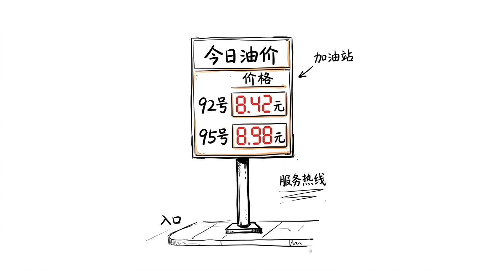
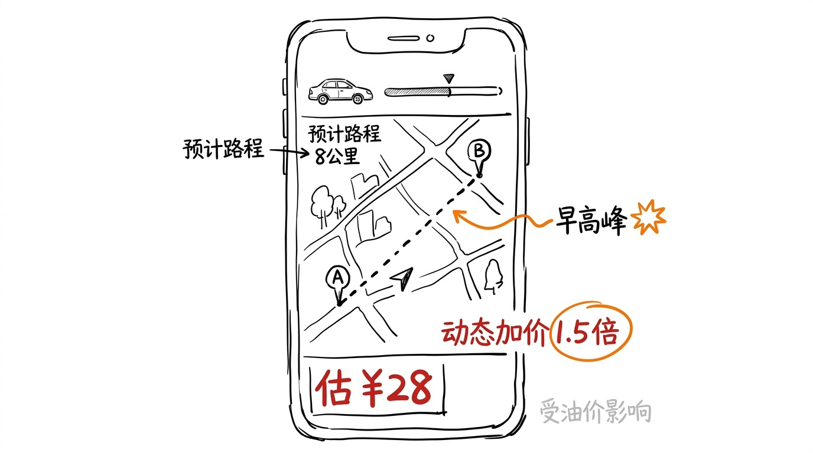
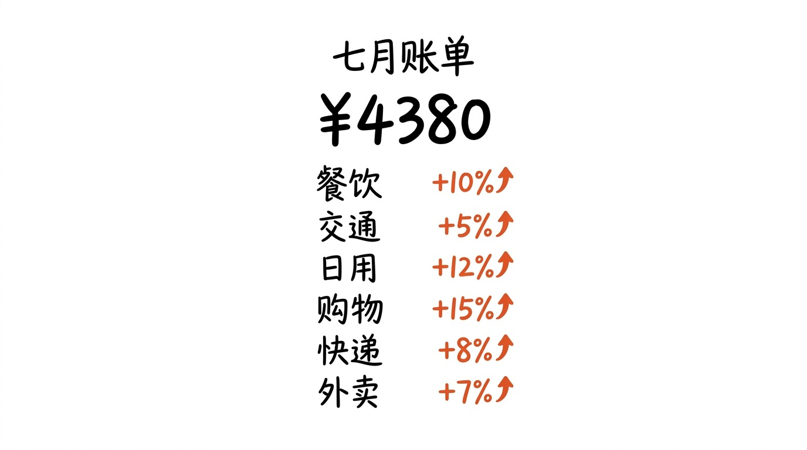

# 油价年内第十涨, 我没感觉, 但下次打车会变

7 月 31 日, 油价年内第十涨。

加满一箱油, 多花 27 块。

我没车, 这 27 块我没付。

但我知道, 接下来这两个月, 我的钱会从这个那个地方, 一点一点地流出去。

## 27 块, 我没付

我没车, 充电的电动车, 一年保险加保养不到 800 块。

油价涨, 我不直接受影响。

但 "油价" 这个词, 不会只停留在加油站。

它会沿着链条, 一节一节地传下去。

传到运输公司, 柴油涨, 物流涨。

传到快递公司, 油价涨, 单件涨 0.5-1 块。

传到外卖, 骑手一单多等 5 分钟, 配送费悄悄 +1。

传到打车, 早高峰调价倍数从 1.2 变 1.5, 同样的 8 公里, 从 22 块变 28 块。

传到菜场, 蔬菜从山东寿光运到北京, 油价 7 块到 8 块, 油费占比从 8% 涨到 11%, 批发价涨 5 分, 零售价涨 1 毛。

27 块的油, 我没付。

但我一个月里, 大概要多付 30-50 块的"油价传导费"。

## 涨价没人通知我

油价涨, 加油站会贴新价格。

但中间环节涨, 没人通知我。

我点外卖, 平台不会说"今天油价涨了, 配送费 +1"。

我打车, 平台不会说"今天油价涨了, 调价倍数 +0.3"。

我买菜, 菜贩不会说"今天油价涨了, 油菜 +5 毛"。

涨价是悄悄的, 散落在 N 个"日常支付" 里。

每一笔都不大, 加起来才看得出来。

这种涨价, 经济学叫"温和通胀", 老百姓叫"不知不觉"。

## 油价涨, 我不付, 但我付的更隐蔽

之前 011 那篇写黄金价差, 切口是"我以为我买的是金, 其实我买的是幻觉"。

那篇是"价差" 切口, 讲的是价格不透明。

这篇是"传导" 切口, 讲的是涨价分散。

011 是一笔 348 块的明牌, 这篇是 N 笔 3-5 块的暗牌。

明牌心疼一次, 暗牌天天心疼。

明牌容易被骂, 暗牌不会被骂。

明牌能引发讨论, 暗牌只引发"最近是不是钱不值钱了" 这种模糊焦虑。

## 油价涨跟我有啥关系

要说没关系, 也不全是。

国家油价是宏观经济的"价格锚", 油一涨, 整个物流/化工/农业成本都跟着动。

CPI 涨, 银行利率跟着调。

利率涨, 我房贷月供明年可能多 80 块。

这 80 块, 比 27 块油钱, 让人更心疼。

但这 80 块, 也没人通知我。

银行只会说"自 X 月 X 日起调整", 不说"因为油价涨了"。

油价-通胀-利率-房贷, 这条链, 普通人看不到, 但每个环节都掏我们口袋。

## 嗯

油价第十涨, 是宏观信号, 不是个人账单。

油价涨, 我钱包不直接缩水, 但钱包的"购买力" 慢慢变低。

购买力变低, 是没声音的。

不像 011 那种"我多付了 348", 看得见摸得着。

购买力变低, 是"我买的东西还是那个东西, 但花的多了", 你不知道多在哪里。

这种"不知道多在哪里" 的感觉, 才是真正让人焦虑的。

我习惯了。

## 嗯

油价涨, 我能做的不多。

不买车 (我本来就没车), 电动车充电便宜。

但物流/外卖/打车, 我躲不开。

躲不开, 也不躲。

只是下次打车, 看到 28 块, 我会想一下"是因为我路远, 还是因为油价涨了"。

大概率是后者。

大概率没人告诉我。
