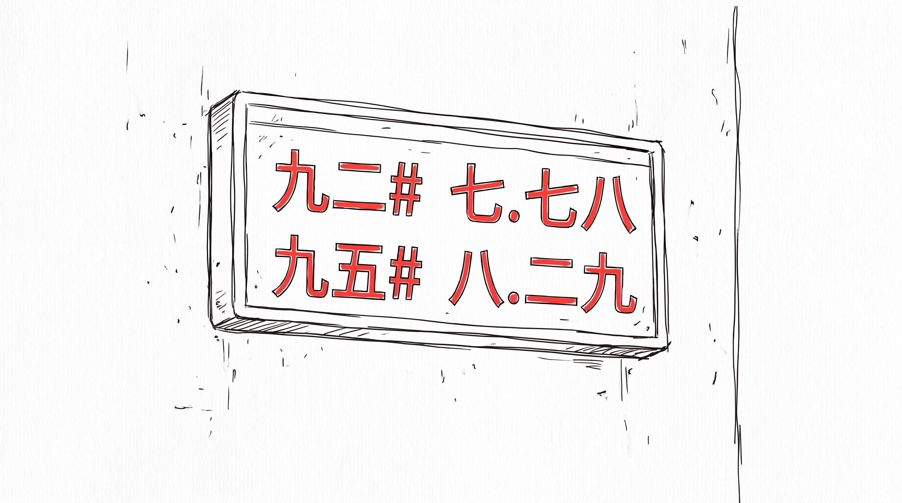
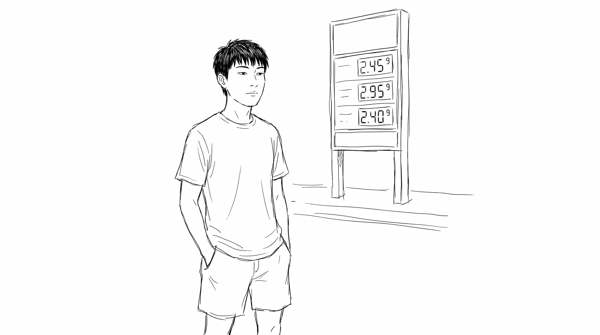
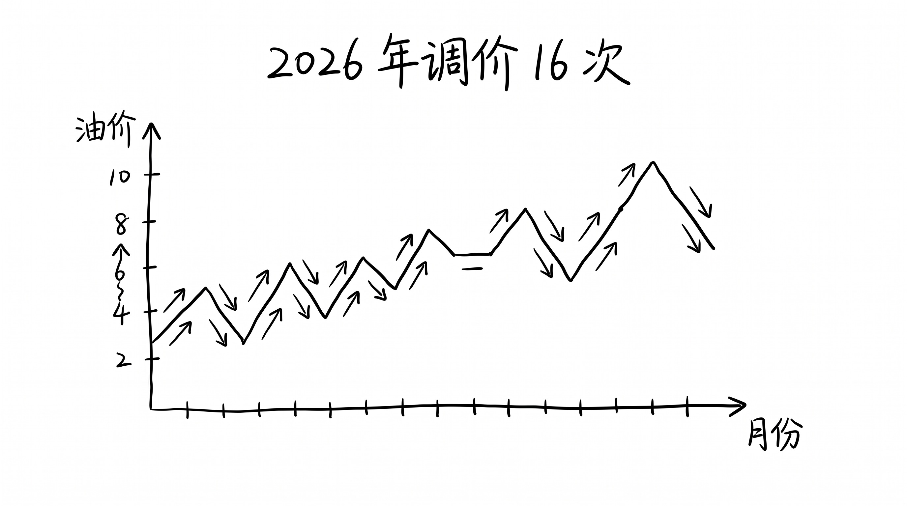

# 加满一箱少 9 块, 但你下次打车还是 27 块

8 月 14 日 24 时, 国家发改委准时开启调价窗口, 92 号汽油每升下调 0.18 元, 95 号下调 0.19 元, 0 号柴油下调 0.19 元。

## 9 块本身很小

50 升一箱 92 号, 加满比昨天少 9 块。

这 9 块, 一杯奶茶的零头。 一瓶农夫山泉 2 块, 一个茶叶蛋 2 块, 一根烤肠 5 块, 加起来 9 块。 你不会为了 9 块专门绕路去加油站, 也不会为 9 块取消明天的出行。 9 块在 8 月的物价里, 大概就是 1 瓶矿泉水 + 1 个茶叶蛋 + 0.5 根烤肠。

新闻也是一笔带过, 9 块就消失在信息流里。

## 但 9 块不是平均下来的

跑长途的重卡, 月跑 1 万公里, 百公里油耗 38 升, 下一轮调价前单车省 337 元。 一家 50 辆重卡的物流公司, 一个月省 16850 元。 这笔钱够一名专线司机的部分工资。

挖机一天烧 30 多升柴油, 工地按月结算, 油价每降 0.19 元/升, 一台挖机一个月省大几百。 绿通车免过路费, 油费占比更高, 油价每动一分, 利润就实打实动一分。

他们才是这次调价真正的受益方。 我不是。 我开 1.5 升排量的车, 一年跑 8000 公里, 一年下来也就省 100 块出头。 平均到每个月 8 块, 不到 1 杯便利店咖啡。

## 私家车主的位置有点尴尬

加满一箱少 9 块, 你不会算。 下次打车 27 块, 你会算。

因为 27 块是一次完整支付, 出现在账单里、记忆里、跟其他订单并排出现在屏幕上。 而 9 块是一箱油 50 升除下来的平均, 散在每一次点火里, 散得你根本看不见。

油价传导到出行价格的链条是断的。 油站降 0.18, 打车 app 不会同步降 0.18; 它只会在下一轮算法里重算, 在 27 块的标价上 ±1 块、±2 块。 你以为传导是即时的, 其实它是按月、按季、按平台规则分批传导。

你以为"9 块"和"27 块" 是同一件事, 其实不是。 一个是真金白银的减免, 一个是算法里的浮动。 一个你能摸到, 一个你只能看到。

## 数字是一回事, 体感是另一回事

8 月 14 日 24 时, 全国 31 省市的电子牌同时换了数字。 北京 92 号从 7.96 跌到 7.78, 上海从 7.93 跌到 7.75, 海南从 9.08 跌到 8.90。

但海南依旧在"8 元时代", 比其他省份高近 1 块。 西藏、新疆、黑龙江这些地区, 跨一个县油价就变了, 7.20 到 7.99 的价差不是一天形成的, 是运距、海拔、价区划分的累积。 同样一箱油, 你在三亚加 445 块, 在乌鲁木齐加 378 块, 差 67 块, 7 顿早餐。

## 全年累计是另一个故事

2026 年成品油已经调了 16 次。 十涨五跌一搁浅。 涨的次数仍是跌的两倍。

所以今天这波下调, 把 7 月底那波大涨"止血" 了一部分, 92 号从 7.93 跌回 7.75, 但年初至今的累计涨幅还在, 你的油费比 1 月份高, 这是事实。 你看 7 月那次涨了 0.27 元/升, 一箱多 13.5 块, 8 月这次降 0.18 元/升, 一箱少 9 块, 一来一回, 还是多 4.5 块。

## 8 月 28 日 24 时再调一次

下一轮调价窗口在 8 月 28 日 24 时, 还有 11 天。

这 11 天, 油价处于本轮下调后的低位运行。 私家车主可以放心加满, 物流公司可以放心跑。 美伊还在谈, 霍尔木兹海峡还是悬着, 下一轮是涨是跌, 没人知道。 卓创资讯分析师说大概率上调, 隆众资讯分析师说大概率搁浅, 两个口径, 两个答案。

9 块钱的失重感, 在 11 天后会重新被填平。 但填平之前, 它是真的。 哪怕只存在 14 天, 哪怕只值 1 瓶矿泉水 + 1 个茶叶蛋 + 0.5 根烤肠。

