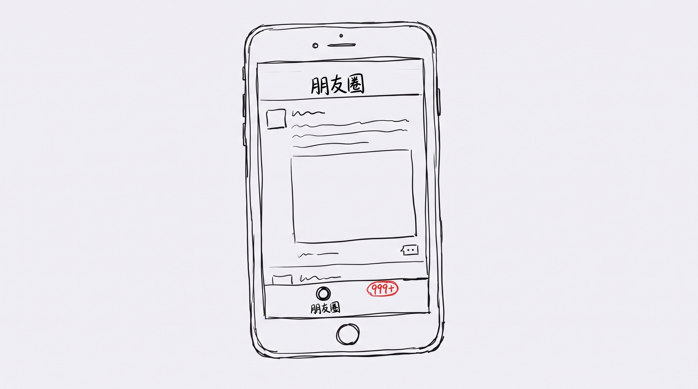
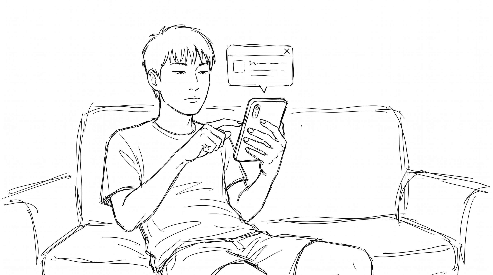
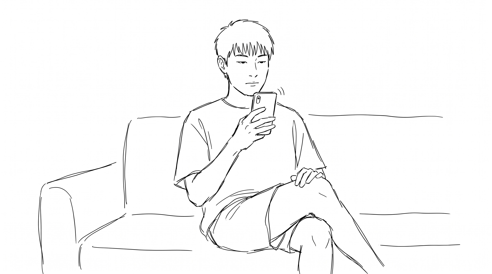
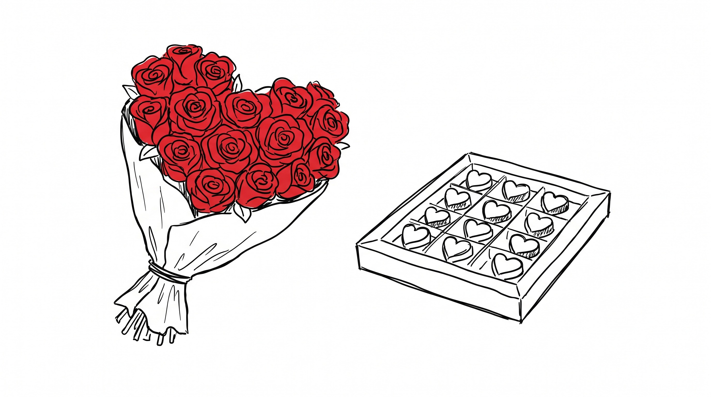

# 我跟七夕没什么关系

8 月 19 日, 周二, 七夕。

朋友圈一早就开始刷屏了。 玫瑰、巧克力、酒店订房截图、礼物拆箱视频, 999+ 持续了 14 个小时, 我下午 3 点还在刷, 99+ 没下去过。 有人上午 10 点发"我们", 中午 12 点发"我们", 下午 5 点发"我们也", 配图是同一束花, 三张图, 不同滤镜。

我那天做了什么呢。

## 早上 9 点

醒了。 看了眼手机, 朋友圈 99+。 没点开。 看了下天气, 32 度, 晴, 紫外线强。 起来刷牙, 烧水, 泡咖啡, 打开电脑。

没有人给我发"七夕快乐", 我也没给任何人发。 上一条发出去的"七夕快乐" 是 4 年前, 当时还分组可见, 给 3 个朋友发了同一句"七夕快乐呀", 配了 1 个 emoji, 后来她们都把朋友圈关了, 我就再没发过。

## 中午 12 点

外卖 app 弹窗"七夕限定套餐, 满 200 减 30", 点了叉。

不是不饿, 是限定套餐里全是玫瑰慕斯、爱心意面、双人牛排, 我一个人吃不完。 双人牛排 1 份也是 1 份, 但刀叉摆 2 副, 一个人对 2 副刀叉, 总觉得哪里不对。

我最后点了一份普通的黄焖鸡, 19 块, 没有心形餐盘, 没有限定 logo, 端上来就是 1 碗饭 + 1 份鸡 + 1 份菜。 我吃得很踏实。

## 下午 3 点

朋友圈 999+。 我点进去了。

第 1 条是大学同学晒转账记录, 5200 元, 配文"第一个七夕"; 第 2 条是同事晒老公送的 LV, 配文"三年如一日"; 第 3 条是小区门口的"七夕特惠, 鲜花 8 折"; 第 4 条是 KTV 推出的"七夕情侣套餐, 含 2 杯特调"; 第 5 条是银行广告, "七夕, 给 TA 1 份稳稳的爱"。

我刷了 30 分钟, 一条没点赞, 一条没评论。

## 晚上 7 点

我妈给我发了个红包, 6.66 元, 配文"七夕快乐"。 我领了, 回了一句"谢谢妈"。

我给她发了一个 6.66 元的红包, 配文"也快乐"。 她没领, 直接发了个语音过来, 让我早点睡。

我姐没发, 我爸没发, 我弟没发。 我们家不过七夕, 也不过 2 月 14, 也不过 5 月 20。 节日对我们家来说, 是周一到周五哪天都行, 没人规定哪天。

## 晚上 9 点

我又刷了一遍朋友圈, 999+ 变成 1000+。

有人在 8 点发"分手快乐", 有人在 9 点发"领证快乐", 有人在 9 点半发"对不起, 我们尽力了"。 同一束花在不同时间被拍成 3 张图, "我们"在 14 个小时里经历了相识、相恋、订婚、分手、复合、再分手。

我关了朋友圈, 打开了猫罐头。 猫不关心今天是七夕还是周四, 它只关心罐头是金枪鱼味还是鸡肉味。 我倒的是金枪鱼味, 它吃得很认真, 一直吃到碗底发亮。

## 晚上 11 点

朋友圈 1001+。 我不刷了, 准备睡觉。

我给今天的自己打了个分: 1 杯咖啡, 1 份黄焖鸡, 1 罐猫罐头, 1 个 6.66 的红包, 1 句"谢谢妈", 0 个 emoji, 0 个玫瑰, 0 个"我们"。

总分: 6.66 元 + 1 份普通的快乐。

我跟七夕没什么关系。 但我跟妈、跟姐、跟弟、跟猫, 有关系。 这些关系不需要 8 月 19 日来证明, 也不需要 520、521、1314、七夕、双十一 来提醒。

它们是周一到周五, 哪天都行。
