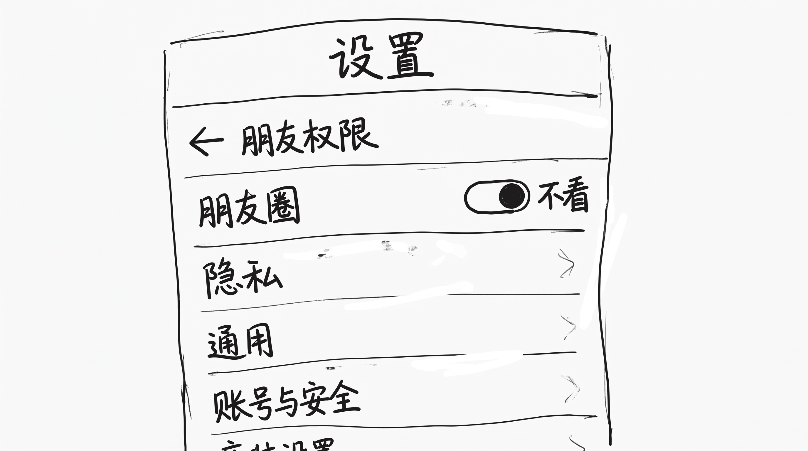
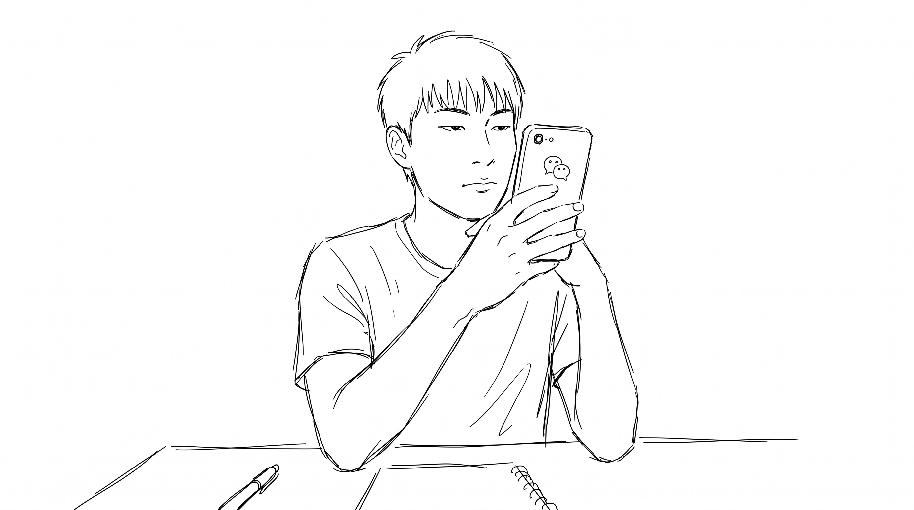
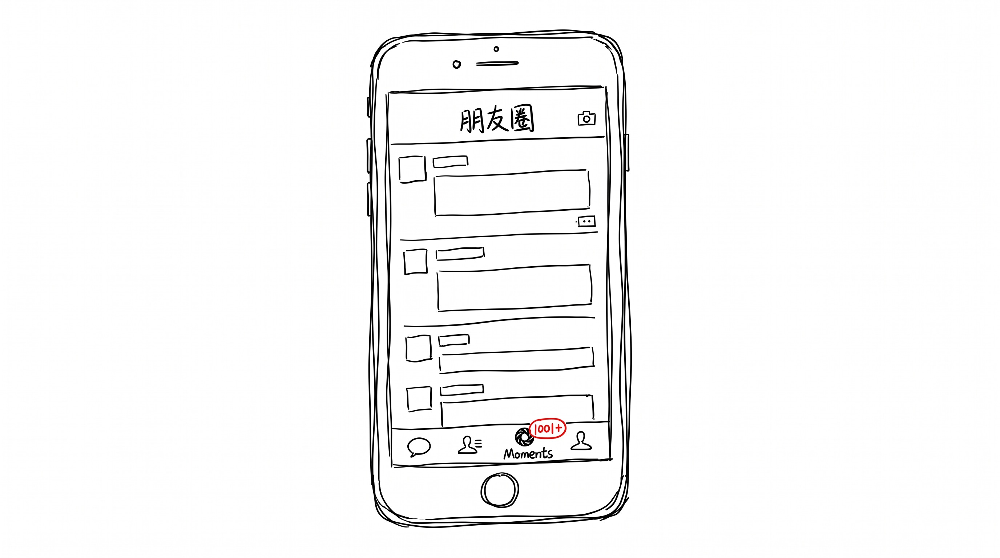
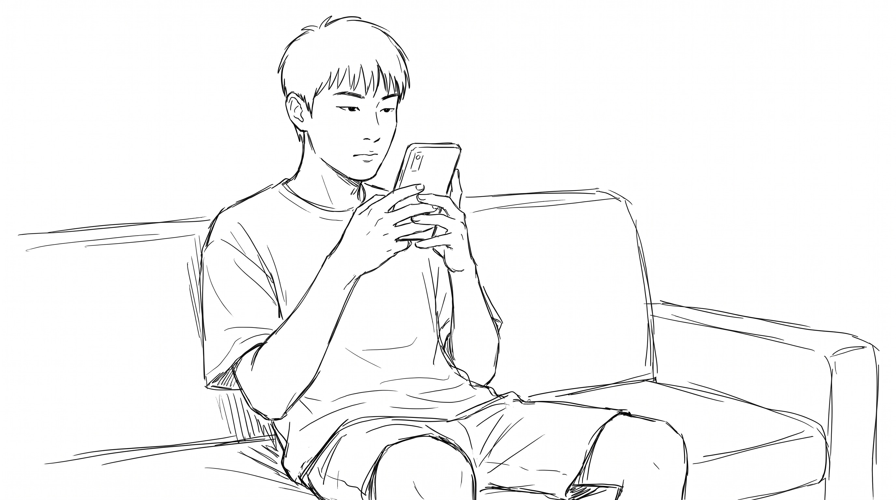

# 我把朋友圈屏蔽了 1 天

8 月 19 日, 周二, 七夕。

朋友圈一早就开始滚, 99+, 一刷都是玫瑰 + 520 + 1001。 我看了 5 分钟, 关掉, 打开微信 → 我 → 设置 → 朋友权限 → 朋友圈 → 看不看 → 不看 (全部) → 确定。

整个白天 0 推送, 0 红点, 0 99+。

## 早上 9 点

屏蔽那一刻, 微信安静得像把窗关了。 朋友圈入口还是亮的, 角标是 0, 我知道它在那, 但我不点。

我把手机扣在桌上, 起来刷牙, 烧水, 泡咖啡, 打开电脑。 跟前一天一样, 跟前一周一样, 跟前一个月一样。 没有任何一个"今天不一样" 的标志, 除了朋友圈那个被我主动关掉的入口。

## 中午 12 点

我下楼去便利店买午饭。 路上情侣比平时多一点, 花店橱窗多了几束玫瑰, 餐厅门口多了"七夕双人套餐" 的立牌。 我买了 1 份三明治 + 1 瓶水, 21 块, 收银员没问我"要买花吗", 跟平时一模一样。

回到办公室, 我吃三明治的时候, 手机微信没响。 整个中午, 微信没响。

## 下午 3 点

朋友圈空白。 准确说, 朋友圈入口一直在, 我点进去也还是能看到之前发的所有内容, 屏蔽的只是"之后的新内容不推送给我"。

我打开的不是朋友圈, 是手机相机, 拍了一张窗外的天空。 杭州 8 月, 32 度, 晴, 云很白, 没风。 我看了 3 秒, 存了, 没发朋友圈。

也不是"不能发" 屏蔽没影响发, 只是我没发。

## 晚上 7 点

我打开微信, 不是朋友圈, 是跟 1 个老朋友的对话框。 老朋友不常联系, 上一条消息是 3 个月前。 我问他 1 个技术问题 (跟七夕没关系, 是工作上一直想问没问的), 他 5 分钟回我, 我俩聊了 20 分钟, 跟节日没关系。

整个过程朋友圈入口一直没动, 角标 0。

## 晚上 9 点

我还是打开了朋友圈, 不是为了看, 是为了确认"屏蔽有没有生效"。 入口还是亮的, 角标还是 0, 我点进去, 看到的是之前所有历史内容, 没有新的 999+。

我关掉, 打开了 Kindle, 看了 1 小时书, 跟七夕没关系。 1 小时后合上, 朋友圈角标还是 0。

## 晚上 11 点

我解除屏蔽, 打开朋友圈。

999+, 准确说 1001+。 跟我早上 9 点屏蔽时一模一样的数字还在, 后面多了 2 个。 有人在 11 点发"我们 1 年了", 有人在 11 点发"准备睡了, 大家七夕快乐", 有人在 11 点半发"明天 8/20, 一切照常"。

我刷了 30 分钟, 跟之前一样, 一条没点赞, 一条没评论。 但这次感觉不一样, 不是因为"我不关心他们", 是因为"我已经 12 小时没在那个频道里"。 他们的玫瑰, 他们的 520, 他们的"我们", 都很真实, 但都不属于我今天。

我大概刷了 100 条就关了, 没刷完。 18 条是 8/19 发的, 7 条是 7 点到 11 点之间的"补发" (估计白天在忙, 晚上才想起来发)。

## 第二天 8/20

我醒来, 朋友圈入口角标变成 8。 我点进去, 看到 8 条新内容, 大部分是 8/19 晚上 11 点之后发的。

第 1 条: "七夕结束了, 大家早安。"

第 2 条: 朋友晒今天早上的油条豆浆, 配文"终于回到正常节奏"。

第 3 条: KTV 的广告, 七夕套餐下架, 换成"周末欢唱"。

第 4 条到第 8 条: 都没什么, 就是日常。

## 8/20 早上 9 点

我刷完这 8 条, 关掉朋友圈, 打开微信, 退掉"不看" 开关, 重新打开"看"。

微信恢复正常推送, 角标开始滚。

## 收尾

七夕这天, 我屏蔽了朋友圈 1 天 (8/19 早 9 点 - 8/20 早 9 点), 24 小时。

这 24 小时, 我没发朋友圈, 没看朋友圈, 0 条推送, 0 条评论, 0 个赞。

这 24 小时, 我吃了 1 份三明治, 1 瓶水, 拍了 1 张窗外的天空, 跟 1 个老朋友聊了 20 分钟技术, 看了 1 小时书。

我什么都没错过, 也什么都没得到。

但有一件事变了 — 我现在知道, 朋友圈对我来说不是"信息", 是"频道"。 频道关了, 不是信息消失了, 是我不在那个频道了。 8/20 早 9 点之后我重新打开, 频道回来了, 但我之前 24 小时不在, 跟 8/19 整天在刷, 看到的"8/19" 是两件不同的事。

前者是"我过了 1 天没朋友圈的日子", 后者是"我过了 1 天刷朋友圈的日子"。 后者的"8/19" 不属于我, 前者的"8/19" 属于我。
