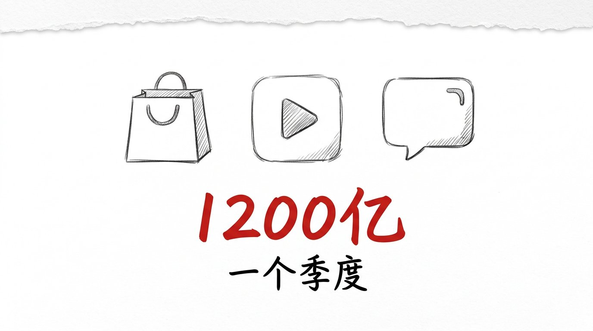
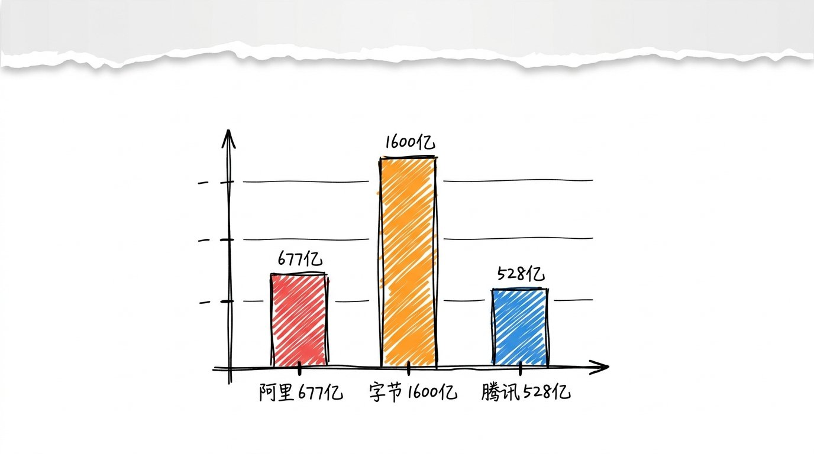
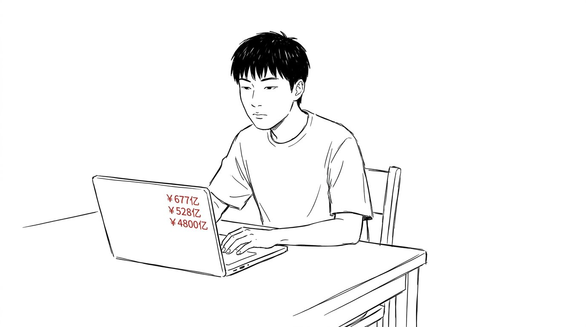
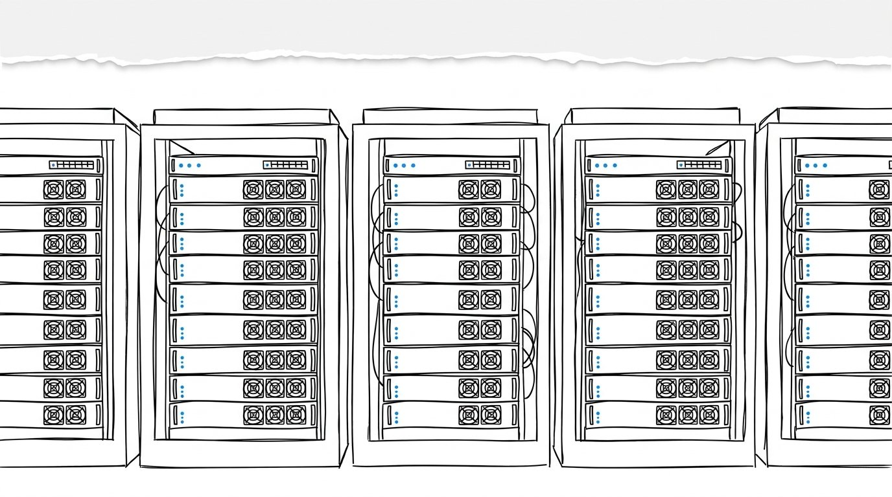

# 三家大厂一个季度烧 1200 亿, 赌的不是 AI, 是门票

8 月 24 日, 财联社一篇短消息: 阿里巴巴完成 800 亿港币新股配售, 100% 投 AI。

我点开看了下, 然后又刷到一条: 腾讯 Q2 资本开支 528 亿, 创单季纪录。

再刷: 字节 2026 年 AI 资本开支预算上限 700 亿美元, 约 4800 亿人民币。

三家加起来, 一个季度 1200+ 亿, 大头是 AI 算力。

## 钱花在哪儿, 三家不一样

阿里: 800 亿配售 + 单季资本开支 677 亿, 投云+AI 算力, 卖给企业客户, B 端先变现。

字节: 2026 全年预算上限 4800 亿 (内部讨论), 砸数据中心 + 囤 GPU, 赌豆包成为"超级入口", C 端先占位。

腾讯: 季度 528 亿 + 研发 498 亿, 优先把算力喂给混元和微信生态, 不对外出租。

三家打法不同, 但**钱都花在同一个地方: AI 算力**。

## 烧得有没有道理

我一开始以为, 这是"AI 多烧钱" 的故事, 一边倒劝退。

翻完三家的财报和券商分析, 不是。

阿里 Q1 AI 相关产品 ARR 突破 495 亿, 占云外部收入 35%, 连续 12 个季度三位数增长。 阿里云外部收入同比增长 45%, 创 22 季度新高。

腾讯 Q2 AI 直接拉动广告增长 22%, WorkBuddy 月活 2097 万, 付费用户留存 80%。

字节豆包日均 Token 调用 180 万亿, 国内 AI 产品付费转化率 1%-3%, 但估值 5500 亿美元, 资本市场不嫌。

三家不约而同, 都在用"算力"换"船票"。

## 算力是新石油

我之前觉得"算力" 是技术词, 不是商业词。

看完这三家之后, 我把它重新归类了。

算力不是技术问题, 是**生产要素问题**。 谁拥有更多算力, 谁就拥有更大规模模型训练和更快速迭代的能力。

高端 GPU 受全球供应链限制, 提前锁定算力资源, 本质上是在抢占一种"生产要素" 的先发优势。

字节 2025 年光囤 GPU 就花了 900 亿, 还不算数据中心。

钱花在算力上, 不是"烧", 是"提前 3 年买原料"。

## 赌的是门票

中国企业资本联盟副理事长柏文喜有个判断: "大厂在赌的是'算力 = 新石油', 押注下一代入口, 愁的是当季财报。"

我重新读了三家财报里最关键的那句话。

阿里 CEO 吴泳铭: "AI 算力投资有望 3 年内回本。"

腾讯总裁刘炽平: "AI 原生业务的资本开支是模型训练、推理及 AI 云的'一次性大额投入', 不应该假设每年都会有这样一笔新投入。"

字节不解释, 内部讨论的预算是"上限", 不到终局不下牌桌。

三句话合起来, 指向一个判断: **现在烧的不是"利润", 是"门票"**。 谁晚买, 2028-2029 年供给释放时, 价格压垮的是没买到算力的那批。

## 嗯

我自己的话, 这三家的财报我 8/24 一天看了 3 份, 加上各家券商研报 5 份, 加上彭博、路透、财联社的报道 20+ 篇。

我自己的结论: 大厂在 AI 上的资本开支, 不是"AI 多烧钱" 的故事, 是"AI 没开始赚钱" 的故事。

前者是结论, 后者是过程。

后者更值钱。

015 那篇写过: 免费不是降级, 是切到我家来的入场券。

今天这篇: 烧钱不是浪费, 是买门票。

入场之后, 出场才收费。

我大概率还是会出场。
