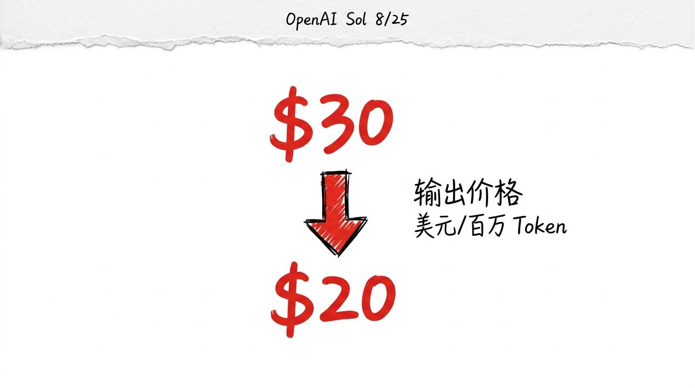
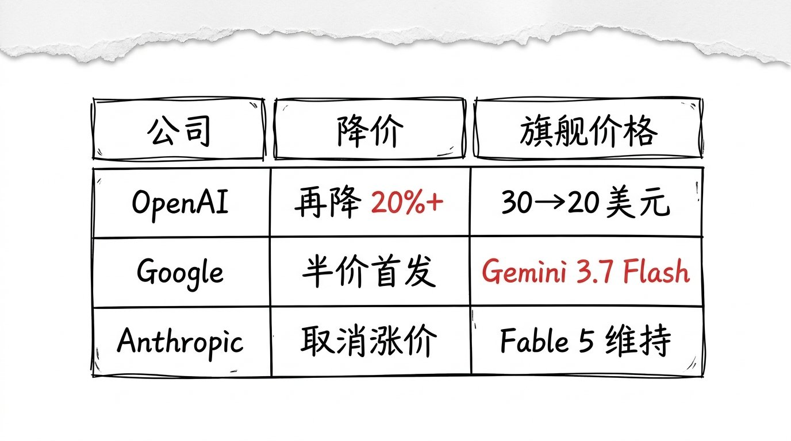
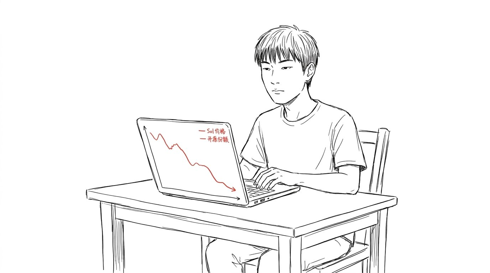
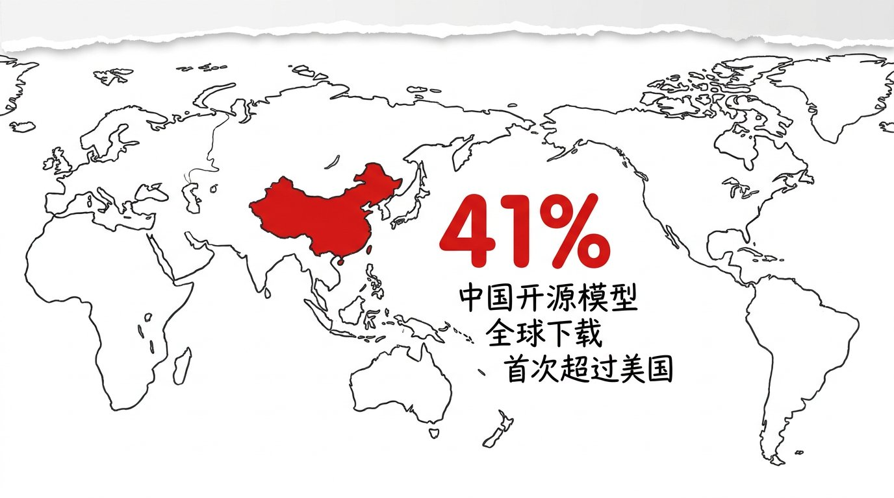

# OpenAI 旗舰再降 20%, 闭源模型的高端溢价窗口正在关闭

8 月 25 日, 环球时报一篇报道: OpenAI 把旗舰 Sol 的价格再降 20%+。

我点开看了下: 输出价格 30→20 美元/百万 Token, 输入 5→4 美元, 缓存输入 0.5→0.4 美元。

这是 1 个月内 OpenAI 第二次降价, 上次是 Luna 降 80%, Terra 降 20%。

Google Gemini 3.7 Flash 半价首发, Anthropic 取消涨价计划。

三大头部, 一个月内全部下调, 闭源旗舰价格一压再压。

## 不是"价格战是好事", 是"价格战 = 闭源护城河被填平"

我一刷, 满屏是"AI 模型普惠" "降价利好开发者"。

反着看。

Vercel 数据显示, 开源模型 Token 份额, 6 月 28%, 8 月 62%, 两个月翻倍。 中国开源模型全球下载 41%, 首次超过美国。 DeepSeek-V4-Flash 连续 3 周全球调用量第一, 一周 11.6 万亿 Token。

闭源护城河, 不是"被降价战" 打掉的, 是**被开源调用量" 填平"** 的。

调用量摆在那, 谁便宜就用谁。 开源便宜 10 倍, 调用量就多 10 倍, 实际效果好, 闭源就不敢维持高价。

## 015 那篇, 是 OpenAI 主动的故事

015 我写过 GPT-5.6 全员免费。 那时候我判断: 免费是切到我家来的入场券。

逻辑是: OpenAI 主动把模型免费, 换 Skills 生态的"原产地租金"。

当时这个判断成立, 因为 7 月时闭源护城河还在, OpenAI 有定价权。

8 月再降价, 性质变了。

这次不是 OpenAI "主动", 是市场"逼的"。

3 个证据:

1. Google Gemini 3.7 Flash 抢在 OpenAI 之前半价首发, 把"价格锚" 拉到新低。
2. Anthropic 取消涨价计划, Fable 5 单价比 Opus 4.8 贵 2 倍, 客户转头就走。
3. OpenRouter 公共 API 调用榜, 中国开源模型连续 17 周超美国, 头部 5 席 4 席是中国模型。

OpenAI 这次降价, 不是"主动让利", 是"被动不降就被抢"。

## 闭源的高端溢价窗口, 正在关闭

我之前在 015 写过: OpenAI 想卖的是 Skills 生态里的"原产地租金"。

但"原产地租金" 的前提是: 用户离不开 OpenAI。

现在, 用户离开了。

调用量 41% 来自中国开源, 用户在用更便宜的 DeepSeek / Qwen / GLM-5.3 跑同样任务, OpenAI 的 Skills 生态再强, 用户也未必回来。

闭源模型未来的利润, 不在"卖 API", 在两条窄路:

1. **企业级私有部署**: Anthropic 的客户 80% 是企业, 微软 70% AI 收入来自 OpenAI, 但都是高定制化、不能"换模型" 的场景。
2. **前沿能力溢价**: 真正的"研究型客户" 还在用 Fable 5 / GPT-5.6 Sol / GPT-5.4, 但这部分客户不到调用量的 5%。

剩下 95% 的调用, 会被开源吞掉, 价格贴着成本走。

高端溢价窗口, 12-18 个月, 不是 5-10 年。

## 嗯

我自己的话, 8/24-8/25 这两天, 我刷了 OpenRouter 公开榜、Artificial Analysis 模型评测、Hugging Face 开源榜, 加起来 30+ 个数据点。

我自己的结论: OpenAI 再降价, 不是"AI 模型普惠" 的故事, 是"闭源护城河被开源填平" 的故事。

前者是结论, 后者是过程。

后者更值钱。

015 那篇写过: 免费是切到我家来的入场券。
今天这篇: 再降价是被开源调用量挤到桌角的被动调整。

入场券这张牌 7 月打完, 8 月就不好使了。

我大概率还是会出场, 但场子比 015 写的时候小了一截。
