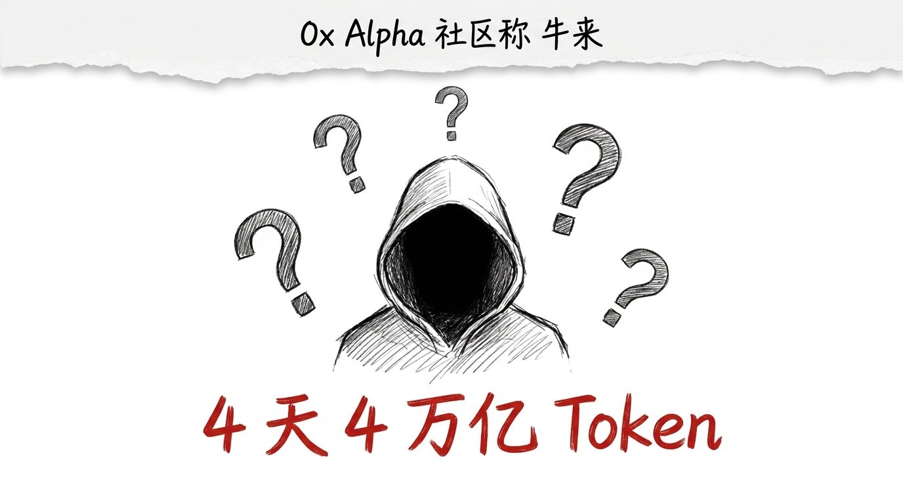
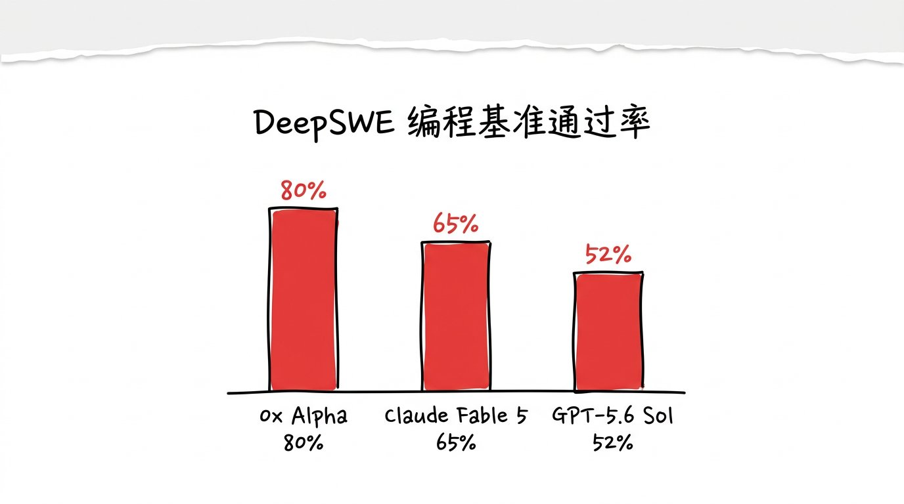
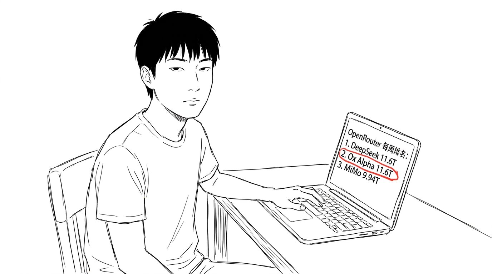
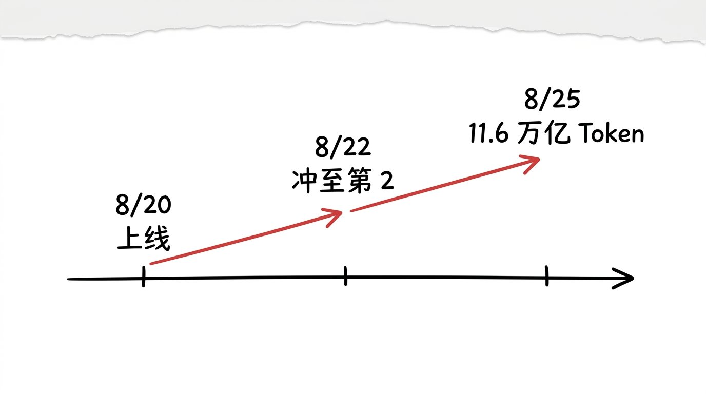

# 4 天冲到全球第二, 那个匿名模型凭什么

8 月 25 日, 我刷 OpenRouter 周榜, 看到一行陌生名字: Ox Alpha (社区称"牛来")。

8 月 20 日上线, 一周调用量 11.6 万亿 Token, 跟 DeepSeek 并列第一, 终结后者连续 56 天榜首。

DeepSWE 编程基准 80% 通过率, 超 Claude Fable 5 (65%), 也超 GPT-5.6 Sol (52%)。

104 万 Token 上下文, 13.1 万 Token 输出。

没人知道它是谁。

## 不是"又一个中国模型", 是"流氓打法"

我一开始以为, 这是哪家中国大厂又发新模型了。

不是。

它没有官网, 没有发布会, 没有定价表, 没有任何公司认领。

4 天就冲到全球第二, 调用量追平 DeepSeek。

这事的反常点, 不在"中国模型变强了", 在"匿名模型敢这么打"。

DeepSeek 出来, 有论文、有开源仓库、有 CEO 访谈。
Qwen 出来, 有阿里通义发布会, 有百万下载榜。
GLM-5.3 出来, 有智谱的官方公告 + 公测链接。

Ox Alpha 出来, 什么都没有, 就一个 OpenRouter 入口。

但调用量摆在那: 一周 11.6 万亿 Token, 是 Gemini 3.6 Flash 周调用量的 2 倍多。

匿名, 不打营销, 不写品牌故事, 不开 Twitter, 就敢让模型自己跑。

这是开源生态里, 一种"流氓打法"。

## 它到底是谁

社区在扒。

技术指纹, 分词器风格, 训练数据分布, 多条证据指向智谱 GLM-5.3。

8 月 28 日, 智谱 GLM-5.3 正式开源, 答案可能就揭晓了。

但也有谷歌 DeepMind 研究员发帖, 暗示是 Gemini 新版, 社区不信, 觉得"Google 不可能匿名上 OpenRouter"。

我的判断: **大概率是智谱, 提前 3 天"放飞" 到 OpenRouter 做压力测试**。

3 个理由:
1. 编程能力 (DeepSWE 80%) 跟 GLM-5.3 公开的 Terminal Bench 3.0 第一名对得上。
2. 智谱之前有过"放预告片" 习惯, GLM-4.5 也是先在第三方榜单出现, 后开源。
3. 8/28 智谱开源时揭晓, 时间窗口刚好。

但**我可能是错的**。 8/28 之前, 没有人知道。

## 为什么匿名能跑赢

我之前写过 015 (OpenAI 卖生态) 和 020 (大厂买门票), 那些是"大公司" 的故事。

Ox Alpha 是反例。

它没大公司撑腰, 没营销, 没品牌, 4 天冲至全球第二, 靠的是**纯模型能力 + 社区口碑 + 调用量口碑**。

3 件事:

1. **DeepSWE 80% 通过率是真的**: 社区独立研究员 10 道子任务测试, 不是刷榜。
2. **免费**: 预览期完全免费, 没有付费档, 没有 quota 限制。
3. **OpenRouter 入口**: 不绑死任何云厂商, 不绑死任何 API key, 任何开发者 1 分钟就能接入。

匿名 + 免费 + 真能力, 是"流氓打法" 的三件套。

大公司不敢这么打, 因为要保股价, 要保品牌, 要保 ARR。

创业公司不敢这么打, 因为要融钱, 要讲估值故事。

只有"反正没人知道我是谁" 的模型, 才敢这么打。

## 嗯

我自己的话, 8/24 晚上我刷到这条时, 第一反应是 "DeepSeek 跌出榜首了? "。

第二反应是 "这谁? "。

第三反应是: 不管它是谁, 它做对了一件事 — **不解释, 让模型自己说话**。

015 那篇写过: 免费是切到我家来的入场券。
020 那篇写过: 烧钱是买门票。
今天这篇: 匿名是让模型自己说话。

入场券, 门票, 模型自己说话, 三件事一个比一个安静。

我大概率还是会出场, 但这次连"场" 是谁建的, 都不知道。
