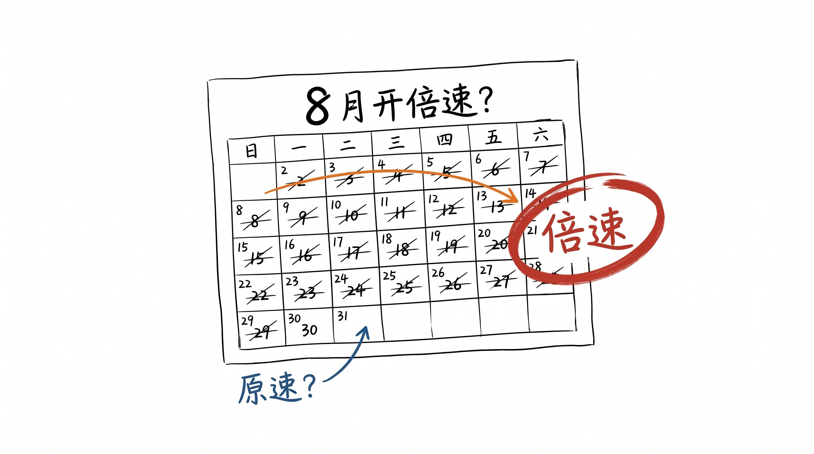
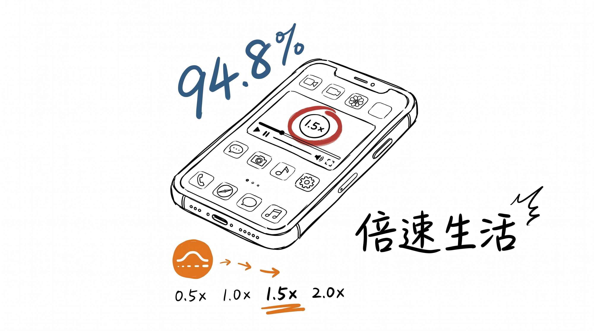
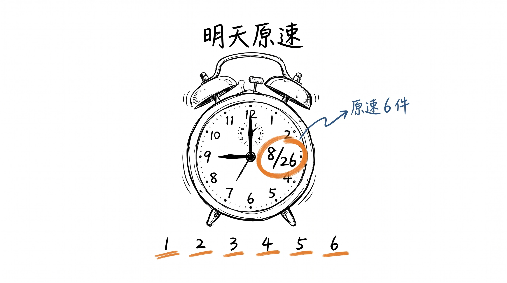
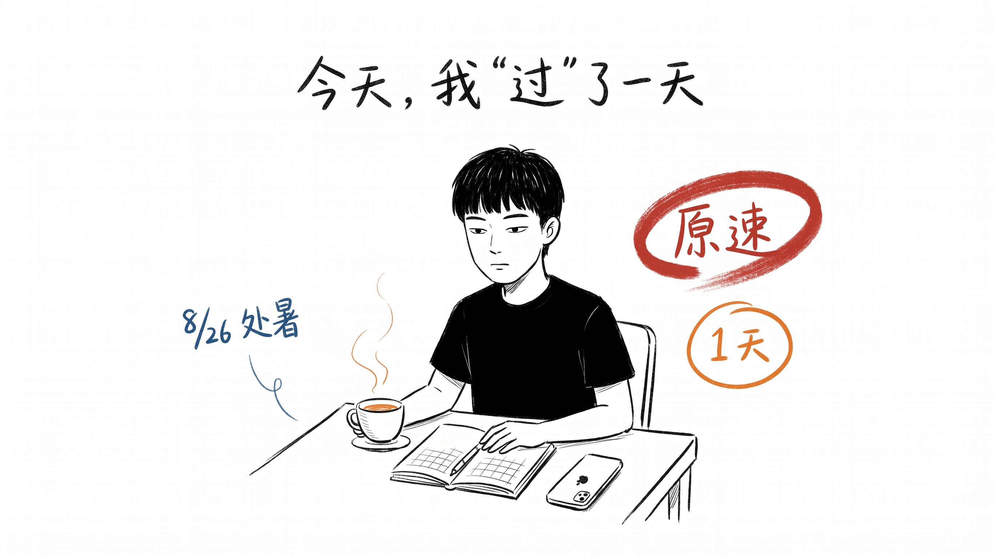
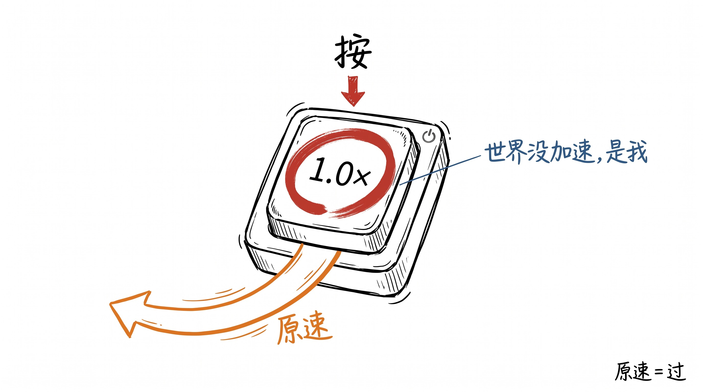

# 8 月没开倍速, 是我自己按的

8 月 23 日晚, 我刷到一条热搜: #我怀疑八月开倍速了#。

4.2 亿阅读。 评论里第一句: "何止八月, 整个 2026 都开了八倍速, 有种昨天还在过年, 明天就又要过年了。"

第二句: "刚一看手机, 都 8.18 了, 下周末就到九月初了, 暑假这就过完了, 睡了一觉八月就没了。"

第三句: "最诡异的不是时间快, 是很多日子明明有好好活过, 回头却想不起自己到底做了什么。"

我把评论区刷到底, 6 万人点赞的那条是: "不觉得今年快得很诡异吗?"

## 8/23 晚, 94.8% 的青年, 在按倍速键

我顺着评论区点进一个数据: 94.8% 的受访青年感觉自己的生活开了倍速键, 76.5% 承认自己过着"倍速生活"。

第一反应是"我也是"。

第二反应是反的 — 既然是我在按, 我能不能关掉?

## 8/24, 我决定按回原速

8/24, 周一, 我决定做一件事: 8/26 (处暑, 三伏出尽) 这天, 设成"原速日"。 6 件事, 不许按倍速:

1. 吃饭不看手机 (一餐 30 分钟吃完)
2. 走路不戴耳机 (一程 15 分钟走完)
3. 处理邮件不"快速归档" (一封 30 分钟, 不写"收到, 谢谢")
4. 1 小时不刷任何短视频
5. 看剧原速, 不开 1.5x/2x
6. 1 件事不并行, 只做饭, 只洗碗, 只回消息

8/24 晚上 11 点, 我在便签写下这 6 条, 写完关掉手机, 准备睡觉。

## 8/26 早 9 点, 我开始原速

8/26, 周三, 处暑。

早上 9 点, 闹钟响, 我没按"再睡 5 分钟", 直接起来。 烧水, 磨咖啡豆, 手冲, 没看手机。

咖啡 5 分钟冲好, 我端到窗前, 站了 3 分钟, 看楼下。 楼下有个外卖小哥, 蹲在路边吃包子, 吃得很慢, 包子 5 口, 配 1 口水, 配 1 次抬头看天。 我平时 9 点也是站窗前, 9 点零 1 分就坐下开电脑了, 不会注意到外卖小哥吃几个包子。

## 8/26 中午 12 点, 三明治 15 分钟

中午下楼, 便利店, 三明治 + 1 瓶水, 21 块。 收银员问我"要加热吗", 我说"不要", 拿回办公室。

回办公室吃, 不用手机, 把三明治放桌上, 看了 30 秒包装袋背面的配料表。 平时我会同时刷微博/微信/抖音, 三明治 3 分钟吃完, 不知道里面有什么。

今天, 我 15 分钟吃完, 中间抬头看了一次窗外, 看到对面楼有个人也端着三明治站着, 他也没看手机。

15 分钟, 我"过"了。

## 8/26 下午 3 点, 邮件 30 分钟

下午, 处理 1 封邮件。 平时我会 5 分钟回, 写"收到, 我看下, 明天回你"。

今天我 30 分钟, 拆成 4 个问题, 写了 1 段 200 字的话, 把每个问题回答了, 加上我自己的 1 个判断。 写完发出去, 关掉邮箱。

发完看了一眼时钟, 3 点 32 分。 平时 3 点 32 分我应该已经回了 12 封"收到"邮件, 看起来"高效", 但 12 封都是 5 分钟 + 一句"收到", 没有 1 封是 30 分钟的。

30 分钟, 我也"过"了。

## 8/26 晚上 9 点, 1 集剧 40 分钟

晚上 9 点, 打开 1 集之前在追的剧, 平时开 1.5x, 40 分钟的剧 25 分钟看完。

今天原速, 1.5x 关掉, 1.0x。

40 分钟过完, 1 集看完, 我记得剧里 3 个镜头, 平时 1.5x 看完, 我记得 1 个镜头 (开头) + 1 个反转 (结尾)。

40 分钟, 我又"过"了。

## 8/26 晚上 11 点, 1 天过完

晚上 11 点, 我坐桌前, 关掉所有屏幕, 算账。

1 天 6 件事原速, 总共多花了 90 分钟 (15 分钟三明治 / 25 分钟邮件 / 40 分钟看剧 / 10 分钟走路和咖啡), 少刷了 1 小时短视频, 少回 12 封"收到"邮件。

我"过"了 1 天, 不是"刷"了 1 天。

然后我反过来想 8 月。 8 月 31 天, 我"刷"了 30 天, 真正"过"的天数, 加上 8/26, 只有 1 天。

30/31, 95% 的时间, 我按了倍速键。

8 月不是开了倍速, 是我自己按的。

## 收尾

8/26 这天, 我做了一件反常识的事: 把 1 天原速过完。

不倍速, 不并行, 不快速归档, 不 0.5s 划走。 6 件事原速, 多了 90 分钟, 少了 1 小时短视频, 少回 12 封"收到"。

我没觉得这天"慢", 也没觉得"快"。 我只记得三明治的配料表, 邮件里的 4 个问题, 剧里的 3 个镜头。 平时 1 天我什么都不记得。

我以前以为: 时间过得快, 是因为今年事情多, 2026 是闰年, 8 月是 31 天 (大月)。

8/26 之后, 我知道: 不是。 是我每天按了倍速键 — 倍速看剧, 公众号拉到底, 短视频 0.5s 划, 邮件 5 分钟 + "收到", 出门 5 分钟冲下楼。

热搜说"我怀疑八月开倍速", 怀疑错了。 八月没开倍速, 8 月份是世界原本的速度。

是我按的。

8/27, 我把 6 件事里"吃饭不看手机" 留了下来, 其余 5 件恢复。 不激进, 1 件就够。 1 件原速, 1 天就不是"刷"过去, 是"过"过去的。

8 月还有 5 天, 加上 9 月, 加上剩下的 2026, 还有 4 个月零 5 天。

够"过"很多天。
