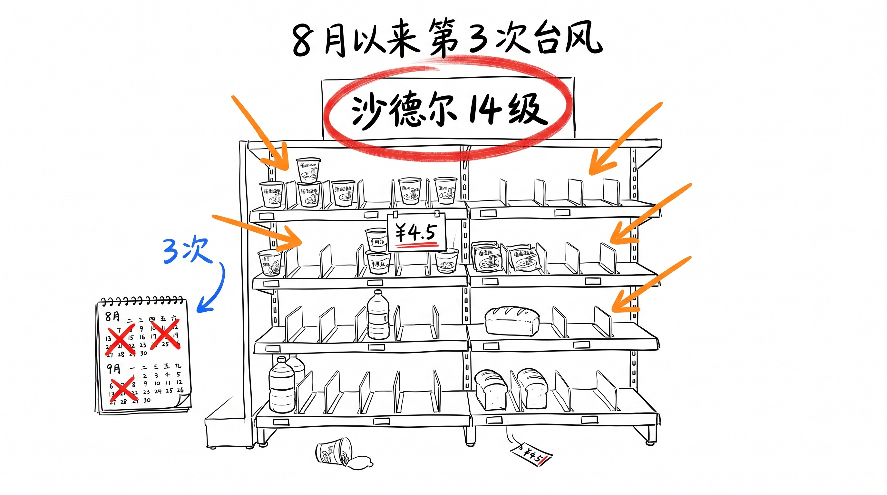
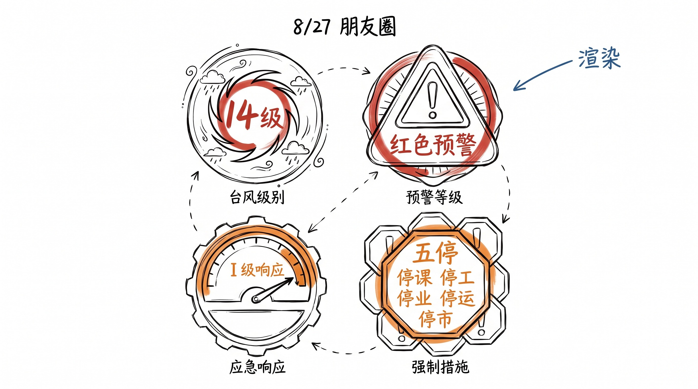
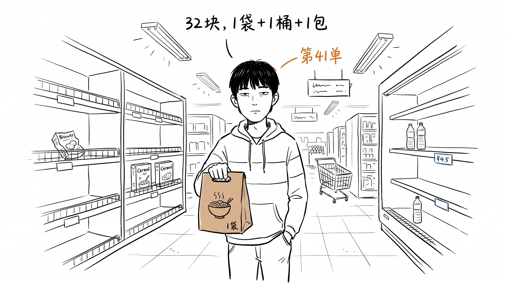
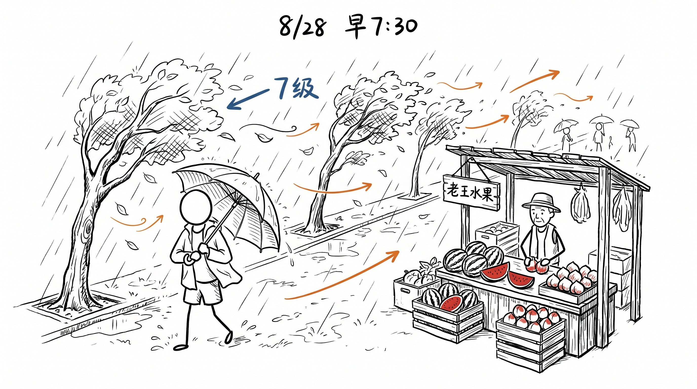
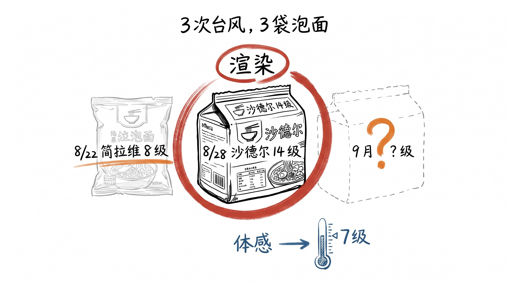

# 杭州这 3 次台风, 我屯了 3 次泡面

8 月以来, 杭州第 3 次台风。 沙德尔, 14 级强台风, 即将登陆浙江沿海。 我屯了 1 袋泡面。

8 月 27 日晚 8 点, 我打开朋友圈。

第 1 条: "沙德尔 14 级强台风, 即将登陆浙江沿海, Ⅰ 级应急响应启动。"

第 2 条: "临安全区 28 日 5 时起实施'五停'——停课、停工、停业、停运、停市。"

第 3 条: "杭州主城区风力 7-9 级, 山区 8-10 级, 个别 11 级。"

第 4 条: "西湖景区、博物馆明起临时关闭, 公共停车免费, 景观灯停运。"

第 5 条: 一段 10 秒短视频, 配文 "风大到人站不住", 视频里是树动 + 雨, 没人。

我刷了 20 分钟, 越刷越觉得今晚应该下楼一趟。

## 8/27 晚 11 点, 我去超市

我下楼到小区对面的超市, 24 小时那种。

平时这个点, 货架是满的, 收银员 1 个, 顾客 2-3 个。

今晚, 货架上泡面/水/面包那一排, 空了一半。 收银台前排了 8 个人, 每人手里都至少 1 袋泡面 + 1 桶水 + 1 袋面包。 有个阿姨, 推车里塞了 12 袋泡面。

我前面那个穿拖鞋的男生, 拿的是 6 袋统一 + 6 瓶农夫山泉 + 1 包火腿肠, 收银员问"这么多啊", 他说"上次'简拉维' 没屯, 后悔了"。

8/22 "简拉维" 那个 8 级热带风暴, 他也后悔了。

我买了 1 袋泡面 + 1 桶水 + 1 袋面包, 32 块。 3 样。

收银的时候, 收银员说"今晚第 41 单泡面"。

## 8/28 早 7 点半, 风力 7 级

8/28 早 7 点半, 闹钟响。 我拉开窗帘, 看楼下。

树在动, 雨在下, 路上没积水, 没树枝, 没人。

7 级风, 是树会动但不至于破坏, 雨下到伞上但不至于淋透。 出门穿短袖, 加 1 件薄外套, 撑伞。

我下楼, 走到路口, 等红灯。 旁边有个穿雨衣的外卖小哥, 蹲在路边, 帽子上没水珠, 看了我一眼, 没说话。

走到小区门口的早餐店, 老板说今天不卖油条, 卖包子, 因为油条锅要露天, 风大吹不熟。

继续走, 走到楼下水果店。 老王照常开门, 摆了一摊西瓜 + 一摊桃子, 没下雨棚。 我说"今天风大, 不怕西瓜吹走吗", 他说"沙德尔都 14 级了, 真到 14 级我这摊早搬了, 7-8 级没事"。

我买了个桃子, 4 块。 老王找钱的时候, 风把 1 张 5 块吹到地上, 我帮他捡起来。

## 临安朋友说也没事

上午 10 点, 临安朋友发来消息: "我这边, 风大, 雨大, 但没停电, 没停水, 路上没树倒, 出门还是能出门。"

我说"你们五停了, 不出门不行吗"。

他说"五停是'能不出的别出', 不是'不能出'。 楼下超市照开, 7-11 照开, 我下楼买了 2 个包, 老板说今天生意比平时好, 大家都下楼来买。"

临安是这次台风实际登陆最严重的区域, 也是"五停"区, 体感也"没事"。

## 我这 1 个月, 3 次台风, 3 次泡面

8/22 "简拉维" 8 级 — 我没屯, 朋友说"沙德尔要来了, 8/28 赶紧屯"。

8/28 "沙德尔" 14 级 — 我屯了 1 袋泡面 + 1 桶水 + 1 袋面包, 32 块。

下次不知什么 — 我大概率还会再屯 1 次。

8 月以来, 杭州平均降水量 278 毫米, 接近常年两倍。 浙江省气象台说, 今年"沙德尔"是浙江第 3 个登陆台风, 追平 2004 年。 8 月 1 次, 9 月 1 次, 10 月 1 次, 大概率。

但我屯的泡面, 每次都吃不完。 这次 1 袋泡面, 大概率又变成 9 月初的 1 袋泡面。

我屯的不是泡面, 是渲染。

媒体说"严重"是 1 个事实, 体感说"7 级"是 1 个事实。 前者写在新闻里, 后者写在我伞上。

前者比后者"严重" 100 倍。 但后者, 是真的。

## 收尾

8/27 晚, 朋友圈把"沙德尔"渲染成"史诗级" — 14 级强台风 + 红色预警 + Ⅰ 级响应 + 临安五停 + 博物馆闭馆 + 西湖关闭 + 公共停车免费。 5 个红色词 + 5 个橙色词 + 5 个蓝色词, 一刷到底, 没一个不吓人。

8/28 早, 我出门, 风力 7 级, 雨下到伞上, 楼下水果店老王照开, 早餐店老板改卖包子, 临安朋友说也没事。

我手里那袋泡面, 大概率又吃不完。 我的冰箱冷冻层, 还存着 8/22 那次朋友硬塞给我的一袋速冻水饺。

我以前以为: 渲染的"严重"是事实, 体感的"7 级"是错觉。

8/28 之后, 我知道: 反的。 渲染的"严重"是渲染, 体感的"7 级"才是事实。 后者不吓人, 但它是真的。

我大概率会再屯 1 次泡面。 不是因为"沙德尔 14 级"吓人, 是因为 8 月以来第 3 次, 我不想再被朋友说"你又不屯, 到时候饿"。

我屯的不是泡面, 是渲染。

但我买的, 还是泡面。

---

> 渲染的"严重"和体感的"7 级", 是两种事实。 前者写在新闻里, 后者写在我伞上。 我屯的不是泡面, 是渲染。 但我买的, 还是泡面。
