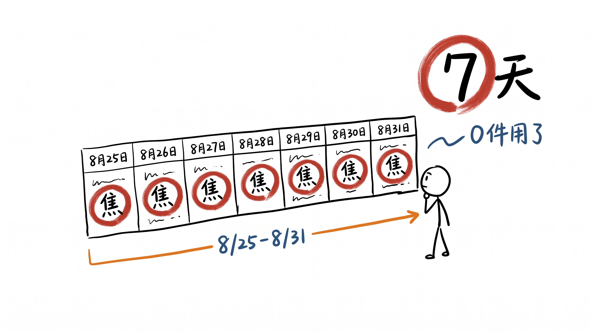
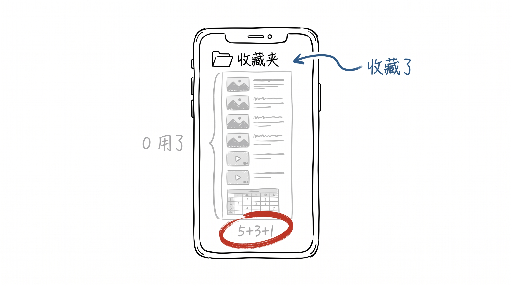
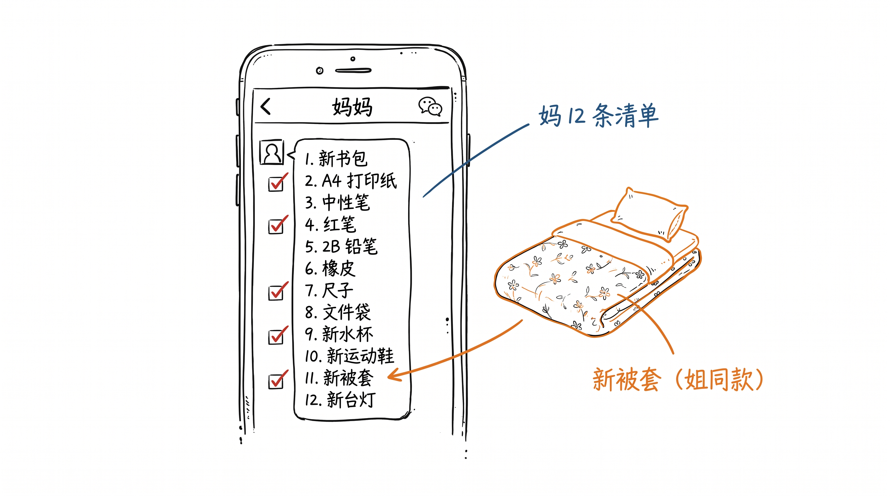
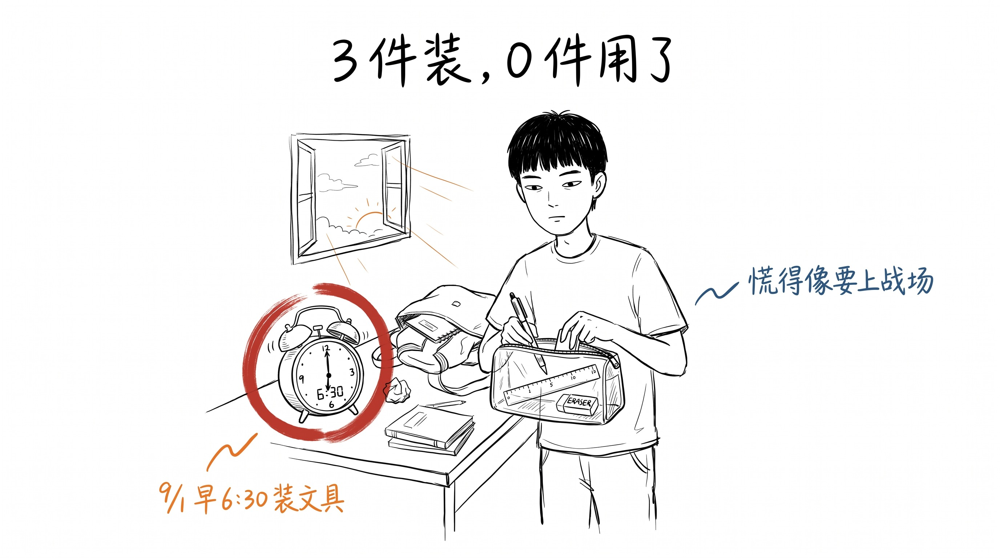
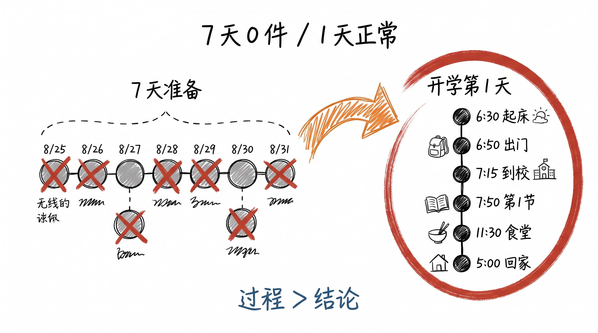

# 开学前 7 天, 我买的是文具, 也是焦虑

8 月那 7 天, 我以为我在准备, 实际我在焦虑。 9/1 开学第 1 天, 6:30 起床, 6:50 出门, 7:15 到校, 7:50 第 1 节, 跟平时一样。 7 天准备 0 件用了, 但 1 天过完了。

8 月 25 日, 周二。

我刷到 1 条热搜: "准高二女生无力上学、准大一新生害怕未来"。

评论区第一句: "开学还有 7 天, 我已经开始失眠了。"

第二句: "不是不想上, 是怕上了之后'跟以前不一样'。"

第三句: "我以为高考完就好了, 结果开学那天又开始慌。"

我点赞了第一条, 收藏了第三条, 退出 app。

我心里想: 还好, 我不是学生, 我不慌。

5 分钟后, 我又打开 app, 搜了 1 个关键词: "开学焦虑"。

刷到 5 篇文章, 收藏了 2 篇, 看了标题, 关掉。

那天晚上, 我失眠了 1 小时。

## 8 月 27 日, 妈妈来电

8 月 27 日, 周四, 上午 10 点, 妈妈从老家打电话。

"开学了, 你的文具买了吗?"

我说"还没, 7 天呢, 不急"。

她急了: "你每次都拖到最后 1 天, 这次是开学, 不是寒假, 你从今天开始列清单。"

她说, 清单要 12 条: 1. 新书包 (旧的拉链坏了); 2. 1 包 A4 打印纸; 3. 5 支中性笔; 4. 1 支红笔; 5. 1 支 2B 铅笔; 6. 1 块橡皮; 7. 1 套尺子; 8. 1 个文件袋; 9. 1 个新水杯; 10. 1 双新运动鞋; 11. 1 床新被套; 12. 1 个新台灯。

我说"妈, 12 条太多了, 我有旧的"。

她说: "旧的能用吗? 你上次那个水杯盖子裂了, 上次那个书包拉链卡, 上次那个台灯一闪一闪, 这些旧的能用?"

我说"能用"。

她说"你别将就, 我出钱, 你去买"。

8 月 28 日, 我去了一趟超市, 买了 1 个新水杯 (38 块) + 1 支红笔 (3 块) + 1 块新橡皮 (2 块)。 其余 9 条, 我没买。

回家后, 我妈微信追问: "书包呢?"

我说"还没, 周末去买"。

她发了个"叹气" 的表情, 然后发 1 张图, 是她在家里的桌子上, 摆着 1 个新书包 (我小学时候用过的同款) + 1 双新运动鞋 (她从镇上超市买好寄过来) + 1 床新被套 (我姐上大学时候买的同款) + 1 个新台灯 (LED 充电款)。

她发 1 条文字: "我帮你买了 4 条, 你只要再买 8 条就行, 别将就。"

我看着那张图, 1 秒没回, 退出了微信。

## 8 月 31 日, 7 件事 / 0 件做了

8 月 28 日 - 8 月 31 日, 这 4 天, 我做的"准备"事:

8 月 28 日: 看了 1 篇《科学调适身心, 从容开启新学期》 (广东省心理教师写的), 收藏 1 份"开学前 7 天作息调整表", 没执行。

8 月 29 日: 看了 2 篇《开学焦虑的背后, 他们到底在怕什么》 (浙江省中山医院 + 扬子晚报), 收藏 1 份"5-4-3-2-1 着陆技术", 没做。

8 月 30 日: 看了 2 个 B 站视频, 1 个讲"接受焦虑", 1 个讲"小步调整", 收藏 1 套"番茄工作法", 没做。

8 月 31 日: 看了 1 篇《9 月离别背后反映了怎样的社会文化心理》 (新浪), 收藏 0 个, 看了标题, 关掉。

5 篇文章, 3 个视频, 1 份作息表, 1 套着陆技术, 1 套番茄工作法, 1 床新被套 (我姐的同款)。

7 天准备 0 件用了。

我没有早睡 1 天, 没有执行 1 次深呼吸, 没有用过 1 次番茄钟, 没有把新被套铺上去。

但我"准备"了 7 天。

我以为准备是缓解焦虑的解药, 准备是焦虑的另一种表现。

## 9 月 1 日, 开学第 1 天, 6 点 30 分

9 月 1 日, 周二, 6 点 30 分, 闹钟响。

我立刻醒, 没按"再睡 5 分钟"。 坐起来, 摸手机看时间, 心跳有点快。

6:35, 我去刷牙, 烧水, 准备泡红枣水 (我妈昨晚从微信发的方子: 5 颗红枣 + 3 颗枸杞 + 2 颗桂圆, 开水泡 5 分钟)。

6:50, 我下楼, 走到地铁站, 路上没人 (太早)。

7:15, 到学校门口, 大门已经开了, 保安在搬桌子, 校道两边的树上挂着"欢迎新学期" 的红条幅。

7:30, 我到办公室, 1 个同事已经在了, 跟我打招呼: "你也这么早?"

7:50, 第 1 节数学, 老师走上讲台, 翻开课本, 说: "今天讲 1.1 节, 跟上学期一样。"

我忽然松了。

第 1 节结束, 9:30, 我去洗手间, 路过走廊窗户, 看楼下操场, 有几个学生在跑步, 1 个男生在踢足球, 2 个女生在聊天, 1 个老师推着自行车过马路。

我看了 1 分钟, 心里想: 8 月那 7 天, 我在慌什么?

我慌的不是"开学", 我慌的是"还没开学"。

我以为我慌的是"会不会有变化", 实际上我慌的是"还没发生的事"。

第 2 节, 第 3 节, 第 4 节, 跟平时一样, 11:30 下课, 跟同事去食堂, 1 荤 2 素 1 汤 12 块, 跟平时一样。

12:00, 微信有 3 条未读, 1 条是妈妈: "今天开学, 顺利吗?" 我回"顺利"。 1 条是我姐: "新被套铺了吗?" 我回"还没, 今晚"。 1 条是工作群, 9:00 的教学会议纪要, 跟我无关。

我下午回到家, 5:00, 把那个新被套铺上去了。 我姐 8 年前用过的同款, 颜色已经从浅粉褪到米黄, 1 个角上有个 1 厘米的小洞, 我没动它。

我躺上去, 闻了 1 下, 是 1 种淡淡的樟脑味, 1 种"新学期" 的味道。

我忽然有点想我妈, 也有点想我姐。

我拿出手机, 给我妈发 1 段文字: "妈, 新被套铺了, 我今晚睡得挺好。 文具我买了 3 件, 用了 1 件 (红笔), 还有 2 件放着。 你寄的运动鞋我没穿, 太新了, 舍不得。 谢谢妈。"

她 1 分钟回: "不客气, 好好睡。"

## 收尾

8 月那 7 天, 我做的 7 件事, 0 件用了。

1 篇文章, 没执行。
1 份作息表, 没执行。
1 个着陆技术, 没做。
1 套番茄钟, 没开。
1 床新被套, 第 1 天没用, 第 2 天才铺。
1 双新运动鞋, 还没穿。
1 个新台灯, 还没开。

但开学第 1 天, 6:30 闹钟, 6:50 出门, 7:15 到校, 7:50 第 1 节, 跟平时一样, 11:30 食堂, 12 块, 跟平时一样, 5:00 回家, 5:10 铺新被套, 6:00 给我妈发微信, 6:01 她回。

我"准备"了 7 天, 0 件用了, 但我"活"了 1 天, 活成了 7 天准备的样子。

我以前以为: 准备是缓解焦虑的解药。
9 月 1 日之后, 我知道: 反的。 准备不是解药, 准备是焦虑的另一种表现。 焦虑不是"我还没准备好", 焦虑是"我还没接受'我没准备好'"。

我妈的清单, 12 条, 我做了 3 条 (新水杯 + 红笔 + 橡皮)。
但最有用那 1 条, 是她寄的 1 床新被套。
新被套 = "开学了, 你还是 8 岁的那个小孩, 你妈还是你妈"。

新被套不是文具, 是锚。

我准备 7 天的 0 件用了, 不代表 7 天白费。
代表"过程" 不是 "结果"。
7 天准备, 是过程, 不是结论。
开学第 1 天 6:30 起床, 是结论。

过程不直接给结论, 但过程让你 6:30 起来的时候, 不那么慌。

我 7 天准备的东西, 0 件用了。
但 7 天之后, 我 6:30 起床了, 跟平时一样。
这就是过程, 不是结论。

---

> 7 天准备 0 件用了, 不代表 7 天白费。 准备是过程, 不是结论。 过程不直接给结论, 但过程让你 6:30 起来的时候, 不那么慌。
