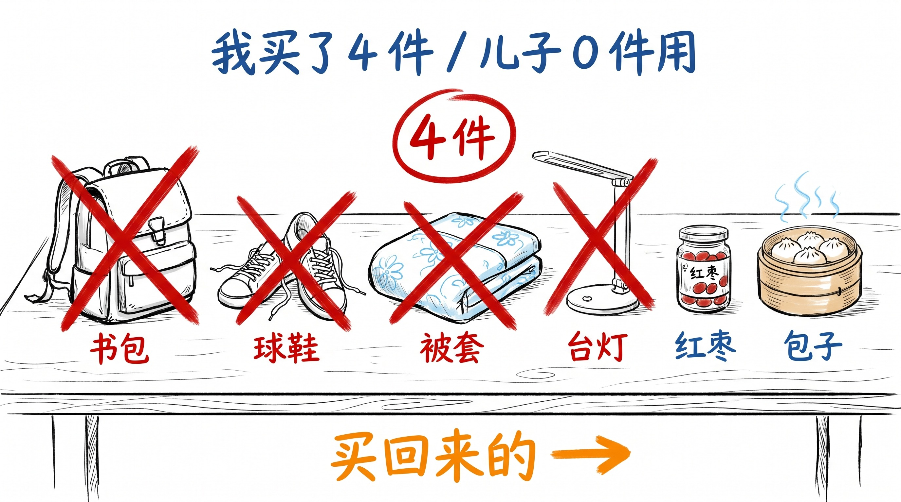
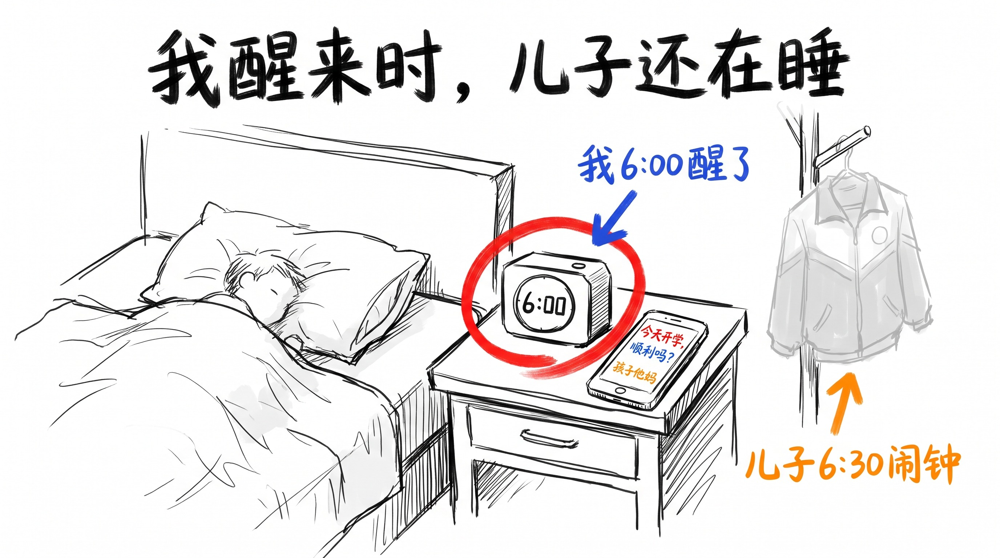

# 开学前 7 天, 我给儿子买了 4 件他没用的东西

我准备 7 天。
4 件, 0 件用了。
但我还是要准备。

## 8/25, 周二晚上 10 点, 我开始列清单

8 月 25 日, 周二晚上 10 点, 儿子做完作业, 在客厅看电视。

我跟孩子他妈说: "9 月 1 号开学, 还有 7 天, 文具还没买。"

她说: "你列个清单, 周末一起去。"

我拿笔, 在餐厅小纸条上列: 1. 新书包 (旧的拉链坏了 2 个月); 2. 一包 A4 打印纸; 3. 五支中性笔; 4. 一支红笔; 5. 一支 2B 铅笔; 6. 一块橡皮; 7. 一套尺子; 8. 一个文件袋; 9. 一个新水杯 (旧的盖子裂了 3 个月); 10. 一双新运动鞋; 11. 一床新被套; 12. 一个新台灯 (旧的一闪一闪)。

我列完 12 条, 把纸条递过去: "你看。"

她接过去, 看了 30 秒: "你这是给小学生列的还是给中学生列的? 12 条, 笔 3 支, 是不是太多了?"

我说: "多 1 支红笔, 1 块橡皮, 1 个文件袋, 其余 9 条基本 1 件 1 支, 不多。"

她说: "1 支 2B 铅笔, 中学才考, 现在不用。"

我划掉。

她又说: "1 个新水杯, 你上次不是给他买过吗?"

我说: "那个盖子裂了 3 个月, 他没说, 我也没主动换。"

她说: "那就是他不想换, 别强求。"

我划掉。

12 条划到 9 条, 我把纸条收回口袋: "9 条, 周四去买。"

她补了 1 句: "新书包, 旧的拉链坏了 2 个月, 这次买 1 个。"

我说: "这条我列了, 第 1 条。"

她说: "你列归列, 我怕你忘。"

我平时连买菜都靠她报菜单, 这次我亲自列, 9 条, 已经是我这些年列过最长 1 次。

## 8/27, 周四下午, 我买了 4 件

8 月 27 日, 周四下午 3 点, 我到家, 进门, 手里 4 个袋子。

儿子从房间跑出来: "买了什么?"

我说: "新书包, 新运动鞋, 新被套, 新台灯。"

他一个一个翻:

第 1 件: 1 个新书包, 黑色, 我挑的, 比他小学时背的同款大 1 号。
第 2 件: 1 双新运动鞋, 白色, 我挑的, 他喜欢黑色, 我没问过他。
第 3 件: 1 床新被套, 浅蓝色, 孩子他妈挑的, 我没见过这个颜色, 旧的用了 4 年, 颜色从浅蓝褪到灰白, 1 个角上有个 1 厘米的小洞, 她没发现, 我也没换。
第 4 件: 1 个新台灯, 白色, LED 充电款, 没 logo, 孩子他妈挑的, 旧的一闪一闪 3 个月。

4 件, 1 个小洞, 1 厘米, 1 个褪了 4 年的被套。

袋子里夹着 1 张孩子他妈写的小纸条, 她的字比我工整:

"我买了 4 件, 你再买 5 件, 别将就。 开学前 1 周别熬夜, 早饭要吃, 衣服穿暖。 妈。"

儿子看 1 分钟, 折好, 放回袋子里。

8 月 28 日, 我去了一趟超市, 买了 1 个新水杯 (38 块) + 1 支红笔 (3 块) + 1 块新橡皮 (2 块)。 其余 6 件, 我没买。

8 月 31 日晚上 11 点, 儿子房间灯还亮着, 我微信发 1 条: "买了没?" 他回"水杯 + 红笔 + 橡皮"。 我发个"行" 字, 3 秒后, 又发 1 条: "运动鞋试试, 不合适我去换。"

他回"还没穿"。

我没再发。

7 天准备, 我买了 4 件。
儿子买了 3 件, 用上 1 件 (红笔)。
我买的 4 件, 儿子 0 件用了 — 新书包压在玄关, 新运动鞋在鞋柜, 新被套没铺, 新台灯没开。

但儿子不知道。
他以为我买的 4 件, 开学那天会用上。

## 9/1 早 6:00, 我醒了, 儿子还在睡

9 月 1 日, 周二。

儿子闹钟 6:30 响, 他立刻起, 6:50 出门, 7:15 到校。

同一时刻, 我 6:00 就醒了。

4 年前, 儿子上 1 年级 (2022 年), 我给他定 6:00 起床。 这 1 个小时时差, 是我没改过来的。

6:00 醒来, 我没躺, 起床走到阳台, 看窗外, 看杭州今天的天气 (我手机里装了一个杭州天气 app, 孩子他妈都不知道)。

我看 3 分钟, 心里想"今天 26 度, 不会下雨, 路上不用带伞"。

我没给儿子发微信, 不是不想发, 是怕 6:00 发过去, 他还没起, 微信提示音吵到他睡觉。

我回客厅, 倒 1 杯水, 坐下来, 打开电视, 调到杭州新闻频道 (我从来不看杭州新闻, 但 9/1 这天我看了 1 小时)。

7:15, 儿子到校。 我不知道。
7:50, 儿子第 1 节数学课开始, 老师讲跟上学期一样。 我不知道。
11:30, 儿子去食堂, 1 荤 2 素 1 汤 12 块。 我不知道。

12:00, 我微信发去 1 条: "到了没?"

不是"顺利吗" (那是孩子他妈问的), 是"到了没"。
不是关心他, 是确认他"没在路上出事"。

儿子中午才看到, 回"到了, 在食堂"。

我接到这 3 个字, 看了 1 遍, 锁屏, 把手机放在桌上, 继续看杭州新闻。

我没再发消息。
不是不想发, 是怕打扰他吃饭。
不是不牵挂, 是"到了" 2 个字我等了 6 小时, 够了。

5:00, 儿子回家, 把那个新被套铺上去。 浅蓝色, 孩子他妈挑的, 我没见过这个颜色。 旧的用了 4 年, 颜色从浅蓝褪到灰白, 1 个角上有个 1 厘米的小洞, 他没动它。

他躺上去, 闻了 1 下, 是 1 种淡淡的樟脑味。

6:00, 我给儿子发 1 段文字: "儿子, 新被套铺了, 今晚睡得挺好。 文具买了 3 件, 用了 1 件 (红笔), 还有 2 件放着。 我买的运动鞋你没穿, 太新了, 舍不得。 谢谢儿子。"

他 10 分钟才回 (他比他妈慢, 因为他在做作业没注意手机):
"不客气, 好好睡。 鞋别舍不得, 穿坏了再买。"

他没提"为什么 4 件你 1 件不用", 没问"新台灯好不好用", 也没说"下次记得买齐 9 件"。

就 1 句: 鞋别舍不得, 穿坏了再买。

## 收尾

7 天准备, 我买了 4 件, 0 件儿子用上。
儿子买了 3 件, 用上 1 件 (红笔)。

加起来 7 件, 用了 1 件。
7 天准备 0 件, 是"用了 1 件" 的另一种说法。

但我还是要准备。

我准备不是因为"儿子需要", 是因为"我需要"。
我需要 1 个动作, 把 7 天里"他离开家" 的焦虑, 落成 4 件具体的物品。
新书包, 新运动鞋, 新被套, 新台灯 — 4 个落点。
4 个我"能买回来" 的动作, 比 4 通打不通的电话管用。

我 8/25 让她划清单, 不是因为"儿子没准备好", 是因为"我还没准备好"。
我 8/27 买 4 件, 不是因为"家里旧的不好", 是因为"旧的让我想起他 6 岁"。
我 9/1 早 6:00 起来看杭州天气, 不是因为"担心他路上", 是因为"我自己 6:00 醒来不知道干嘛"。
我 12:00 发"到了没", 不是因为"关心他吃了饭没", 是因为"到了" 2 个字我等了 6 小时, 够了。

我以前以为: 准备是为了解决问题。
9/1 之后, 我知道: 反的。 准备不是解决问题, 准备是让"还没发生" 的事"已经发生"。 焦虑不是"问题没解决", 焦虑是"问题还没来"。 准备让问题"提前到", 焦虑就提前释放了。

我准备 7 天, 4 件 0 件用了, 但我还是要准备。
准备不是解药, 准备是我爱孩子的方式。

---

> 我准备 7 天, 4 件 0 件用了, 但我还是要准备。 准备不是解药, 准备是我爱孩子的方式。
