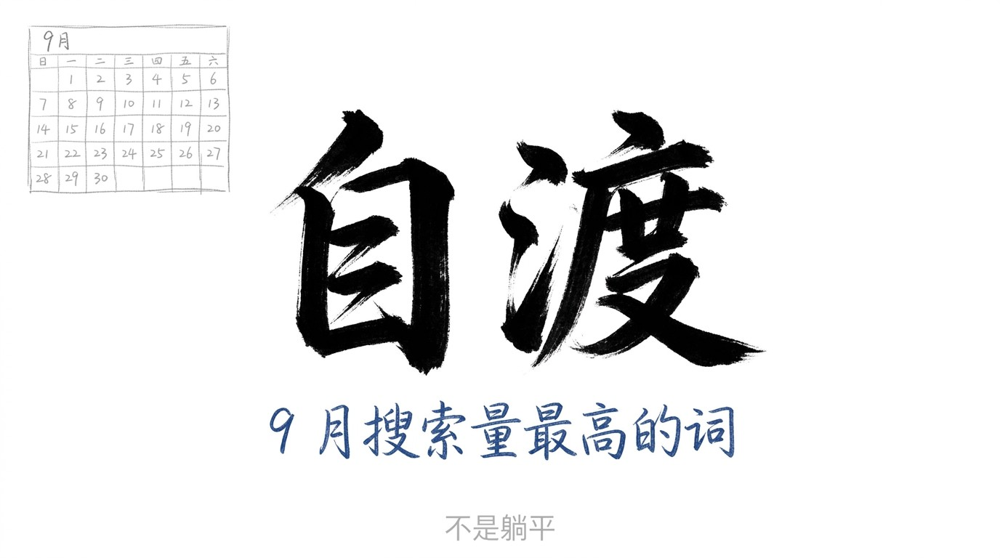
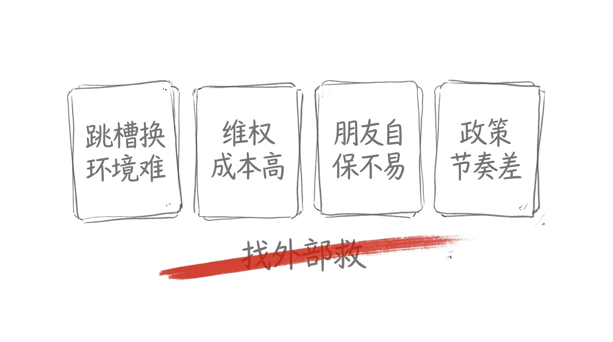
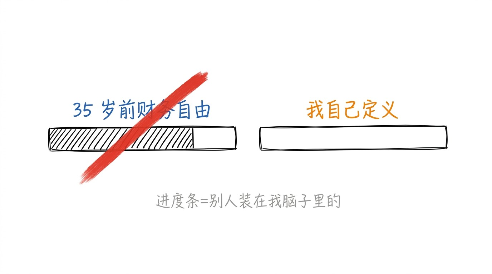
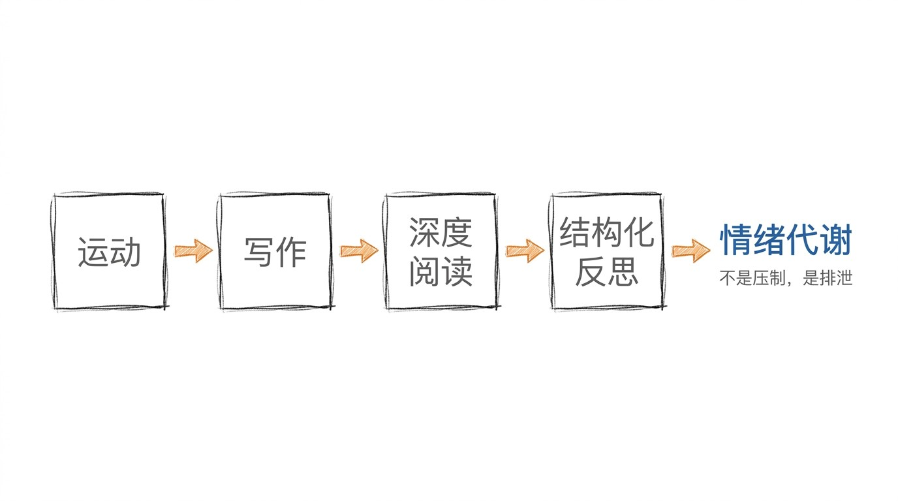
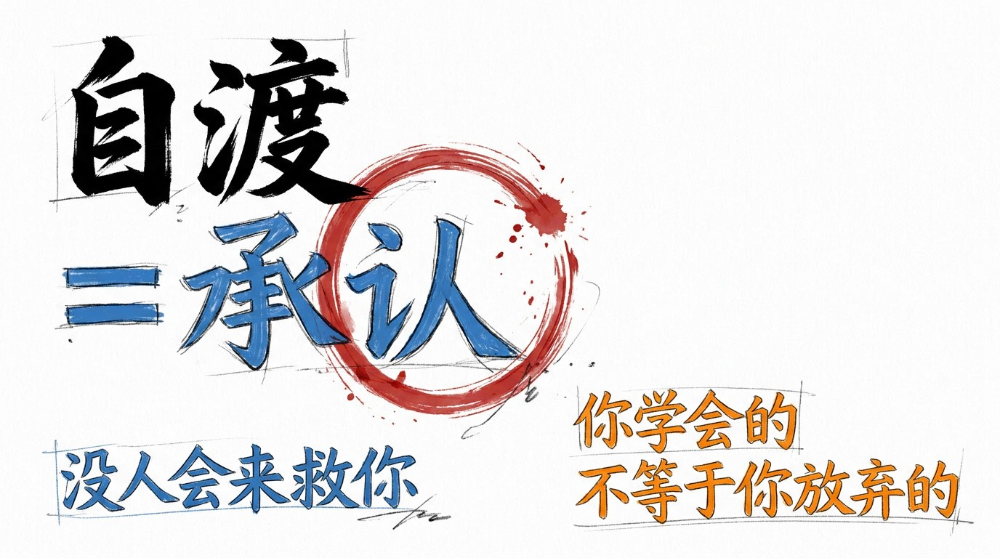

# 自渡这个词, 不是鸡汤, 是承认

9 月, 年轻人搜索量最高的词, 不是"躺平", 是"自渡"。

不是今年 9 月才有的, 是从 9 月开始, 大家突然都在搜。

我以前以为: "自渡" = "自我提升" = 跟"躺平"反着来。 咬牙硬扛, 自己解决, 不求人。

9 月之后, 我知道: 反的。 "自渡" 不是"自我提升"。 "自渡" 是"承认没人会来救你"。

承认, 比提升难。

## 4 个征兆, "自渡"为什么在 9 月爆了

9 月是 1 个特殊的月份。

年初定的计划, 到 9 月该验账了。 减肥减了吗, 存款涨了吗, 该考的证考了吗, 该跳的槽跳了吗。

大部分人没完成。 距离年底只剩 4 个月, 焦虑在 9 月集中爆发。

但"自渡" 爆了, 不只因为季节性焦虑。

更深的原因是: 过去几年, 人们习惯求助的那些通道, 正在收窄。

### 征兆 1: 跳槽换环境难

职场上, 过去遇到瓶颈可以跳槽换环境, 现在行业整体收缩, 跳槽的选项变少了。

5 年前, 你跳槽, 是"换个地方证明自己"。 9 月, 你跳槽, 是"换个地方被同样卡住"。

### 征兆 2: 维权成本高

过去遇到不公可以投诉维权, 现在维权成本越来越高, 很多人选择忍了。

5 年前, 你投诉, 是"我应该被公平对待"。 9 月, 你投诉, 是"算了, 投诉完还要上班"。

### 征兆 3: 朋友自保不易

人际关系上, 过去遇到困难可以找朋友帮忙, 找家人兜底, 现在大家都在各自的困境里挣扎。

5 年前, 你找朋友, 是"你一定有空"。 9 月, 你找朋友, 是"你也有你的事"。

### 征兆 4: 政策节奏差

政策层面, 过去遇到危机可以期待某种外部力量介入 — 行业救市, 就业补贴, 消费券。

现在人们发现, 政策的节奏和个人的困境之间, 总是差着一段距离。

这 4 个征兆, 不是"抱怨"。 是"通道在收窄"。

## 自渡 ≠ 自我提升: 它是承认

很多人把"自渡" 跟"自我提升" 混了。

"自我提升" 是: 我要变成更好的人。 我要读完 100 本书。 我要每周健身 3 次。 我要存够 50 万。

"自渡" 不是。 "自渡" 是: 我承认, 没人会来救我。

我承认, 跳槽换不到更好的环境。 我承认, 投诉维不到想要的公平。 我承认, 朋友都在自己的事里。 我承认, 政策救不到我。

"自我提升" 是"加东西"。 "自渡" 是"减东西"。

"自我提升" 是"我要做更多"。 "自渡" 是"我不期待别人"。

KOL 说"35 岁前必须财务自由"。 招聘 APP 弹窗"985 硕士起薪 45K"。 健身镜提醒"今日核心激活度低于同龄人 73%"。

这些声音的本质, 是替你定义"你应该活成什么样"。

"自渡" 的第一步, 不是做更多的事。 是拆掉别人装在你脑子里的进度条, 自己定义"值得" 的标准。

## 情绪代谢, 不是情绪压制

承认之后, 怎么"自渡"。

不是"咬牙硬扛"。 心理学里, 真正高心理韧性的人, 不是从不崩溃, 是拥有"情绪代谢力" — 让痛苦流经自己, 却不淤积成伤。

就像老榕树, 台风来时枝叶狂舞, 根系却在地下悄然延展十米深。

它不抗拒风, 也不讨好风。 它只是把每一次摇晃, 都转化成向下扎根的指令。

具体怎么做。

不是压抑负面情绪, 是给它一个出口。 运动, 写作, 深度阅读, 结构化反思 — 这些不是"消磨时间" 的活动, 是给情绪建立一条"排泄通道"。

第二步, 用极致执行力替代等待。 "自渡" 不是"想通了就好了", 是"想不通也先干起来"。 在行动中调整方向, 比在原地想清楚再出发更有效。

多数人的困境, 不是因为方向错了, 是因为在原地等了太久。

## 收尾

"自渡" 不是一句鸡汤。

"自渡" 是一种清醒。

不是"我能搞定一切" 的自信, 是"没人会来救我, 但我还在" 的承认。

9 月大家都在搜"自渡", 不是因为世界变冷了。 是因为, 自己变强了, 才有能力承认"世界没义务变暖"。

"自渡" 不是解药。 "自渡" 是草稿的另一种说法 — 不是"写完了" 的结果, 是"还在写" 的过程。

能救你的, 确实只有你自己。 但这不是绝望的结论, 是过程的起点。

---

> 9 月大家搜的"自渡", 不是鸡汤, 是承认。 不是"自我提升", 是"没人会来救我"。 自渡 = 你学会的, 跟你放弃的, 不是同义词。 自渡不是解药, 自渡是草稿的另一种说法。
