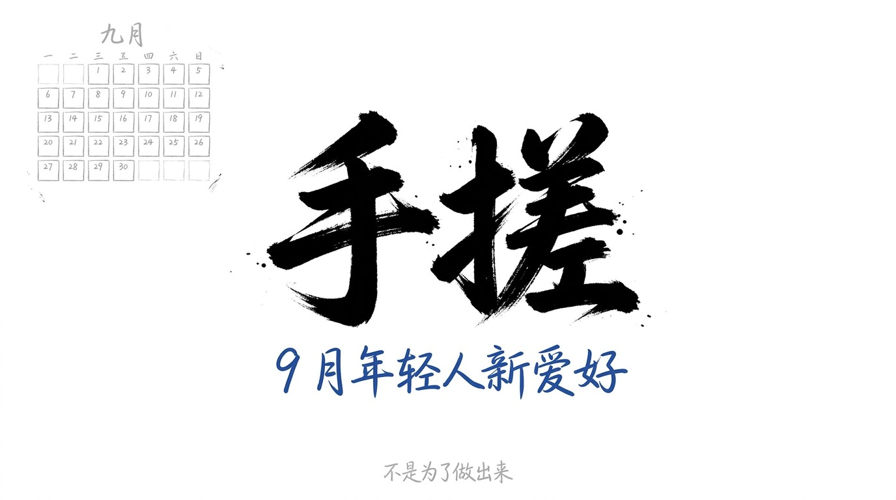
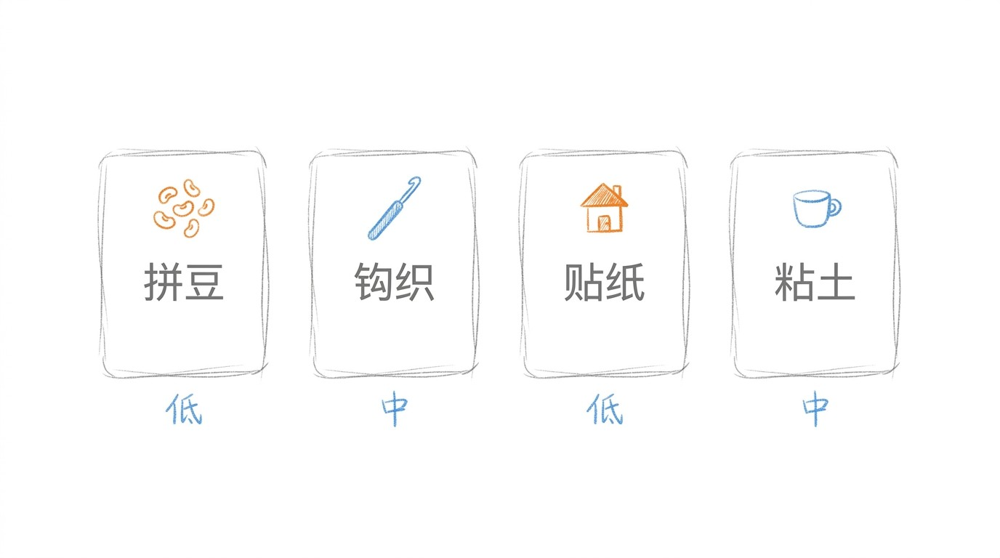
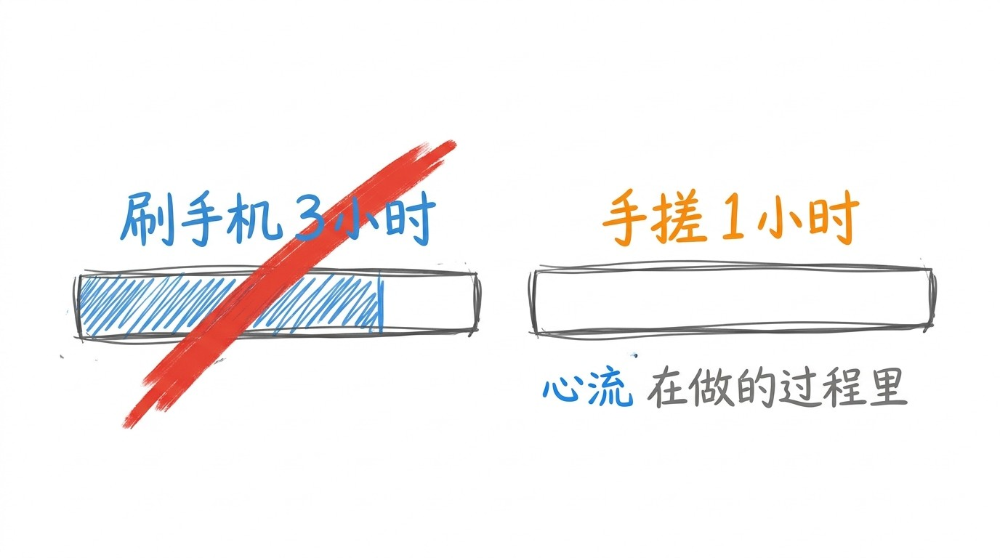
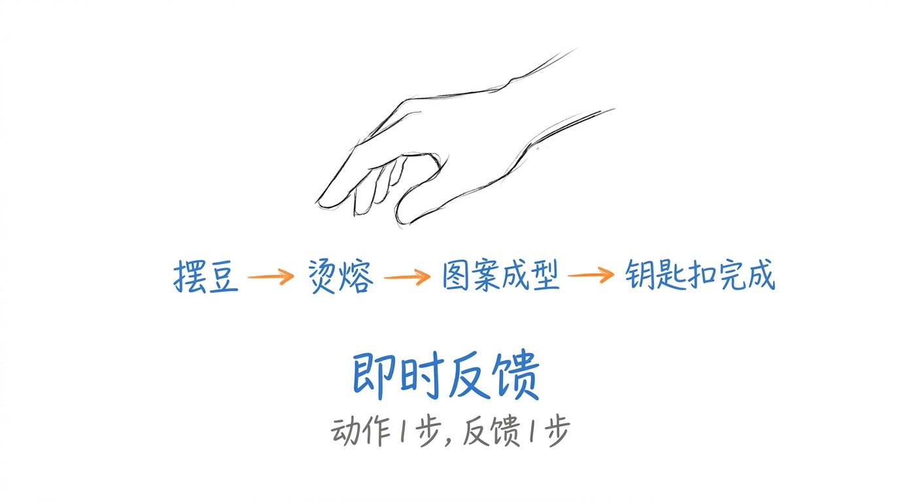
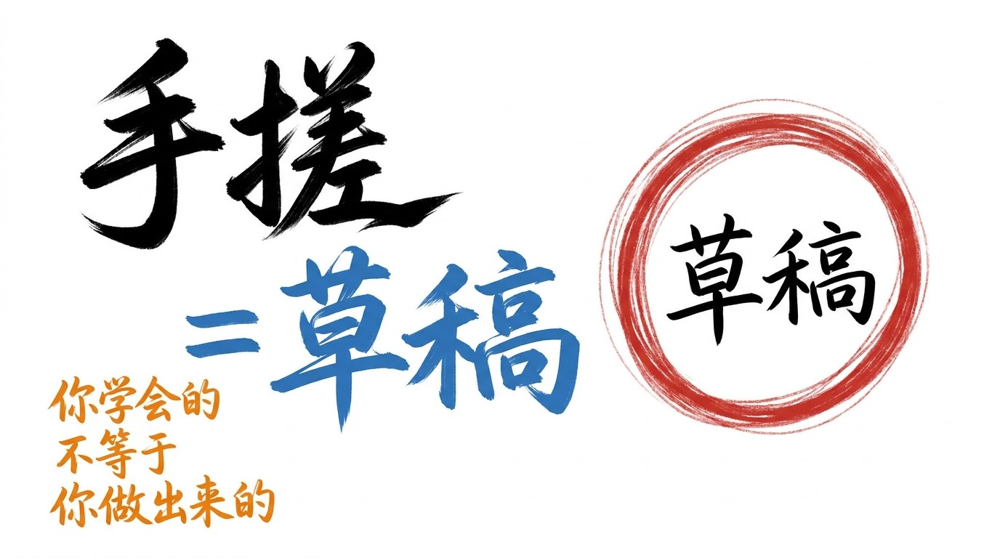

# 手搓的人, 都不是为了做出来

9 月, 年轻人最上头的新爱好, 两个字: 手搓。

抖音 #手搓万物 87.6 亿次播放, 小红书百万笔记, 00 后占近 4 成。 拼豆, 钩织, 造景贴纸, 捏粘土, 活字印刷 — 这些"自己动手做" 的事, 正在 2026 年的 9 月集体爆发。

我以前以为: 手搓 = 拼豆大赛 = 卷出精品 = 拍视频晒小红书。

9 月之后, 我知道: 反的。 手搓不是为了做出来。 手搓是为了"在做的过程里" 找回自己。

## 4 个门类, 9 月为什么转向手搓

手搓不是单一项目, 它是一大类爱好, 不同性格的年轻人, 可以找到适配自己的赛道。

### 门类 1: 拼豆 — 当代年轻人的十字绣

彩色塑料小豆, 对照像素图纸, 一颗颗摆放在模板上, 摆满之后用熨斗高温烫熔。 入门简单, 重复摆豆的动作极其解压。

### 门类 2: 钩织 — 地铁上都能搓的随身爱好

钩针 + 毛线, 钩挂件, 玩偶, 包包, 发圈。 95 后女生通勤地铁上, 拿出钩针, 利用碎片时间手搓。 不需要大块时间。

### 门类 3: 造景贴纸 — 桌面上的小世界

不需要剪刀胶水, 靠微缩贴纸, 在本子上搭建房间, 街道, 小屋。 不用复杂工具, 一张桌子就可以玩。 节奏轻柔, 适合性格安静的人。

### 门类 4: 捏粘土 — 长投入, 高归属

给玩偶缝制衣服, 改造样貌; 拼装微缩小屋, 搭建迷你房间; 粘土捏制小摆件。 耗时更长, 细节繁多, 适合愿意投入大块时间的人。

4 个门类, 看上去完全不同, 但底层是同 1 件事: **你的付出, 立刻看得见**。

## 手搓 ≠ 拼豆大赛: 是过程, 不是结果

很多人没看懂手搓。

他们以为: 手搓 = 拼豆 = 摆出精美图案 = 拍照发小红书 = 收获点赞。

错。

手搓最真实的状态, 是: 摆错位置, 推倒重来。 钩错行, 拆掉重织。 贴纸贴歪, 破坏整个画面。 黏土干了, 重揉。

每个手搓的人, 都经历过无数次"翻车"。 但他们没有停下。 因为**翻车本身就是过程的一部分**。

刷手机, 是被动接收。 算法推什么, 你看什么。 1 小时, 3 小时, 5 小时, 刷完头昏脑胀, 内心更空。

手搓, 是主动创造。 摆豆, 钩织, 贴纸, 黏土 — 你的注意力, 全在指尖。 1 小时, 你完成了一个钥匙扣, 哪怕歪歪扭扭, 也是你做的。

你不是在"做" 一件东西。 你是在"进入" 一段心流。

## 即时反馈, 是手搓最值钱的 1 件事

手搓有 1 个 AI 永远给不了的东西: **即时反馈**。

你摆 1 颗豆, 模板上多了 1 个点。 你钩 1 行, 包包就大 1 圈。 你贴 1 张贴纸, 小屋多 1 扇窗。

动作 1 步, 反馈 1 步。 你付出多少, 当下就收到多少。

AI 时代, 大家习惯了"等" — 等 AI 写完, 等 AI 画完, 等 AI 给你答案。 但手搓告诉你: **你不需要等, 你可以现在就开始, 现在就看到**。

你不需要 AI 帮你做, 你自己就能做。 你的手, 比 AI 更值。

## 收尾

手搓不是解药。 手搓是草稿的另一种说法 — 不是"做完了" 的结果, 是"还在做" 的过程。

9 月双联: 上篇「自渡」 (心理转向) + 下篇「手搓」 (行为转向)。 两篇都落在同一句话: **你学会的, 跟你做出来的, 不是同义词**。

自渡告诉你, 没人会来救你, 你得自己造船。 手搓告诉你, 造船不用等到完美, 你现在就可以摆第 1 颗豆。

9 月热搜, 不再是"我想要什么", 是"我现在能做什么"。

> 手搓的人, 都不是为了做出来。 9 月年轻人搜的不再是"我想要什么", 是"我现在能做什么"。 手搓不是解药, 是草稿的另一种说法。
