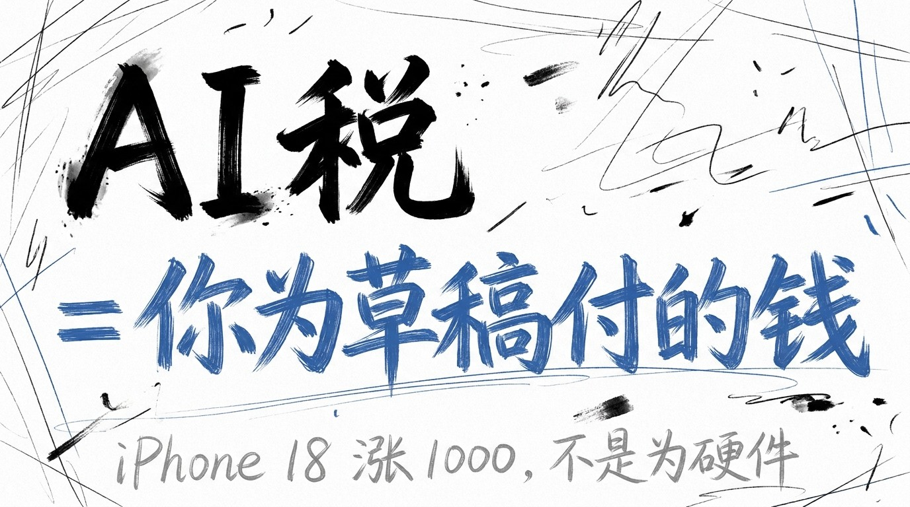
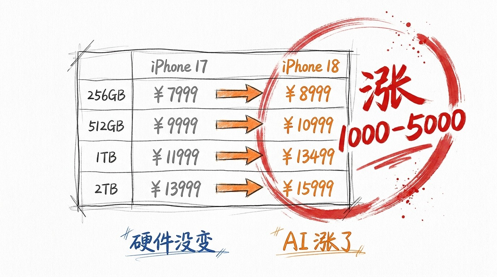
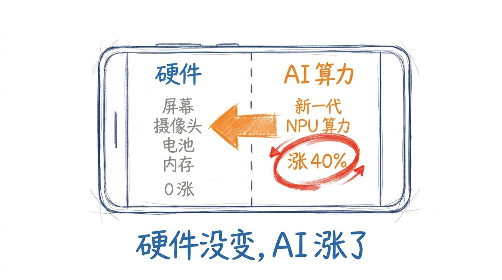
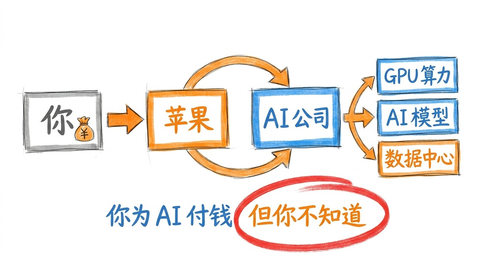
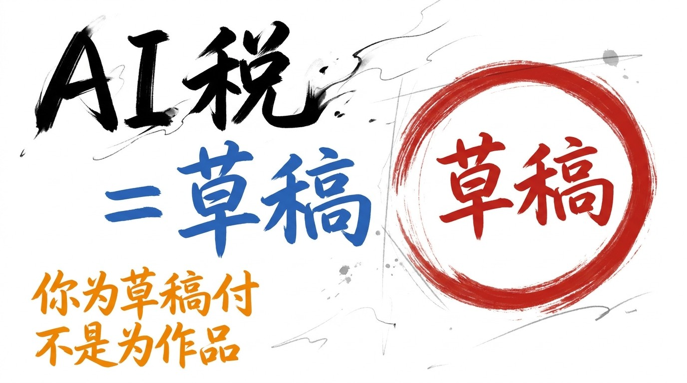

# iPhone 18 涨了 1000, 你买的不是手机, 是 AI 税

9 月 10 日凌晨 1 点, 苹果秋季发布会。

iPhone 18 Pro 256GB 比上一代涨 1000, 1TB 涨 2500, 2TB 涨 3500。 iPhone Duo 折叠屏, 国行起售 15999。 同期华为 Mate XT 2 比去年贵 2000, 小米 18 Fold 高存储版本贵了 1500。

9 月手机集体涨价, 已经冲上热搜。

我以前以为: 涨价 = 硬件升级 = 摄像头变强, 续航变久, 屏幕变大, 内存变多。

9/10 之后, 我知道: 反的。 **涨的钱不是为硬件, 是为 AI**。

## 价格表: 涨的钱花在哪儿

苹果官网有 1 张很诚实的对比表。

iPhone 18 Pro 256GB 比 iPhone 17 同容量涨 1000。 512GB 涨 2000。 1TB 涨 3500。 2TB 涨 5000。

存储越大, 涨幅越大。 但存储芯片本身这两年是降价的 (供过于求), 不是涨价。

涨的部分, 去了 1 个地方: **AI 算力**。

iPhone 18 全系配 A20 Pro 芯片, Neural Engine 算力比 A19 涨 40%。 这个算力, 不是给你剪视频打游戏用的, 是给端侧大模型 (Apple Intelligence 2.0) 用的。

你为 1 个"装在手机里的 AI 助手" 付了 1000 到 5000 块。 你买的是 AI 税, 不是手机。

## 拆开看: 你付的钱, 流向 GPU 算力

iPhone 18 拆开, 硬件部分跟 iPhone 17 几乎一样: 屏幕, 摄像头, 电池, 内存 (LPDDR5X 容量没变)。

变的部分是 1 个芯片: A20 Pro, 自带 NPU 算力涨 40%。

GPU 算力不是天上掉下来的。 它来自 1 个地方: 台积电的 3nm 产线, AI 训练集群, 数据中心。

你的 1000 块, 一部分去了台积电 (买产能), 一部分去了苹果的 AI 训练集群 (买 GPU), 一部分去了数据中心 (买电费)。

你以为是买手机, **实际是为 AI 基建买了单**。

## AI 税 ≠ 智商税: 你自愿付的

很多人骂"AI 税", 说这是"智商税"。

错。 智商税是你被骗。 AI 税不是。

AI 税是你**自愿付的**。 你知道手机里有 AI, 你知道 AI 算力要钱, 你还是买了。 因为你不想被落下。

AI 税不只是手机。

Adobe 加了 AI 功能 (Generative Fill) 之后, 订阅费从每月 53 涨到 80。 涨的 27 块, 是 AI 算力成本。

Netflix 加了 AI 字幕 + AI 推荐之后, 高级版从 22 涨到 28。 涨的 6 块, 是 AI 算力成本。

甚至云存储 (iCloud / OneDrive) 都开始按"AI 推理 token" 收费。 你存照片不要钱, 但你让 AI 帮你搜照片, 要按 token 算钱。

你为 AI 付的钱, 已经不只藏在手机里, 藏在订阅费里, 藏在流量税里, 藏在"用 AI 帮你省的时间"里。

## AI 税 = 草稿的另一种说法

公众号写过 020 大厂门票, 021 OpenAI 降价, 022 匿名模型。 都在聊 AI 战略 — 资本怎么下注, 价格怎么卷, 模型怎么冲榜。

028 不一样。 028 不聊战略, 聊你的钱包。

iPhone 18 涨 1000, 不是手机升级, 是你为 AI 买了单。 这个"为 AI 买单" 的过程, 不是结果, 是过程。

你买的是 1 个"还在写" 的草稿 — AI 模型每 1 个月迭代 1 次, 你的 AI 算力买 1 次, 旧的就过时。 1 年后 iPhone 19 出来, 你又得为新的 AI 算力付钱。

**你永远在为草稿付钱, 不在为作品付钱**。

公众号角度: AI 税 = 草稿的另一种说法。

不是"我被 AI 骗了", 是"我在为 AI 的'还在写' 持续付费"。 我承认, AI 还没写完。 我承认, 1 年后我还得为新 AI 付钱。

我不骂 AI 税, 我也不美化 AI 税。 我只是看清楚: 我在买的是草稿, 不是作品。

## 收尾

公众号 9 月双联, 026「自渡」 + 027「手搓」 + 028「AI 税」。

026 告诉你, 没人会来救你, 你得自己造船。 027 告诉你, 造船不用等到完美, 你现在就可以摆第 1 颗豆。 028 告诉你, 你以为你在买船, 其实你在为造船用的钉子付钱。

3 篇, 都落在同一句话: **你学会的, 跟你买到的, 跟你做出来的, 不是同义词**。

> iPhone 18 涨 1000, 不是为硬件, 是为 AI 算力。 你买的不是手机, 是 AI 税。 AI 税 = 草稿的另一种说法 — 你为草稿付钱, 不为作品付钱。
