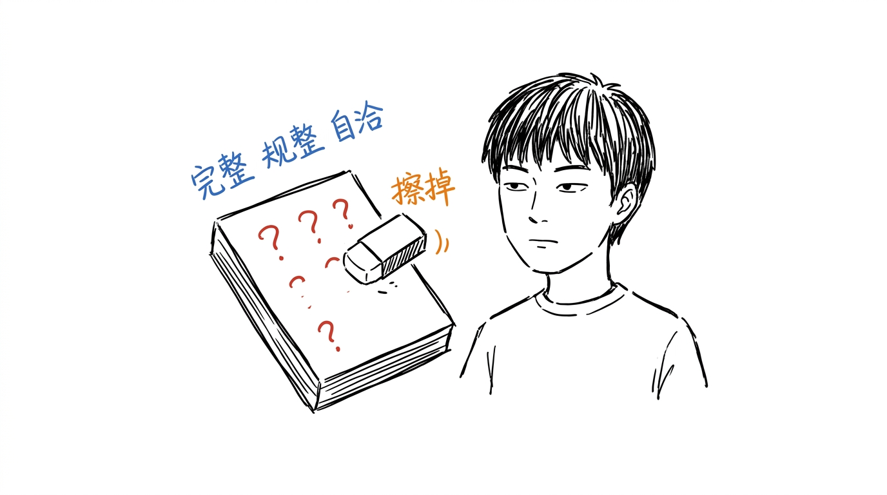
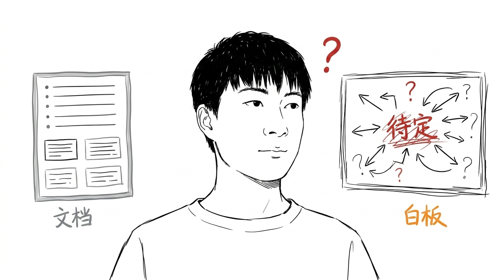
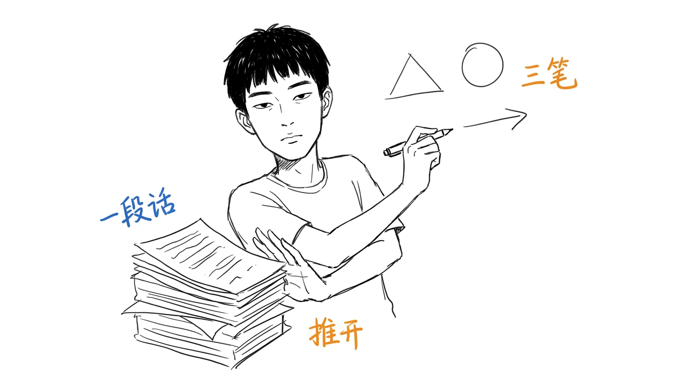
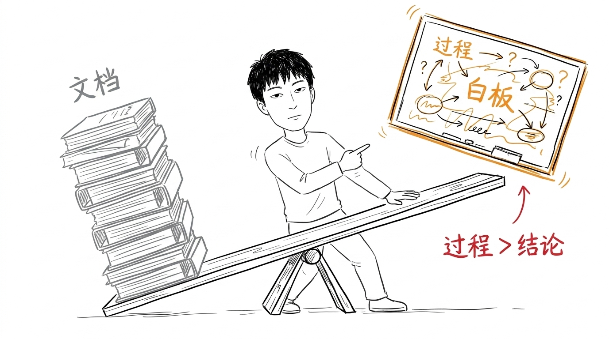

# 白板比文档更值钱

> 这是一篇用 xiaofan-ink 配图的实战示例文章,4 张图全部由 xiaofan-ink 生成。文章本身是配图选题的来源,也是看效果的载体。
>
> 生成日期:2026-07-16 / 主题:思维方法 / 配图数:4

---

我做了几年文档,后来发现一个尴尬的事实:

**写得最认真的文档,几乎没人看。写得最随意的白板草图,反而最能讲清楚事。**

不是文档没用。是大多数文档,把最有价值的部分给抹掉了。

---

## 文档的陷阱

文档的默认状态是"完整、规整、自洽"。这听起来是优点,实际是个问题。

为了完整,你得补全所有分支;为了规整,你得调整结构;为了自洽,你得改掉那些"还没想清楚"的部分。

改完之后,文档看起来很专业。但里面那些"还没想清楚"的部分,恰恰是最值钱的部分 —— 它告诉你这件事的边界在哪、哪里可能是错的、哪里值得再深挖。

**完整、规整、自洽的文档,把最有价值的部分全抹掉了。**

---

## 白板的好处

白板不要求完整。

写到一半,卡住了,就画个问号;前后矛盾,先留着,画个箭头指回去;哪个地方不确定,写个"?"或者"待定"。

白板上的草图,自带"这是草稿"的氛围。看的人知道,这是过程,不是结论。

**结论是要付费的,过程是免费的。但过程比结论更值钱。**

---

## 用草图表达,而不是用文字

很多人觉得"我写不出来,因为我文笔不好"。

其实不是。

你写不出来,是因为你想得太完整,想给读者一个"完美答案"。

换成白板,试试看:

- 不要写一段话,画三笔
- 不要解释清楚,留个问号
- 不要追求对称,允许歪

你会发现,你脑子里那些"没想清楚"的部分,其实用三笔就能讲明白。

---

## 少写文档,多用白板

我做了 xiaofan-ink,这个白板风的配图 skill,就是为了让自己多用白板,少写文档。

不是文档不好。是大多数文档,不如三笔草图。

**过程比结论值钱,草图比规整值钱,留个问号比写个答案值钱。**

---

## 附:这次配图怎么做的

- 主题选定:从"思维方法"里挑了"白板 vs 文档"这个角度
- 锚点提炼:每段一个核心判断(抹掉、白板好、三笔、过程值钱)
- 结构选择:概念隐喻 + 前后对比 + 隐喻
- 小凡姿态:4 张图各不相同(站/看/画/推),不重复
- 配色:温暖墨水感,黑主 + 蓝(过程/系统) + 橙(动作) + 灰(规整/沉)
- QA:过 16:9、白底、小凡核心动作、留白、≤8 标注

具体 shot list 和 prompt 详见 `xiaofan-ink/references/` 下的文件。
