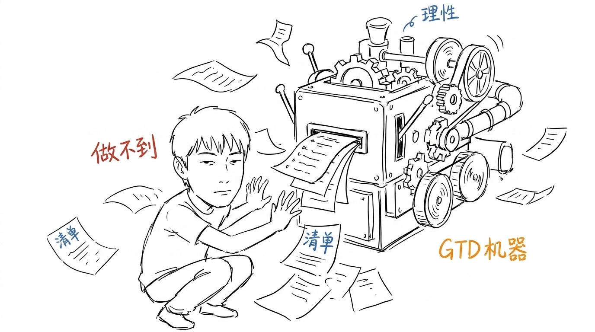
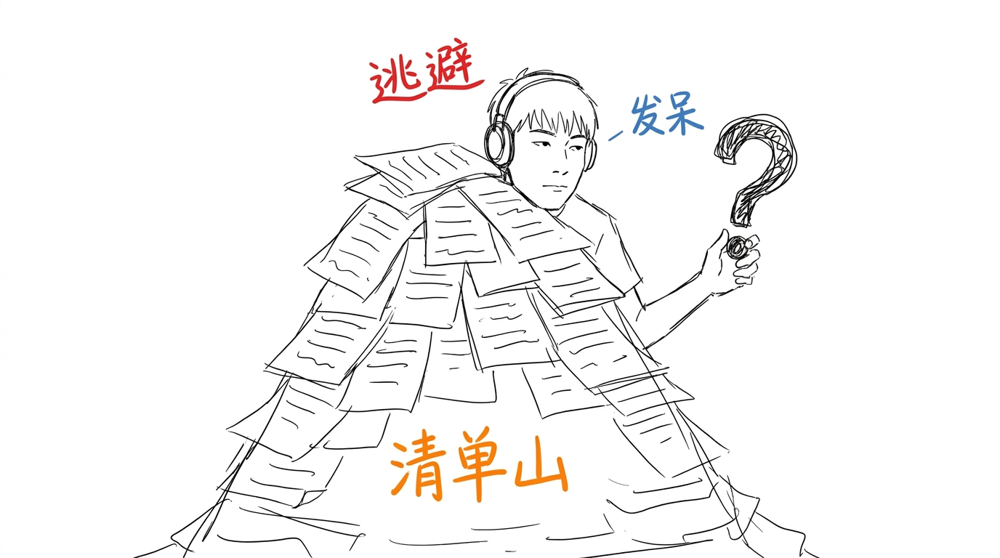
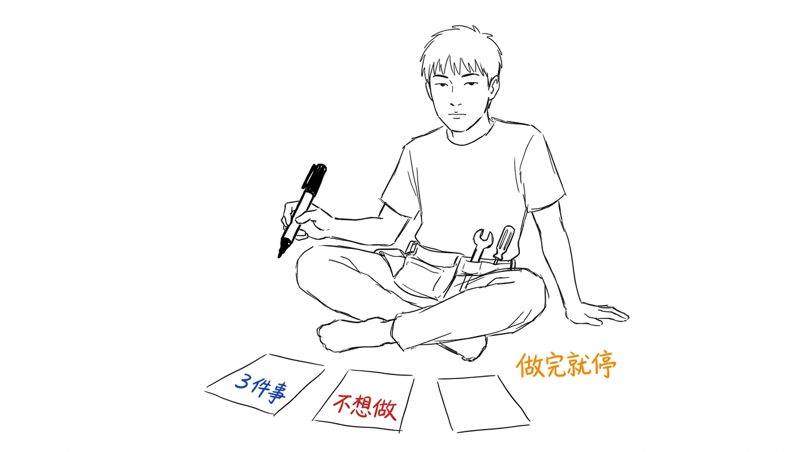
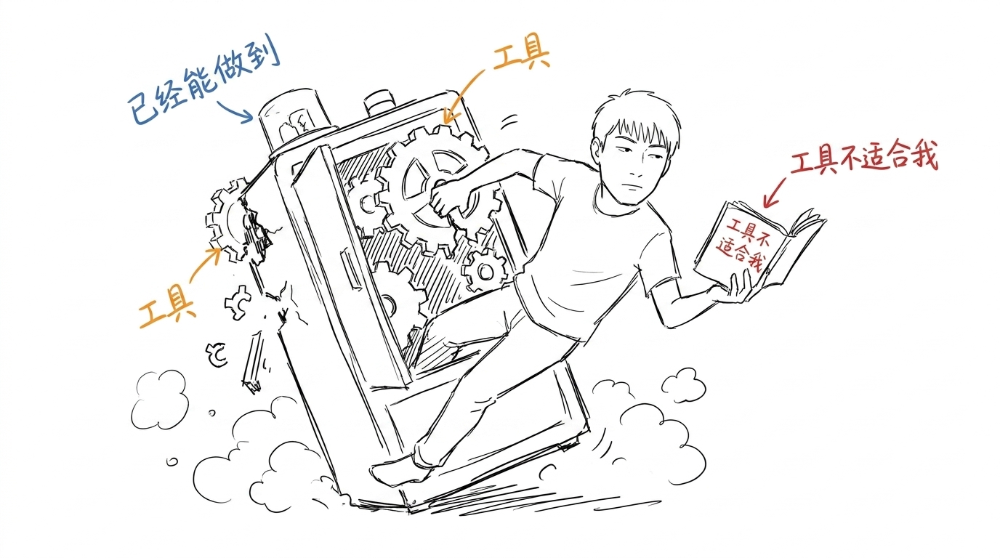

# 为什么我不再用 GTD 了

> 这是 xiaofan-ink 第二篇实战示例文章,4 张配图全部由 xiaofan-ink 生成。本篇刻意应用 v0.5 的改进点:小凡姿态"非站"化(蹲/探出/坐/卡住)+ 备选装扮(耳机/工具包+笔/笔记本)+ 物件变化。
>
> **状态:skill 实战验证样本,非《`essays/`》正式系列**(系列从 001 开始)
>
> 生成日期:2026-07-17 / 主题:工具反思 / 配图数:4

---

我用 GTD(Getting Things Done)用了三年,后来放弃了。

不是 GTD 不好。是 GTD 给我的那套流程,在我身上失效了。

---

## GTD 假设的"理想用户"

GTD 假设你是一个理性、有条理、能严格执行清单的人。

实际上,我不是。

我打开收件箱,看到 30 封未读邮件,我的第一反应是关掉它,去做别的。我的大脑会自动回避"我可能搞不定的事"。

**GTD 不解决这个问题。GTD 只告诉我"你应该做这件事"。**

---

## GTD 的反噬

用 GTD 越久,我的"待办清单"越长。

每天打开清单,看到 50 条待办,我的反应是"今天做不完",然后什么都不做。

清单变成了一种负担,不是工具。

**最后我开始逃避清单,逃避软件,逃避"管理自己"这件事。**

---

## 我现在的做法

我现在不列待办清单了。我只做两件事:

1. **写下"今天想做的 3 件事"**,不超过 3 件,做完就停。
2. **写下"今天不想做的事"**,明确告诉自己"这些今天不做"。

不追求"管理所有事",只追求"今天做这 3 件"。

---

## 结论

GTD 适合那种"真的能用清单管好自己"的人。

如果你不行,**不要怪自己做不到**,是工具不适合你。

工具是为"已经能做好的人"设计的,不是为"做不到的人"设计的。

找一个适合你大脑的工具,或者不用工具,只用"3 件事 + 不想做的事"两行字。

---

## 附:这次配图怎么做的(v0.5 改进点验证)

这是 v0.5"全部 7 项优化"完成后的第二篇实战,刻意验证两个改进点:

### 1. 姿态"非站"化

| 图 | 旧版姿态 | 新版姿态 |
|---|---|---|
| gtd-01 | 站 | **蹲**在机器前 |
| gtd-02 | 站 | **探出**清单山 |
| gtd-03 | 站 | **坐**在地上 |
| gtd-04 | 站 | **卡**在机器上 |

4 张图主姿态完全避开"站",覆盖 4 种不同姿态,符合 v0.5 composition-patterns.md 反复刻规则里"姿态关键词至少 4 种不同" 的要求。

### 2. 备选装扮使用

| 图 | 备选装扮 | 用途 |
|---|---|---|
| gtd-01 | 无 | 突出"被压"的状态 |
| gtd-02 | 戴耳机 | 反讽"用耳机逃避问题" |
| gtd-03 | 围工具包 + 拿粗笔 | "准备做"的姿态 |
| gtd-04 | 拿小笔记本 | "自己找替代方案" |

3/4 张图用了备选装扮,装扮与主题契合(不是装饰)。

### 3. 物件变化

| 图 | 核心物件 |
|---|---|
| gtd-01 | GTD 机器(复杂、不断喷清单) |
| gtd-02 | 清单山(清单堆成的山) |
| gtd-03 | 3 张纸(简易、克制) |
| gtd-04 | 坏掉的 GTD 机器(同上但简化/坏) |

4 张图核心物件都不相同,避免"每张都是低科技机器" 的反复刻陷阱(虽然都是机器,但形态/状态各异)。
